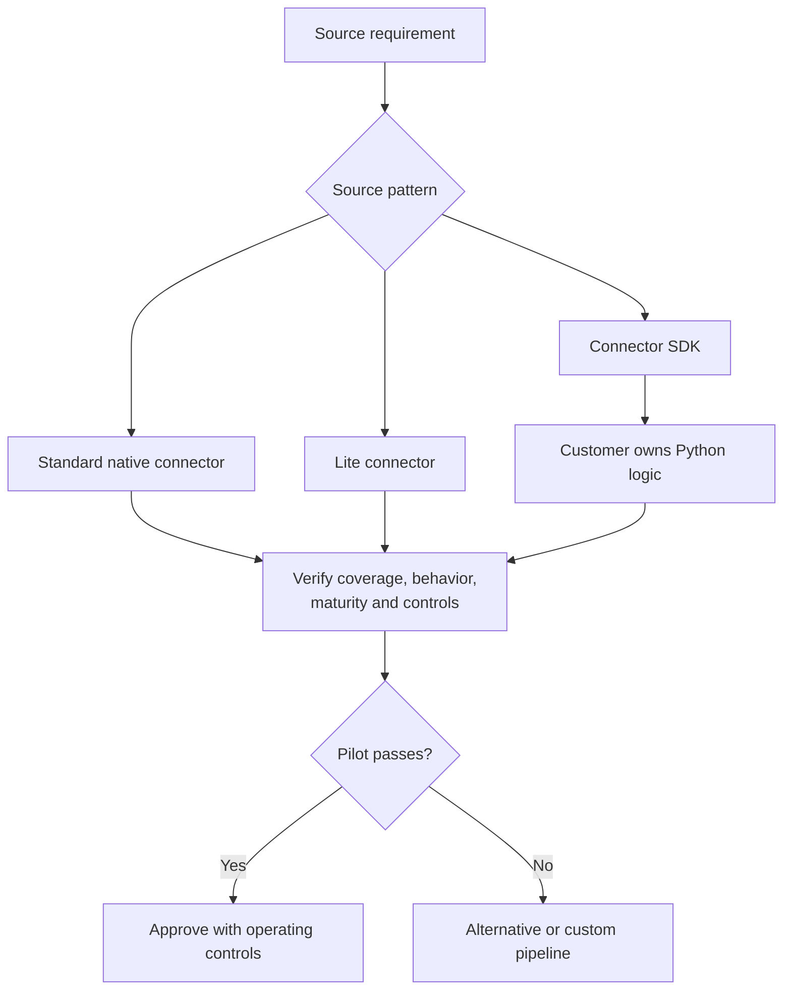

# Connector Types, Coverage, and Maturity

> [!abstract] Mental model
> A connector tile proves that an integration exists; a fit assessment proves that it can carry the client's required data with acceptable behavior and support.

## Executive Summary

- **What it is:** A framework for classifying connectors by source pattern and evaluating exact coverage, release phase, service level, prerequisites, and limitations.
- **Why it matters:** Connectors for similar-looking sources can differ materially in history, deletes, keys, sync strategies, latency, controls, and maturity.
- **Mental model:** Evaluate **type → coverage → behavior → maturity → ownership**, in that order.
- **Recommend when:** The exact connector documentation and a pilot confirm critical objects, fields, history, deletes, schema changes, latency, and controls.
- **Reconsider when:** A critical requirement is missing, the connector is immature for the workload, or a Lite/custom option shifts too much responsibility to the client.

## What It Can Do

- Cover application/API, database, file, event, log, and custom source patterns.
- Provide standard connectors with broad or near-complete common-use-case coverage.
- Provide Lite connectors for faster, narrower API use cases with Fivetran hosting and support once GA.
- Allow custom Python connectors through Connector SDK, hosted and triggered by Fivetran.
- Expose release phases that signal expected maturity and support behavior.

## What It Cannot Do

- Guarantee feature parity across connector types or even across sources in the same category.
- Make every endpoint, custom object, delete, or historical period available when the source API does not expose it.
- Transfer ownership of Connector SDK logic to Fivetran; the customer still builds and maintains that code.
- Make Private Preview or Beta risk equivalent to a long-established GA connector.

## Core Concepts

| Concept | Plain-language meaning | Why it matters |
|---|---|---|
| Standard connector | Fivetran-built integration aimed at broad common-use-case coverage | Usually the default option when feature fit is proven |
| Lite connector | Faster-built API connector focused on specific use cases and often fewer endpoints | Can close a catalog gap but requires careful coverage review |
| Connector SDK | Python framework for customer-built connectors hosted by Fivetran | Extends coverage while shifting code and support ownership to the client |
| Private Preview | Limited early release that may lack functionality and has weaker resolution expectations | Appropriate only with explicit risk acceptance; connector MAR is currently free |
| Beta | Functionally complete broader test phase with SLA-based issue handling | Edge cases may still emerge under production workloads |
| Generally Available | Validated release supported under the applicable SLA | Stronger maturity signal, not proof of client-specific fit |
| Sunset | Feature or connector being replaced through a breaking change | Requires migration planning; Fivetran documents at least 90 days' notice |

## How It Works (Simple Flow)

1. Classify the source as application/API, database, file, event, log, or custom.
2. Identify the exact connector variant, release phase, plan requirements, deployment support, and documented limitations.
3. Map required source objects, fields, historical range, keys, deletes, filters, and schema behavior to documented coverage.
4. Review authorization, quotas, logs, agents, networking, and source-system impact.
5. Test representative data volumes, edge cases, schema changes, recovery, and destination output.
6. Assign ownership for source prerequisites, connection operations, custom code, incidents, and connector changes.
7. Approve, mitigate gaps, or select another ingestion approach.

## Visuals

## Readable Snippets

Minimum connector assessment matrix:

| Requirement | Evidence to capture |
|---|---|
| Coverage | Required objects, fields, custom objects, and accessible history |
| Change behavior | Inserts, updates, deletes, keys, history mode, and re-import tables |
| Freshness | Allowed schedule, API/log constraints, measured sync duration |
| Resilience | Checkpoints, rollback window, re-sync scope, and source retention |
| Controls | Row/column selection, hashing/filtering, RBAC, networking, deployment |
| Maturity | Standard/Lite/SDK, release phase, SLA, plan, and known limitations |
| Ownership | Vendor, source owner, platform team, and custom-code support |

## Consultant Talking Points

- **Client question this answers:** "Fivetran lists our source—does that mean the integration is covered?"
- **Trade-offs to mention:** Standard connectors favor mature shared capability; Lite improves speed to coverage; SDK offers customization but reintroduces engineering ownership.
- **Risk or governance angle:** Release phase, support SLA, security review, sensitive-data scope, and ownership should be explicit in production approval.
- **Cost or operational angle:** Preview pricing may change at GA, and narrow or custom connectors can create hidden test, maintenance, and incident costs.

## Common Pitfalls

- Evaluating only the source name can miss a required endpoint, region, API edition, or connector variant.
- Treating GA as proof of data completeness can bypass client-specific reconciliation and edge-case tests.
- Choosing Lite for a broad enterprise use case can expose missing endpoints after downstream models depend on it.
- Choosing Connector SDK to “stay managed” can hide the fact that the client still owns Python logic, testing, releases, and data semantics.
- Ignoring sunset notices or connector changelogs can cause avoidable breaking migrations.

## When to Recommend What (Decision Table)

| Situation | Recommend | Why | Watch-outs |
|---|---|---|---|
| Standard connector covers all critical needs | Native standard connector | Broad managed capability and support | Still pilot source-specific edge cases |
| Narrow SaaS use case is fully covered by GA Lite | Lite connector | Faster time to value with Fivetran hosting | Endpoint scope and enhancement expectations differ |
| Private API or unsupported source with stable contract | Connector SDK | Custom coverage within Fivetran operations | Customer owns code, tests, schema, and SLA outcomes |
| Mission-critical source only in Private Preview | Controlled pilot, not automatic production approval | Learns fit while risk is visible | Missing features and slower issue resolution are possible |
| Critical requirement is absent from all variants | Alternative vendor or custom pipeline | Avoids building downstream dependence on a known gap | Compare maintenance and exit cost |

## Related Topics

- [[03 Fivetran/02 Connectors and Sync Behavior/Connectors and Sync Behavior Overview|Connectors and Sync Behavior Overview]]
- [[03 Fivetran/02 Connectors and Sync Behavior/07 Application and API Connectors|Application and API Connectors]]
- [[03 Fivetran/02 Connectors and Sync Behavior/08 Database Connectors CDC and High-Volume Agent|Database Connectors, CDC, and High-Volume Agent]]
- [[03 Fivetran/02 Connectors and Sync Behavior/09 File Event and Custom Connector Patterns|File, Event, and Custom Connector Patterns]]

## Related Decision Notes

- [[80 Comparisons and Decision Notes/Decision Notes/Fivetran/Decisions - Evaluating Fivetran Connector Fit|Evaluating Fivetran Connector Fit]]
- [[80 Comparisons and Decision Notes/Comparisons/Fivetran/Comparison - Fivetran vs Custom Ingestion|Fivetran vs Custom Ingestion]]

## Questions

- **Explain:** Why are catalog availability, coverage, and maturity three separate tests?
- **Apply:** What evidence would you require before approving a GA Lite connector for finance reporting?
- **Challenge:** Which ownership remains with the client when Connector SDK is hosted by Fivetran?

## Sources To Revisit

- [Fivetran Docs: Connectors](https://fivetran.com/docs/connectors)
- [Fivetran Docs: Core Concepts — Release Phases](https://fivetran.com/docs/core-concepts#release-phases)
- [Fivetran Docs: Lite Connectors](https://fivetran.com/docs/connectors/applications/lite-connectors)
- [Fivetran Docs: Connector SDK](https://fivetran.com/docs/connector-sdk)
