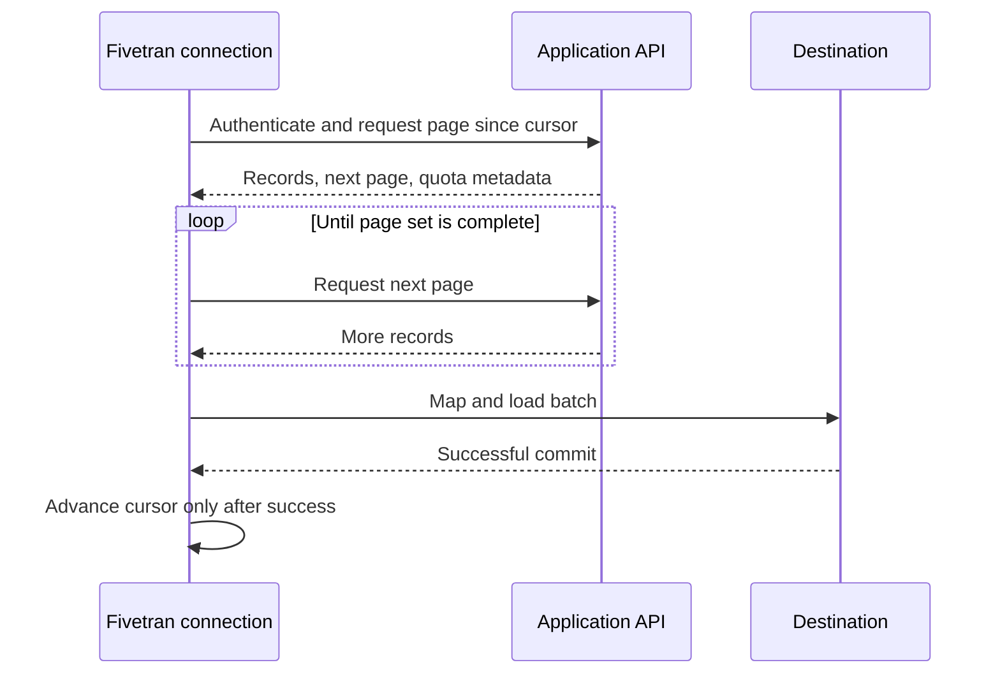

# Application and API Connectors

> [!abstract] Mental model
> An application connector is a managed client of someone else's API; Fivetran can automate extraction, but the provider controls what history, changes, deletes, and throughput the API exposes.

## Executive Summary

- **What it is:** Pull-based connections that periodically call SaaS or application APIs, map provider objects into destination tables, and maintain incremental progress.
- **Why it matters:** API semantics—not just Fivetran configuration—set hard boundaries on coverage, freshness, consistency, and recovery.
- **Mental model:** Fivetran is a careful API consumer with saved cursors, rate-limit handling, and a connector-specific destination model.
- **Recommend when:** Required objects and history are exposed, credentials and quotas support the workload, and eventual analytical consistency meets the use case.
- **Reconsider when:** Critical changes are not exposed, history is too short, API quotas make the SLA impossible, or transactional/real-time guarantees are required.

## What It Can Do

- Authenticate to supported applications and pull standard and, where supported, custom objects and fields.
- Perform an initial historical extraction and maintain connector-specific incremental cursors.
- Normalize API responses into documented destination schemas and adapt supported source schema changes.
- Handle pagination, supported rate-limit behavior, retries, and overlapping or rollback windows.
- Allow supported tables or columns to be excluded from the connection schema.

## What It Cannot Do

- Extract endpoints, fields, deleted records, or historical periods that the provider does not expose to the authorized account.
- Guarantee snapshot-perfect capture of every intermediate row version; most application connectors provide eventual consistency from API deltas.
- Override provider quotas, outages, permission models, API deprecations, or delayed source reports.
- Make the connector's normalized schema equivalent to a business-ready data model.

## Core Concepts

| Concept | Plain-language meaning | Why it matters |
|---|---|---|
| Pull connector | Fivetran initiates periodic API requests | Freshness depends on scheduling, duration, quotas, and provider behavior |
| Endpoint/object coverage | Which API resources and fields the connector actually reads | A connector can exist without covering a critical dataset |
| Cursor | Saved per-table or per-object progress | Supports incremental continuation after successful loads |
| Modified timestamp | Common provider field used to request recently changed records | Incorrect or delayed timestamps may require overlap or rollback strategies |
| Rate limit | Provider cap on API calls or throughput | Can reschedule or lengthen syncs regardless of configured frequency |
| Eventual consistency | Destination converges to the state exposed by the API over time | Not every intermediate change is necessarily visible |
| Rollback window | Re-reading a recent time range to catch late or revised records | Improves completeness but can increase API calls and active rows |

## How It Works (Simple Flow)

1. The client authorizes a source account with the required scopes, edition, and API access.
2. Fivetran discovers connector-supported standard and custom objects and applies the selected schema configuration.
3. The initial sync requests the historical data that the API and account make available.
4. Fivetran maps nested or provider-specific responses into documented destination tables and data types.
5. Later syncs use timestamps, cursors, reports, or connector-specific endpoints to request new or changed data.
6. The connector handles pagination, retries, quotas, and any overlap or rollback logic before committing progress.
7. Operators monitor delivered freshness and reconcile critical records against source reports or APIs.

## Visuals



## Readable Snippets

Questions to answer from the individual connector documentation and a pilot:

```text
Coverage: required endpoints, custom objects, custom fields?
History: earliest available date and priority-first behavior?
Changes: cursor field, overlap/rollback period, delete support?
Limits: API quotas shared with production users or integrations?
Identity: OAuth user or service account; required scopes?
Schema: table mapping, nested structures, naming, system tables?
Freshness: configured interval, measured duration, source delay?
```

## Consultant Talking Points

- **Client question this answers:** "Why is the Salesforce—or another SaaS—connection not as fresh or complete as the source UI?"
- **Trade-offs to mention:** Managed API adaptation reduces maintenance, but the connector inherits provider limitations and may use normalized schemas unfamiliar to business users.
- **Risk or governance angle:** OAuth grants and service accounts should be least-privilege, centrally owned, rotated, and reviewed when scopes or connected apps change.
- **Cost or operational angle:** API quotas, rollback reads, high-churn objects, report regeneration, and duplicated connections can affect latency, MAR, and downstream compute.

## Common Pitfalls

- Assuming the source UI and API expose identical data can leave required reports or calculated values unavailable.
- Authorizing with a named employee account can break production syncs when the person leaves, changes roles, or re-consents.
- Setting a short sync interval without measuring API quota and sync duration creates a misleading freshness promise.
- Treating missing deletes as current records can overstate customers, subscriptions, campaigns, or balances.
- Building directly on raw connector tables without staging contracts makes connector schema changes expensive downstream.

## When to Recommend What (Decision Table)

| Situation | Recommend | Why | Watch-outs |
|---|---|---|---|
| Standard SaaS analytics with supported objects | Native application connector | Managed pagination, mapping, incremental state, and API maintenance | Verify history, deletes, custom fields, and quotas |
| Required use case is exactly covered by GA Lite | Lite connector after pilot | Fast managed coverage for a narrower API surface | Do not assume broader endpoints will be added |
| Public REST API but no adequate connector | Connector SDK or AI-assisted connector evaluation | Can implement required extraction | Customer retains semantic and code ownership |
| Provider offers delayed/revised reporting data | Connector with documented rollback strategy | Re-reading recent periods can converge accurately | Higher latency/API calls and current-month MAR effects |
| Need every intermediate application state in real time | Event/audit stream or application-native export | Better match for complete event capture | Separate ingestion and retention controls required |

## Related Topics

- [[03 Fivetran/02 Connectors and Sync Behavior/Connectors and Sync Behavior Overview|Connectors and Sync Behavior Overview]]
- [[03 Fivetran/02 Connectors and Sync Behavior/06 Connector Types Coverage and Maturity|Connector Types, Coverage, and Maturity]]
- [[03 Fivetran/02 Connectors and Sync Behavior/10 Initial Incremental Re-import and Re-sync Strategies|Initial, Incremental, Re-import, and Re-sync Strategies]]
- [[03 Fivetran/03 Destination Data History and Schema Change/16 Data Contracts Completeness and Reconciliation|Data Contracts, Completeness, and Reconciliation]]

## Related Decision Notes

- [[80 Comparisons and Decision Notes/Decision Notes/Fivetran/Decisions - Evaluating Fivetran Connector Fit|Evaluating Fivetran Connector Fit]]

## Questions

- **Explain:** Why does an application connector provide eventual rather than snapshot-perfect consistency?
- **Apply:** Which API facts would you verify before promising a 30-minute Salesforce freshness SLA?
- **Challenge:** How could a source permission or reporting delay look like a Fivetran data-quality defect?

## Sources To Revisit

- [Fivetran Docs: Application Connectors](https://fivetran.com/docs/connectors/applications)
- [Fivetran Docs: Core Concepts](https://fivetran.com/docs/core-concepts)
- [Fivetran Docs: Sync Overview](https://fivetran.com/docs/core-concepts/syncoverview)
- [Fivetran Docs: Lite Connectors](https://fivetran.com/docs/connectors/applications/lite-connectors)
