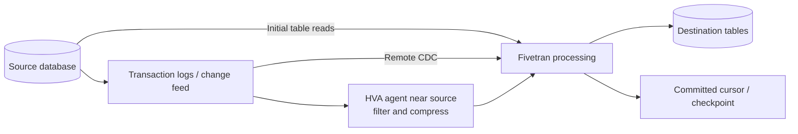

# Database Connectors, CDC, and High-Volume Agent

> [!abstract] Mental model
> Database replication starts with a bulk baseline, then follows changes through logs, feeds, or comparison methods; HVA brings log reading closer to selected high-volume sources.

## Executive Summary

- **What it is:** Managed database replication using an initial copy followed by source-native or Fivetran-specific incremental change capture; HVA is an agent-based option for supported enterprise databases.
- **Why it matters:** Capture method determines source prerequisites, latency, load, delete behavior, resilience, and operational ownership.
- **Mental model:** **Copy the current book, then follow its change journal.** If the journal expires during an outage, a new copy may be required.
- **Recommend when:** The database and capture method are supported, transaction-log retention and permissions are governed, and measured source impact and latency meet requirements.
- **Reconsider when:** Required logs or privileges cannot be provided, long pauses exceed retention, source load is unacceptable, or the workload needs transactional streaming semantics.

## What It Can Do

- Discover and initially copy selected database tables and supported schemas.
- Capture later inserts, updates, and deletes using database-native or Fivetran proprietary methods.
- Maintain progress cursors and resume after many interruptions while required source changes remain available.
- Map source types into destination-compatible columns and merge changes into destination tables.
- Use HVA's local agent and log-based CDC for supported high-volume enterprise databases.

## What It Cannot Do

- Capture a change after the required transaction log, change stream, or history has expired.
- Eliminate all source impact; initial reads, log access, capture processes, and long transactions consume source resources.
- Guarantee identical behavior for tables without reliable primary keys or across every database connector.
- Use HVA for every database; supported engines, methods, plans, and deployment combinations must be checked.

## Core Concepts

| Concept | Plain-language meaning | Why it matters |
|---|---|---|
| Initial sync | Bulk copy of selected historical tables | Creates the baseline and often drives the largest source read |
| Change data capture (CDC) | Reading inserts, updates, and deletes after the baseline | Avoids full table scans during normal operation |
| Transaction log/change stream | Database-maintained record of changes | Enables efficient capture but has retention and permission requirements |
| Cursor/checkpoint | Last safely committed replication position | Supports restart and helps avoid gaps |
| Teleport/query-based method | Finds changes through Fivetran queries rather than standard log access | Useful when logs are unavailable, with different load and behavior trade-offs |
| High-Volume Agent (HVA) | Fivetran agent installed near supported source databases | Reads and compresses log changes locally for high-volume replication |
| Log retention | How long source changes remain readable | Must cover outages, maintenance, and catch-up time |

## How It Works (Simple Flow)

1. The team configures a read/capture identity, network path, selected tables, keys, and connector-specific database prerequisites.
2. Fivetran runs the initial sync while recording a consistent change position according to the connector method.
3. Rows are type-mapped and loaded into Fivetran-managed destination tables.
4. Incremental syncs read new database changes from logs, feeds, streams, time-travel data, or a proprietary comparison method.
5. Fivetran batches and merges new, updated, and supported deleted rows into the destination.
6. Progress advances only after successful processing and load, allowing retry after interruption.
7. Operators monitor lag, log retention, source resource use, long transactions, schema changes, and destination reconciliation.

## Visuals



## Readable Snippets

Production prerequisite checklist:

```text
[ ] Supported database version and connector/capture method
[ ] Stable primary keys for critical tables
[ ] Read/capture user with least required privileges
[ ] Transaction/change-log retention covers outage + catch-up objective
[ ] Network path, TLS, firewall and private-connectivity approval
[ ] Initial-sync window and measured source resource impact
[ ] Monitoring for replication lag, log growth and long transactions
[ ] Re-sync decision and downstream reconciliation runbook
```

## Consultant Talking Points

- **Client question this answers:** "Can Fivetran replicate our production database without slowing it down or losing changes?"
- **Trade-offs to mention:** Log-based CDC is efficient and low latency but needs database configuration and retention; query/comparison methods can reduce log prerequisites but may add source work or behavioral limits.
- **Risk or governance angle:** Database and security teams must approve capture privileges, agent placement, network path, credentials, log access, and production change procedures.
- **Cost or operational angle:** Source CPU/I/O, retained logs, agent resources, network transfer, destination merge compute, MAR, and re-sync workload all matter.

## Common Pitfalls

- Enabling CDC without enough log retention can turn a routine multi-day outage into a full historical re-sync.
- Running an initial sync against a busy production database without measurement can create I/O contention or surprise replication duration.
- Including tables without stable keys can produce connector-specific delete, deduplication, and MAR behavior.
- Installing HVA without infrastructure ownership leaves agent upgrades, ports, certificates, disk, and monitoring unmanaged.
- Assuming a short schedule guarantees low lag ignores source transaction volume, long transactions, network throughput, and destination load time.

## When to Recommend What (Decision Table)

| Situation | Recommend | Why | Watch-outs |
|---|---|---|---|
| Supported OLTP database with accessible change logs | Native log-based CDC | Efficient steady-state replication and delete capture | Retention, permissions, slots/jobs, and log growth |
| Logs cannot be exposed but supported comparison method fits | Evaluate Teleport/query-based capture | Simpler read-only access in some cases | Source query load and connector-specific limitations |
| Supported enterprise database with very high change volume | Evaluate HVA | Local log capture, compression, and enterprise throughput | Agent operations, source resources, plan and network requirements |
| Database has unreliable keys on critical tables | Fix keys or isolate/test affected tables | Correct identity underpins updates and deletes | Synthetic-key behavior and re-sync cost |
| Need ordered event streaming for application processing | Database-native stream or streaming platform | Better fit for event semantics and consumers | Greater platform ownership and schema evolution work |

## Related Topics

- [[03 Fivetran/02 Connectors and Sync Behavior/Connectors and Sync Behavior Overview|Connectors and Sync Behavior Overview]]
- [[03 Fivetran/02 Connectors and Sync Behavior/10 Initial Incremental Re-import and Re-sync Strategies|Initial, Incremental, Re-import, and Re-sync Strategies]]
- [[03 Fivetran/02 Connectors and Sync Behavior/11 Scheduling Latency Checkpoints and Recovery|Scheduling, Latency, Checkpoints, and Recovery]]
- [[03 Fivetran/03 Destination Data History and Schema Change/13 Keys Deletes and Fivetran System Columns|Keys, Deletes, and Fivetran System Columns]]

## Related Decision Notes

- [[80 Comparisons and Decision Notes/Decision Notes/Fivetran/Decisions - Evaluating Fivetran Connector Fit|Evaluating Fivetran Connector Fit]]

## Questions

- **Explain:** How do the initial copy, change log, and committed cursor work together?
- **Apply:** What would you ask the DBA before approving PostgreSQL CDC for a critical source?
- **Challenge:** Which outage or retention condition would force a re-sync despite Fivetran checkpoints?

## Sources To Revisit

- [Fivetran Docs: Database Connectors](https://fivetran.com/docs/connectors/databases)
- [Fivetran Docs: High-Volume Agent Connectors](https://fivetran.com/docs/connectors/databases/hva-connectors)
- [Fivetran Docs: Optimize Log-Based CDC Performance](https://fivetran.com/docs/connectors/databases/troubleshooting/optimize-cdc-performance)
- [Fivetran Docs: Sync Overview](https://fivetran.com/docs/core-concepts/syncoverview)
