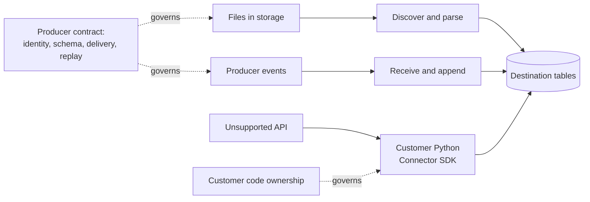

# File, Event, and Custom Connector Patterns

> [!abstract] Mental model
> Files are discovered and interpreted, events are pushed and appended, and custom connectors execute customer-owned extraction logic; each pattern creates a different data contract.

## Executive Summary

- **What it is:** Three non-database ingestion approaches for storage files, push-based events, and sources requiring custom Python extraction.
- **Why it matters:** File identity, producer delivery, replay, schema, and code ownership determine reliability more than the Fivetran setup screen.
- **Mental model:** **File = discover batches; event = receive messages; custom = run maintained extraction code.**
- **Recommend when:** The source naturally publishes stable files or events, or a stable unsupported API justifies customer-owned Connector SDK logic.
- **Reconsider when:** Producers cannot guarantee naming, retention, unique records, replay, or stable contracts, or the organization cannot own custom-code operations.

## What It Can Do

- Monitor supported storage or file-delivery locations and load new or updated files.
- Use Magic Folder Mode for simple folder-to-table mapping or Merge Mode for filename-pattern-to-table routing.
- Receive supported push events, including generic webhooks, and load them into a destination.
- Run Python Connector SDK code on Fivetran-hosted infrastructure.
- Add connector/system metadata that helps identify file or sync origin.

## What It Cannot Do

- Infer a reliable primary key, event ordering, or business meaning when the producer does not provide them.
- Recover an event that was never delivered and is no longer replayable from the producer.
- Prevent conflicting destination tables when multiple file connections write duplicate table names into one schema.
- Own Connector SDK business logic, source compatibility, tests, or data-quality outcomes for the customer.

## Core Concepts

| Concept | Plain-language meaning | Why it matters |
|---|---|---|
| Magic Folder Mode | Folder contents map to destination tables with minimal routing configuration | Simple, but file layout and naming become part of the contract |
| Merge Mode | Filename patterns route files into specified destination tables | Supports several tables from one base folder and incremental syncs |
| File identity | Path, name, modified time, and connector metadata used to recognize files | Replacement or reuse can change deduplication and replay behavior |
| Push event | Producer sends a payload to a Fivetran endpoint | Latency can be low, but delivery and replay depend on the producer |
| Append pattern | New event records are added rather than treated as current-state rows | Consumers must handle duplicates, ordering, and retention |
| Connector SDK | Python extraction code deployed to Fivetran infrastructure | Hosting is managed; code and semantics remain customer-owned |

## How It Works (Simple Flow)

1. Define the producer contract: location or endpoint, format, schema, identifiers, naming, delivery frequency, retention, and replay.
2. Choose file Magic Folder/Merge Mode, a supported event connector, or Connector SDK based on source behavior.
3. Configure access and select or define how records map to destination tables.
4. Fivetran discovers files, receives events, or invokes custom connector code and checkpoints accepted work.
5. Records are parsed, type-mapped, and loaded with available source and system metadata.
6. Producers deliver later files/events or the SDK requests later changes according to the contract.
7. Operators validate arrivals, duplicates, gaps, schema drift, replay, and destination cost.

## Visuals



## Readable Snippets

Example producer contract—not a Fivetran configuration syntax:

```yaml
dataset: daily_card_transactions
delivery_path: bank-drop/transactions/YYYY/MM/DD/
file_pattern: transactions_*.csv
record_key: transaction_id
schema_version_field: schema_version
delivery_deadline_utc: "02:00"
late_file_policy: accept_and_reconcile
replacement_policy: immutable_files_only
retention_days: 30
owner: payments-platform
```

## Consultant Talking Points

- **Client question this answers:** "Should this feed arrive as files, events, or a custom API connector?"
- **Trade-offs to mention:** Files are simple and replayable when retained; events are timely but need producer delivery guarantees; SDK is flexible but restores code ownership.
- **Risk or governance angle:** Authenticate producers, limit accepted data, classify sensitive payloads, version schemas, retain replay evidence, and assign custom-code approval.
- **Cost or operational angle:** Replaced files, duplicates, high event volume, custom retries, and poor partitioning can drive MAR, storage, compute, and support work.

## Common Pitfalls

- Reusing or overwriting filenames without a documented policy can cause missed changes, duplicate loads, or confusing reprocessing.
- Assuming a webhook proves exactly-once delivery can leave silent gaps or duplicates when producer retries and replay are weak.
- Routing several file connections to the same schema/table names can create conflicts that Fivetran does not prevent.
- Treating an append-only event table as current state can double-count entities or transactions.
- Building Connector SDK code without tests, state design, schema versioning, and an owner recreates the custom-pipeline burden the client intended to avoid.

## When to Recommend What (Decision Table)

| Situation | Recommend | Why | Watch-outs |
|---|---|---|---|
| Stable batch exports retained in object storage | File connector | Simple, inspectable, and replayable | Immutable naming, late files, schema drift, record keys |
| Several logical tables distinguished by filenames | Merge Mode | Explicit pattern-to-table routing | Overlapping patterns and duplicate table names |
| Producer can push timely immutable business events | Supported event/webhook connector | Avoids polling and captures event payloads | Authentication, duplicates, ordering, gaps, replay |
| Stable unsupported API with a clear incremental key | Connector SDK | Custom extraction on managed infrastructure | Customer owns Python, tests, state, and support |
| Complex streaming with partitions and strict delivery semantics | Dedicated streaming platform | Stronger event transport and replay controls | Higher platform complexity and cost |

## Related Topics

- [[03 Fivetran/02 Connectors and Sync Behavior/Connectors and Sync Behavior Overview|Connectors and Sync Behavior Overview]]
- [[03 Fivetran/02 Connectors and Sync Behavior/06 Connector Types Coverage and Maturity|Connector Types, Coverage, and Maturity]]
- [[03 Fivetran/02 Connectors and Sync Behavior/10 Initial Incremental Re-import and Re-sync Strategies|Initial, Incremental, Re-import, and Re-sync Strategies]]
- [[03 Fivetran/03 Destination Data History and Schema Change/13 Keys Deletes and Fivetran System Columns|Keys, Deletes, and Fivetran System Columns]]

## Related Decision Notes

- [[80 Comparisons and Decision Notes/Comparisons/Fivetran/Comparison - Fivetran vs Custom Ingestion|Fivetran vs Custom Ingestion]]
- [[80 Comparisons and Decision Notes/Decision Notes/Fivetran/Decisions - Evaluating Fivetran Connector Fit|Evaluating Fivetran Connector Fit]]

## Questions

- **Explain:** How do file discovery, pushed events, and Connector SDK differ operationally?
- **Apply:** Which contract fields would you require for a daily finance CSV feed?
- **Challenge:** What evidence would reveal an event gap that Fivetran could not recover itself?

## Sources To Revisit

- [Fivetran Docs: File Connectors](https://fivetran.com/docs/connectors/files)
- [Fivetran Docs: Webhooks](https://fivetran.com/docs/connectors/events/webhooks)
- [Fivetran Docs: Connector SDK](https://fivetran.com/docs/connector-sdk)
- [Fivetran Docs: Connectors](https://fivetran.com/docs/connectors)
