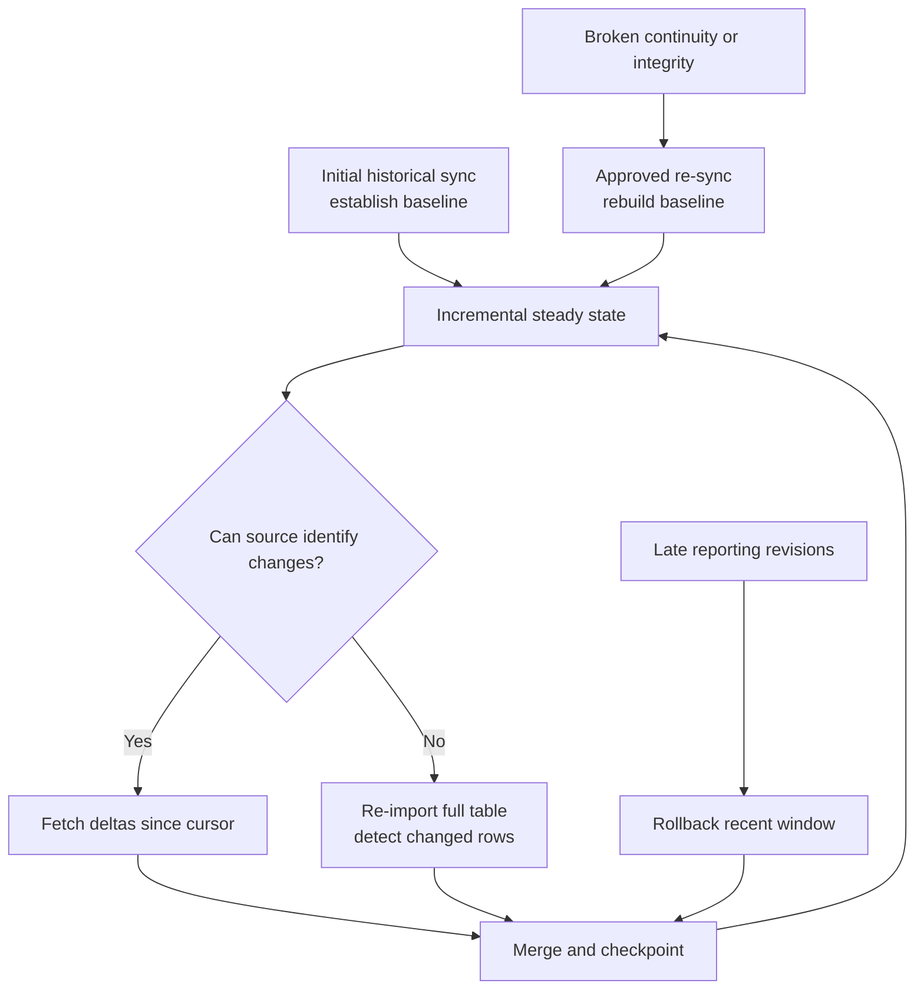

# Initial, Incremental, Re-import, and Re-sync Strategies

> [!abstract] Mental model
> Initial sync establishes the baseline, incremental sync follows changes, re-import repeatedly compares a table, and re-sync deliberately rebuilds history when continuity or integrity cannot be trusted.

## Executive Summary

- **What it is:** The main strategies Fivetran uses to establish, maintain, revisit, and reconstruct destination data.
- **Why it matters:** The strategy determines delivery order, source work, recovery behavior, destination disruption, and usage—not merely sync frequency.
- **Mental model:** **Baseline once → changes normally → periodic full comparison where necessary → full rebuild only when justified.**
- **Recommend when:** Connector documentation and operational plans explicitly identify which tables use each strategy and how downstream users are protected.
- **Reconsider when:** A critical source cannot expose reliable incrementals, the required history cannot be re-read, or frequent reconstruction would breach source or destination constraints.

## What It Can Do

- Run a mandatory initial historical sync before normal incremental operation.
- Use connector-specific cursors, logs, timestamps, or feeds to load only new or changed records.
- Re-import full tables when a source cannot expose their changes incrementally, while detecting which rows actually changed.
- Re-read recent reporting periods through connector-specific rollback syncs to capture late revisions.
- Fetch recent high-value data first for supported priority-first initial syncs while older history backfills.
- Re-sync a supported table or connection to reconstruct destination state after a confirmed integrity or continuity issue.

## What It Cannot Do

- Incrementally capture changes that the source API or database never exposes.
- Guarantee historical completeness beyond the source's accessible history, retention, or account permissions.
- Make a re-sync operationally free; even when historical MAR is free under current pricing, source, network, destination, and downstream costs remain.
- Preserve every intermediate state unless the connector's history behavior explicitly supports it.

## Core Concepts

| Concept | Plain-language meaning | Why it matters |
|---|---|---|
| Historical/initial sync | Reads available selected history to create the first baseline | Required before incremental use; duration and source impact vary |
| Incremental sync | Reads new, updated, or deleted records since retained progress | Preferred steady-state strategy for efficiency |
| Re-import table | Full table is read repeatedly because changes cannot be queried reliably | Source reads can be large even though only changed rows activate usage |
| Rollback sync | Re-reads a recent reporting window to capture late revisions | Common where conversion or report metrics change after first publication |
| Priority-first sync | Loads recent data before working backward through older history | Makes current data usable sooner but does not mean history is complete |
| Re-sync | Invalidates incremental cursors and re-fetches original records, overwriting existing rows | Recovery tool for broken continuity or integrity, not a routine retry |

## How It Works (Simple Flow)

1. Fivetran discovers selected tables and runs a historical initial sync from the source's available history.
2. It checkpoints extracted and loaded batches so a failed historical sync can continue from retained progress.
3. When the baseline completes, the connection transitions to scheduled incremental operation.
4. Incremental-capable tables fetch changes since their cursor; re-import tables are read in full and compared for actual changes.
5. Supported reporting connectors additionally re-read rollback windows, and priority-first connectors may load recent periods before older backfill.
6. Fivetran merges the resulting changes into the destination and advances progress only after successful load.
7. If incremental continuity or destination integrity is genuinely broken, an approved re-sync reconstructs the affected table or connection.

## Visuals

## Readable Snippets

| Observation | Likely strategy | Consultant interpretation |
|---|---|---|
| Current rows appear while older months are still arriving | Priority-first historical sync | Recent availability is not full historical completion |
| A small table is fully read every sync | Re-import table | Source lacks reliable incremental-change access for that object |
| Last 30 days are fetched repeatedly | Rollback sync | Late or revised metrics need a moving correction window |
| All selected records are fetched again after an incident | Re-sync | Incremental continuity or integrity was deliberately reset |
| Only changed keys are requested after baseline | Incremental sync | Normal efficient steady state |

## Consultant Talking Points

- **Client question this answers:** "Why is Fivetran reading old data again, and does that mean the pipeline is broken?"
- **Trade-offs to mention:** Incrementals are efficient but depend on reliable change tracking; re-import and rollback improve completeness where sources are weaker; re-sync offers recovery at greater operational impact.
- **Risk or governance angle:** Document which datasets are not complete during priority-first backfill and require approval plus reconciliation before a re-sync.
- **Cost or operational angle:** Current pricing distinguishes free historical/re-sync MAR from paid changed rows, but source calls, destination compute, storage, and contract-specific rules still matter.

## Common Pitfalls

- Querying a priority-first connection as if all history were complete can understate long-period finance or campaign results.
- Assuming every full read creates paid MAR confuses rows scanned with distinct rows detected as changed under current pricing.
- Treating rollback duplicates as errors can lead teams to disable the very mechanism that captures late source revisions.
- Triggering a re-sync for an ordinary transient failure can create avoidable load and downstream instability.
- Starting a re-sync without confirming source historical retention can replace a richer destination copy with a shorter source window.

## When to Recommend What (Decision Table)

| Situation | Recommend | Why | Watch-outs |
|---|---|---|---|
| Reliable source change feed after baseline | Incremental sync | Lowest routine extraction and load work | Retain logs/cursors and monitor lag |
| Small object has no reliable modified marker | Connector-managed re-import | Full comparison can still detect updates/deletes | Source API calls and large-table scalability |
| Advertising or reporting metrics revise after conversion | Documented rollback window | Converges late-adjusted measures | Window length, quotas, and current-month MAR |
| Users need recent data before a long backfill ends | Priority-first sync where supported | Accelerates time to current-period value | Label historical completeness clearly |
| Confirmed gap or destination corruption | Targeted re-sync after root-cause review | Re-establishes a trusted baseline | Downstream coordination, source history, compute, and validation |

## Related Topics

- [[03 Fivetran/02 Connectors and Sync Behavior/Connectors and Sync Behavior Overview|Connectors and Sync Behavior Overview]]
- [[03 Fivetran/01 Foundations and Platform Mental Model/03 The Connection Lifecycle|The Connection Lifecycle]]
- [[03 Fivetran/02 Connectors and Sync Behavior/11 Scheduling Latency Checkpoints and Recovery|Scheduling, Latency, Checkpoints, and Recovery]]
- [[03 Fivetran/06 Cost and Consultant Decision-Making/29 Monthly Active Rows|Monthly Active Rows]]

## Related Decision Notes

- [[80 Comparisons and Decision Notes/Decision Notes/Fivetran/Decisions - Evaluating Fivetran Connector Fit|Evaluating Fivetran Connector Fit]]

## Questions

- **Explain:** How do initial, incremental, re-import, rollback, priority-first, and re-sync operations differ?
- **Apply:** What would you communicate to analysts while a priority-first historical sync is still running?
- **Challenge:** Which integrity problem justifies a re-sync, and what should be checked before starting it?

## Sources To Revisit

- [Fivetran Docs: Sync Overview](https://fivetran.com/docs/core-concepts/syncoverview)
- [Fivetran Docs: Core Concepts — Re-syncing and Checkpoints](https://fivetran.com/docs/core-concepts)
- [Fivetran Docs: Application Reporting Connectors](https://fivetran.com/docs/connectors/applications/reports)
- [Fivetran Docs: Usage-Based Pricing](https://fivetran.com/docs/getting-started/pricing)
