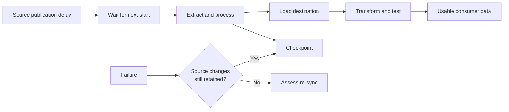

# Scheduling, Latency, Checkpoints, and Recovery

> [!abstract] Mental model
> Sync frequency is a start cadence; freshness is the age of usable downstream data after source delay, waiting, extraction, loading, transformation, and recovery.

## Executive Summary

- **What it is:** The scheduling modes, actual freshness chain, saved progress, retries, and source-retention conditions that govern ongoing delivery.
- **Why it matters:** A “15-minute connection” can still deliver data much later, while checkpoints can resume technical work without proving business completeness.
- **Mental model:** **Freshness = source availability + schedule wait + sync duration + downstream processing.** Checkpoints shorten recovery, but source history sets the recovery ceiling.
- **Recommend when:** SLAs are based on measured end-to-end freshness and paired with alerts, retained source history, runbooks, and downstream status.
- **Reconsider when:** The required latency is below connector/source capability, sync duration routinely exceeds cadence, or outages can outlast source retention.

## What It Can Do

- Run connections on fixed intervals, supported cron schedules, or API-triggered manual mode.
- Save checkpoints during historical and incremental syncs and resume from the last written checkpoint after failure.
- Retry failed syncs automatically and return to the configured schedule after recovery.
- Surface active, delayed, broken, incomplete, paused, syncing, and historical states in the dashboard.
- Continue from retained cursors after destination outages when required source history remains available.

## What It Cannot Do

- Start a second overlapping sync to compensate when the previous run exceeds its schedule; scheduled occurrences may be postponed or skipped.
- Make data fresher than the source publishes it or faster than quotas, extraction, network, and destination loading allow.
- Recover changes after a source API window, database log, or event retention period has expired.
- Prove downstream dashboards are current merely because the connection status is successful.

## Core Concepts

| Concept | Plain-language meaning | Why it matters |
|---|---|---|
| Fixed interval | Regular cadence between scheduled start opportunities | Default mode; current documented default is six hours, but plan/connector options vary |
| Cron schedule | One or more explicit calendar schedules where supported | Precise timing, but a firing is skipped when a sync is already running |
| Manual mode | Sync begins only through an explicit REST API trigger | Useful for external orchestration; the caller owns reliable triggering |
| Sync duration | Time required to extract, process, and load one run | If it approaches cadence, freshness degrades and starts are postponed |
| Checkpoint | Point through which data has been retrieved and written | Failed work resumes from recent progress rather than the entire prior sync boundary |
| Cursor | Source-specific incremental position | Maintains continuity across successful loads |
| Recovery window | Time changes remain available from the source | Must exceed plausible outage plus catch-up time |

## How It Works (Simple Flow)

1. The team chooses fixed interval, supported cron, or API-triggered manual scheduling based on business demand and connector capability.
2. At a start opportunity, Fivetran requests data made available by the source since the retained cursor or within the connector's overlap window.
3. The connection extracts, processes, and loads batches, writing checkpoints during the run.
4. On success, the cursor advances and downstream transformations or freshness checks can proceed.
5. If a run is still active at another scheduled time, Fivetran postpones or skips that occurrence according to the scheduling mode.
6. On failure, automatic retries resume from the latest checkpoint while source history remains accessible.
7. Operators escalate sustained delay before credentials, quotas, logs, or API retention turn the backlog into a re-sync requirement.
8. End-to-end monitoring confirms not only ingestion success but also transformation completion and consumer freshness.

## Visuals



## Readable Snippets

Use separate measures rather than one “freshness” label:

```text
Source available at:        09:03
Scheduled sync starts:      09:15   (+12 min wait)
Destination load completes: 09:27   (+12 min sync)
dbt build completes:        09:36   (+9 min transform)
Dashboard refresh completes:09:41   (+5 min publish)

End-to-end freshness delay: 38 minutes
```

For a recovery objective, require:

`source retention > maximum detection time + repair time + backlog catch-up time + safety margin`

## Consultant Talking Points

- **Client question this answers:** "If we set Fivetran to every 15 minutes, why is the dashboard still 45 minutes behind?"
- **Trade-offs to mention:** Shorter intervals reduce schedule wait but do not fix long-running syncs or slow downstream jobs; exact cron timing adds control but can skip occurrences when work overlaps.
- **Risk or governance angle:** Define freshness at the consumer, assign alert ownership, retain source changes beyond the recovery objective, and record when data was known incomplete.
- **Cost or operational angle:** Frequency itself does not usually multiply MAR for the same changed key in a month, but more runs can increase API calls, destination work, and downstream model runs.

## Common Pitfalls

- Promising freshness equal to sync frequency ignores source publication, offsets, run duration, transformation, and BI refresh.
- Scheduling more frequently than a typical run duration causes postponed or skipped starts rather than parallel catch-up.
- Assuming checkpoints can recover expired source changes can hide a looming full re-sync.
- Monitoring only “last successful sync” can miss delayed source data, incomplete selected scope, or failed downstream transformations.
- Using manual/API mode without idempotent triggering, monitoring, and retry ownership can silently stop ingestion.
- Letting repeated failures continue toward automatic pause without escalation increases backlog and recovery risk.

## When to Recommend What (Decision Table)

| Situation | Recommend | Why | Watch-outs |
|---|---|---|---|
| Standard analytics with flexible timing | Fixed interval | Simple managed scheduling | Measure actual completion and downstream freshness |
| Required runs at specific business times and feature is supported | Cron schedule | Precise calendar control | Plan/deployment eligibility; overlapping run fires can be skipped |
| Enterprise orchestrator owns cross-system dependencies | API-triggered manual mode | One external dependency graph | Caller owns trigger, retry, idempotency, and alerting |
| Sync duration routinely exceeds target cadence | Reduce scope or solve bottleneck before shortening schedule | Addresses the real latency driver | Source quotas, large re-import tables, destination load |
| Outage could exceed source retention | Increase retention and improve early alerting; document re-sync path | Protects incremental continuity | Storage/log cost and source-team approval |
| Critical business SLA spans ingestion and models | End-to-end freshness SLI | Measures what consumers actually receive | Correlate source, Fivetran, dbt, and BI timestamps |

## Related Topics

- [[03 Fivetran/02 Connectors and Sync Behavior/Connectors and Sync Behavior Overview|Connectors and Sync Behavior Overview]]
- [[03 Fivetran/01 Foundations and Platform Mental Model/03 The Connection Lifecycle|The Connection Lifecycle]]
- [[03 Fivetran/02 Connectors and Sync Behavior/10 Initial Incremental Re-import and Re-sync Strategies|Initial, Incremental, Re-import, and Re-sync Strategies]]
- [[03 Fivetran/05 Security Governance and Production Operations/26 Monitoring Logging Freshness and the Platform Connector|Monitoring, Logging, Freshness, and the Platform Connector]]

## Related Decision Notes

- [[80 Comparisons and Decision Notes/Decision Notes/Fivetran/Decisions - Evaluating Fivetran Connector Fit|Evaluating Fivetran Connector Fit]]
- [[80 Comparisons and Decision Notes/Decision Notes/Fivetran/Decisions - Designing a Fivetran Production Operating Model|Designing a Fivetran Production Operating Model]]

## Questions

- **Explain:** Why is sync frequency not the same as consumer freshness?
- **Apply:** Which timestamps would you collect for a 60-minute finance-report freshness SLA?
- **Challenge:** How can a recoverable destination outage become unrecoverable without any checkpoint defect?

## Sources To Revisit

- [Fivetran Docs: Sync Overview](https://fivetran.com/docs/core-concepts/syncoverview)
- [Fivetran Docs: Core Concepts — Data Checkpoints](https://fivetran.com/docs/core-concepts)
- [Fivetran Docs: Connections and Statuses](https://fivetran.com/docs/getting-started/fivetran-dashboard/connectors)
- [Fivetran Docs: Monitor and Optimize Usage](https://fivetran.com/docs/usage-based-pricing/manage-mar)
