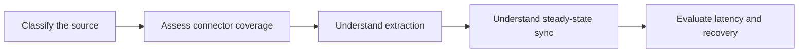

# Connectors and Sync Behavior Overview

> Evaluate connector fit by understanding the source, extraction strategy, latency, recovery behavior, and ownership boundary.

> [!abstract] Chapter outcome
> You should be able to assess a connector beyond catalog availability and explain how Fivetran initially loads, incrementally maintains, and recovers source data.

## Topics

- [[03 Fivetran/02 Connectors and Sync Behavior/06 Connector Types Coverage and Maturity|06 - Connector Types, Coverage, and Maturity]]
- [[03 Fivetran/02 Connectors and Sync Behavior/07 Application and API Connectors|07 - Application and API Connectors]]
- [[03 Fivetran/02 Connectors and Sync Behavior/08 Database Connectors CDC and High-Volume Agent|08 - Database Connectors, CDC, and High-Volume Agent]]
- [[03 Fivetran/02 Connectors and Sync Behavior/09 File Event and Custom Connector Patterns|09 - File, Event, and Custom Connector Patterns]]
- [[03 Fivetran/02 Connectors and Sync Behavior/10 Initial Incremental Re-import and Re-sync Strategies|10 - Initial, Incremental, Re-import, and Re-sync Strategies]]
- [[03 Fivetran/02 Connectors and Sync Behavior/11 Scheduling Latency Checkpoints and Recovery|11 - Scheduling, Latency, Checkpoints, and Recovery]]

## Chapter Map

## How To Use This Area

Use the source-specific topics to build recognition, then use Topics 10 and 11 to reason about operational behavior across connectors.

## Related Areas

- [[03 Fivetran/Fivetran Learning Map|Fivetran Learning Map]]
- [[03 Fivetran/01 Foundations and Platform Mental Model/Foundations and Platform Mental Model Overview|Previous: Foundations and Platform Mental Model]]
- [[03 Fivetran/03 Destination Data History and Schema Change/Destination Data History and Schema Change Overview|Next: Destination Data, History, and Schema Change]]
