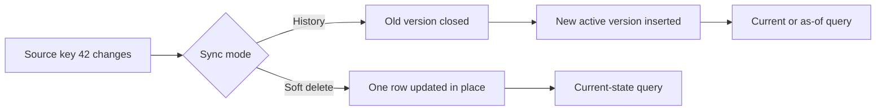

# Soft Delete Mode vs History Mode

> Choose between a current-state replica with delete markers and SCD Type 2 row versions for point-in-time analysis.

## Executive Summary

- **What it is:** Fivetran's two sync modes for representing updates and deletes in destination tables.
- **Why it matters:** The mode changes row grain, query logic, storage, Monthly Active Rows (MAR), and whether prior source values remain available.
- **Mental model:** Soft delete keeps one row per source key; history mode keeps one row per source-key version.
- **Recommend when:** Use soft delete for a faithful current-state landing layer; use history mode only where change history has durable analytical or audit value.
- **Reconsider when:** The connector or table does not support selectable history mode, update volume is high, or consumers cannot safely handle versioned rows.

## What It Can Do

- Mark source-deleted rows without physically removing them in soft delete mode.
- Preserve every observed version of supported records using SCD Type 2 semantics in history mode.
- Identify the current history row with `_fivetran_active` and version validity with `_fivetran_start` and `_fivetran_end`.
- Support current-state, as-of, and change-over-time analysis from the same history table.
- Migrate supported tables between modes from connection schema settings.

## What It Cannot Do

- Reconstruct changes that occurred before history tracking began or between source observations that the connector never captured.
- Offer selectable history mode for every connector or table; some tables are fixed to one mode.
- Preserve the original historical timeline when a history-mode re-sync begins: prior rows remain but are closed, and active history starts again from the re-sync point.
- Make an SCD table safe to query without explicit current-row or as-of predicates.

## Core Concepts

| Concept | Plain-language meaning | Why it matters |
|---|---|---|
| Soft delete mode | One destination row per source key; deletes set `_fivetran_deleted = TRUE` | Simple current-state grain, but prior values are overwritten |
| History mode | One destination row per observed version | Enables point-in-time analysis at greater volume and query complexity |
| Active version | History row where `_fivetran_active = TRUE` | The current-state filter for a history table |
| Validity interval | `_fivetran_start` to `_fivetran_end` | Defines when a row version applied |
| Mode migration | Fivetran changes system columns and destination representation | Can pause the sync and alter downstream contracts |
| Re-sync boundary | Time from which active history is re-established | A re-sync is not a replay of every past source change |

## How It Works (Simple Flow)

1. Confirm the connector feature table shows which tables support history mode and whether the setting is selectable.
2. Choose the mode per supported table before initial sync where possible.
3. In soft delete mode, Fivetran upserts the matching destination row and marks detected source deletes with `_fivetran_deleted = TRUE`.
4. In history mode, a change closes the old version and inserts a new active version with a new validity interval.
5. Downstream models filter active rows or use an as-of predicate according to their business need.
6. If the mode changes, treat the system-column and grain change as a governed downstream migration.
7. Validate row counts, active-row uniqueness, and historical boundaries after migrations or re-syncs.

## Visuals



## Readable Snippets

Current rows use different predicates:

```sql
-- Soft delete mode
select *
from raw.crm.customer
where not coalesce(_fivetran_deleted, false);

-- History mode
select *
from raw.crm.customer_history
where _fivetran_active;
```

An as-of query uses a half-open interval to avoid two versions matching a boundary:

```sql
where _fivetran_start <= :as_of_timestamp
  and _fivetran_end   >  :as_of_timestamp
```

## Consultant Talking Points

- **Client question this answers:** "Do we need only the latest source state, or must we explain what was true at an earlier time?"
- **Trade-offs to mention:** History mode provides audit-friendly versions but increases rows, storage, MAR, and downstream complexity.
- **Risk or governance angle:** A mode switch changes table grain and system columns; version it like a data-contract change.
- **Cost or operational angle:** Frequently updated records create new destination rows in history mode and each inserted version can contribute to paid MAR.

## Common Pitfalls

- Treating `_fivetran_deleted = FALSE` as sufficient without handling `NULL` can accidentally exclude valid rows in some migrated or legacy data.
- Enabling history mode on high-churn tables by default can sharply increase MAR and Snowflake storage.
- Joining a history table without `_fivetran_active` or an as-of condition creates duplicate business keys and inflated measures.
- Assuming history mode backfills source history can create false audit claims; it records only history Fivetran can observe from activation onward.
- Re-syncing a history table without documenting the boundary can make analysts misread the new active-history period as continuous source history.

## When to Recommend What (Decision Table)

| Situation | Recommend | Why | Watch-outs |
|---|---|---|---|
| Operational reporting needs latest source state | Soft delete mode | Stable one-row-per-key grain | Always exclude deleted rows where appropriate |
| Regulatory or commercial analysis needs past attribute values | History mode | Native SCD Type 2 versions support as-of analysis | Confirm connector support and retention expectations |
| Only a few entities require history | History mode on selected supported tables | Limits cost and complexity | Document mixed sync modes in the same schema |
| History is needed for modeled business entities rather than raw tables | Soft delete plus dbt snapshots or effective-dated models | Keeps history scope under transformation-team control | History begins only when downstream capture starts |
| Very high update volume with little historical value | Soft delete mode | Avoids unnecessary versions | Source deletes still require correct filtering |

## Related Topics

- [[03 Fivetran/03 Destination Data History and Schema Change/Destination Data History and Schema Change Overview|Destination Data, History, and Schema Change Overview]]
- [[03 Fivetran/03 Destination Data History and Schema Change/13 Keys Deletes and Fivetran System Columns|Keys, Deletes, and Fivetran System Columns]]
- [[03 Fivetran/03 Destination Data History and Schema Change/16 Data Contracts Completeness and Reconciliation|Data Contracts, Completeness, and Reconciliation]]

## Related Decision Notes

- [[80 Comparisons and Decision Notes/Comparisons/Fivetran/Comparison - Soft Delete Mode vs History Mode|Soft Delete Mode vs History Mode]]
- [[80 Comparisons and Decision Notes/Decision Notes/Fivetran/Decisions - Estimating and Controlling Fivetran Cost|Estimating and Controlling Fivetran Cost]]

## Questions

- **Explain:** How does the destination grain differ between soft delete and history mode?
- **Apply:** Which mode would you choose for a customer status table used in regulatory reporting, and why?
- **Challenge:** What source, connector, or cost limitation could make native history mode unsuitable?

## Sources To Revisit

- [Fivetran - Sync Modes](https://fivetran.com/docs/core-concepts/sync-modes)
- [Fivetran - History Mode](https://fivetran.com/docs/core-concepts/sync-modes/history-mode)
- [Fivetran - System Columns and Tables](https://fivetran.com/docs/core-concepts/system-columns-and-tables)
- [Fivetran - Monthly Active Rows](https://fivetran.com/docs/usage-based-pricing)
