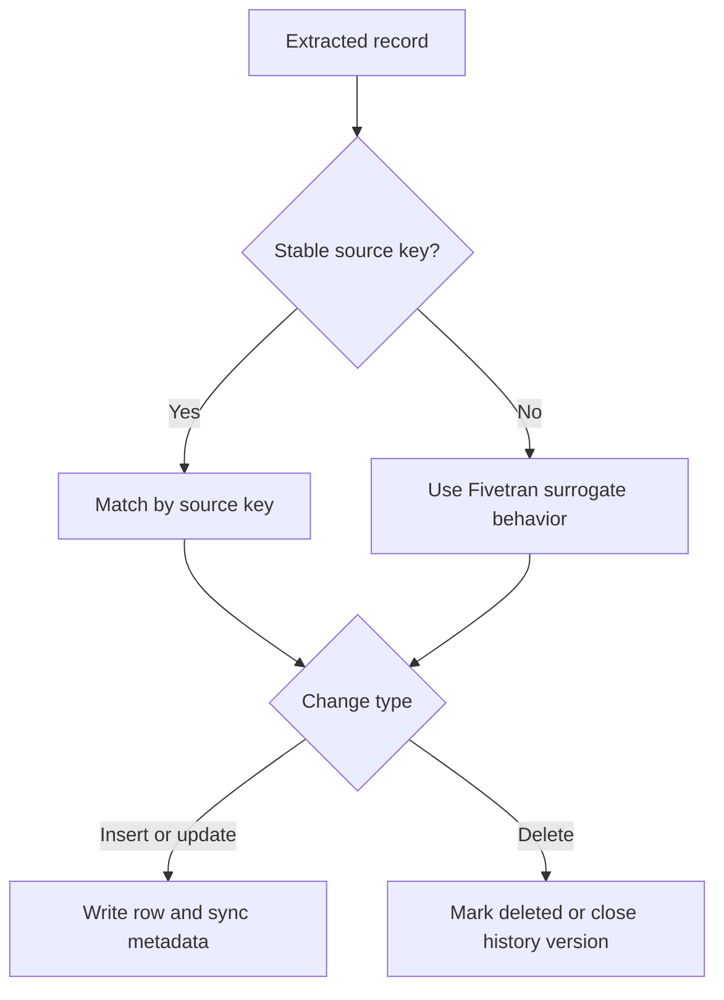

# Keys, Deletes, and Fivetran System Columns

> Read Fivetran metadata correctly so updates, duplicate prevention, delete state, and freshness are not confused.

## Executive Summary

- **What it is:** The interaction between source row identity, connector delete detection, and Fivetran-added metadata in destination tables.
- **Why it matters:** Wrong assumptions about keys or system columns cause duplicate facts, resurrected deletes, and misleading freshness checks.
- **Mental model:** Keys answer "which row?"; sync mode answers "how is change represented?"; system columns describe Fivetran's handling of that row.
- **Recommend when:** Establish key and delete semantics for every important source table before downstream modeling.
- **Reconsider when:** A source lacks stable keys, the connector cannot reliably detect deletes, or a bulk operation has different metadata behavior.

## What It Can Do

- Use source primary keys to match later changes to the correct destination row.
- Generate `_fivetran_id` as a surrogate key where a stable source primary key is unavailable.
- Use `_fivetran_index` to preserve the observed order of updates for some keyless tables.
- Mark detected deletes with `_fivetran_deleted` in soft delete mode.
- Record row-level load time with `_fivetran_synced` and history validity with history-mode columns.

## What It Cannot Do

- Invent a durable business identity when the source has no stable key; a hash-based `_fivetran_id` reflects row values, not business meaning.
- Guarantee delete capture where the source API, logs, or connector strategy cannot expose deletes promptly.
- Make `_fivetran_synced` a source business-event timestamp or an end-to-end dashboard freshness timestamp.
- Update `_fivetran_synced` for every bulk delete case; truncates, mass deletes during re-sync, and history-mode deletes are documented exceptions.

## Core Concepts

| Concept | Plain-language meaning | Why it matters |
|---|---|---|
| Source primary key | Stable columns identifying one source row | Lets Fivetran apply updates and deletes to the right row |
| `_fivetran_id` | Fivetran-generated hash-like surrogate key based on row values | Avoids exact duplicates in keyless tables but is not a business key |
| `_fivetran_index` | Observed update ordering for certain keyless tables | Helps interpret successive records where identity is weak |
| `_fivetran_deleted` | Soft-delete indicator | Current-state queries generally exclude `TRUE` rows |
| `_fivetran_synced` | UTC time Fivetran last synced the row | Useful for load observation, not source-event truth |
| History columns | `_fivetran_active`, `_fivetran_start`, `_fivetran_end` | Define current and prior versions in history mode |

## How It Works (Simple Flow)

1. Fivetran identifies the connector-defined or source primary key for a table.
2. If no suitable primary key exists, connector-specific behavior may add `_fivetran_id` and `_fivetran_index`.
3. Each sync matches extracted records to destination identity and inserts or updates the appropriate row representation.
4. When a supported delete is detected, soft delete mode marks the row deleted; history mode closes the active version.
5. Fivetran writes system timestamps and flags according to the operation and documented exceptions.
6. Downstream staging models expose a clean business key, filter current state, and retain metadata needed for audit and troubleshooting.
7. Reconciliation separately proves source coverage, key uniqueness, delete handling, and downstream freshness.

## Visuals



## Readable Snippets

Inspect key, delete, and load behavior before building a downstream source model:

```sql
select
    count(*)                                      as physical_rows,
    count_if(not coalesce(_fivetran_deleted,false)) as current_rows,
    count(distinct customer_id)                   as distinct_source_keys,
    max(_fivetran_synced)                         as latest_row_sync
from raw.crm.customer;
```

Use a deterministic dbt staging filter rather than deleting raw rows:

```sql
select * exclude (_fivetran_deleted)
from {{ source('crm_raw', 'customer') }}
where not coalesce(_fivetran_deleted, false)
```

## Consultant Talking Points

- **Client question this answers:** "How do we know an update or delete applies to the right record, and what do these `_fivetran_*` columns mean?"
- **Trade-offs to mention:** Source keys give stable replication semantics; keyless sources require weaker surrogate behavior and stronger downstream controls.
- **Risk or governance angle:** Preserve system metadata in raw data and document its meaning; do not expose it as business truth without interpretation.
- **Cost or operational angle:** Key changes and repeated row-value changes can create additional MAR and increase merge or history volume.

## Common Pitfalls

- Treating `_fivetran_id` as a stable customer or transaction identifier can break joins when row values change.
- Physically deleting soft-deleted raw rows removes reconciliation evidence and can cause deleted records to reappear after a re-sync.
- Using `max(_fivetran_synced)` alone as pipeline freshness can report "fresh" when only one row arrived while expected data is missing.
- Assuming every source delete is immediately observable can leave stale active records for connectors that infer deletes through later re-imports.
- Ignoring nullable delete flags can exclude valid rows or produce inconsistent current-state logic across models.

## When to Recommend What (Decision Table)

| Situation | Recommend | Why | Watch-outs |
|---|---|---|---|
| Stable source primary key exists | Preserve and test it as the raw grain | Best update and delete matching | Key reuse or mutable composite keys |
| Source has no key but rows are append-only | Retain `_fivetran_id` and define a downstream event key | Supports deduplication and traceability | Row-value changes may produce a new ID |
| Consumers need current state | Filter soft deletes in staging | Centralizes a consistent rule | Keep raw deleted rows for audit |
| Consumers need as-of state | Use history columns and uniqueness tests on active key | Correct version semantics | Never join unfiltered history to facts |
| Delete detection is weak or delayed | Add source-to-destination reconciliation | Detects stale records | Define cadence and remediation owner |

## Related Topics

- [[03 Fivetran/03 Destination Data History and Schema Change/Destination Data History and Schema Change Overview|Destination Data, History, and Schema Change Overview]]
- [[03 Fivetran/03 Destination Data History and Schema Change/12 Soft Delete Mode vs History Mode|Soft Delete Mode vs History Mode]]
- [[03 Fivetran/03 Destination Data History and Schema Change/16 Data Contracts Completeness and Reconciliation|Data Contracts, Completeness, and Reconciliation]]
- [[02 dbt/01 Core Concepts and Project Structure/07 Sources and Source Freshness|dbt Sources and Source Freshness]]

## Related Decision Notes

- [[80 Comparisons and Decision Notes/Comparisons/Fivetran/Comparison - Soft Delete Mode vs History Mode|Soft Delete Mode vs History Mode]]

## Questions

- **Explain:** Why is `_fivetran_synced` not the same as the source event time?
- **Apply:** How would you model a current customer table when deletes are soft-marked?
- **Challenge:** Which key or connector limitation could make destination state unreliable?

## Sources To Revisit

- [Fivetran - System Columns and Tables](https://fivetran.com/docs/core-concepts/system-columns-and-tables)
- [Fivetran - Sync Modes](https://fivetran.com/docs/core-concepts/sync-modes)
- [Fivetran - History Mode](https://fivetran.com/docs/core-concepts/sync-modes/history-mode)
- [Fivetran - Features](https://fivetran.com/docs/core-concepts/features)
