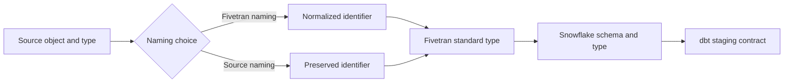

# Destination Schemas, Naming, and Data Type Mapping

> Understand how source objects become destination schemas, identifiers, and Snowflake types before downstream contracts depend on them.

## Executive Summary

- **What it is:** Fivetran's rules for placing connector data into destination schemas and translating names and source types.
- **Why it matters:** Naming and type conversion determine stable dbt source references, query behavior, precision, and schema-change risk.
- **Mental model:** Fivetran preserves source shape where practical, then normalizes it into a destination-compatible contract.
- **Recommend when:** Decide the destination schema or prefix and naming convention before the initial sync, then isolate raw names behind staging models.
- **Reconsider when:** Source-preserved identifiers conflict with destination restrictions, Quickstart models are required, or source types cannot map without semantic loss.

## What It Can Do

- Create and manage a destination schema for each non-database connection.
- Prefix replicated source schemas for database connections, producing separate destination schemas.
- Standardize identifiers with Fivetran naming or preserve original UTF-8 identifiers with Source naming where supported.
- Convert source-specific types into Fivetran standard types and then Snowflake destination types.
- Convert timezone-bearing source timestamps to UTC and retain timestamps without timezone as timezone-free values.

## What It Cannot Do

- Guarantee source and destination types have identical precision, range, timezone semantics, or nested structure.
- Change an existing connection to Source naming after its initial sync has begun.
- Use Source naming with Quickstart transformations.
- Prevent all naming collisions or reserved-word conflicts; incompatible Source-named objects can be excluded with a warning.

## Core Concepts

| Concept | Plain-language meaning | Why it matters |
|---|---|---|
| Destination schema | Namespace receiving one non-database connection | Defines raw ownership and dbt source location |
| Schema prefix | Prefix combined with each source schema for database replication | Prevents collisions when one source exposes many schemas |
| Fivetran naming | Lowercase, underscore-oriented normalized identifiers | Predictable and portable, but not exact source spelling |
| Source naming | Preserve original source identifiers | Improves fidelity but introduces quoting and compatibility risk |
| Standard type | Fivetran's intermediate representation | Explains why destination types may differ from source types |
| Type promotion | Moving values to a broader compatible destination type | Protects loading but may change downstream contracts |

## How It Works (Simple Flow)

1. Choose a destination schema name or database-connector schema prefix before the initial sync.
2. Select Fivetran naming or Source naming where the connector and destination support the choice.
3. Fivetran discovers source schemas, tables, columns, and types.
4. Identifier rules normalize or preserve each name and resolve it against destination constraints.
5. Source values are converted to Fivetran standard types and then mapped to Snowflake types.
6. Fivetran creates or evolves destination objects and loads data.
7. dbt staging models cast, rename, document, and test the durable analytical interface.

## Visuals



## Readable Snippets

Database schema prefixes and non-database schemas behave differently:

```text
Database connection
  prefix: erp
  source schemas: sales, finance
  destination schemas: erp_sales, erp_finance

Application connection
  destination schema: crm
  all selected connector tables land in: raw.crm
```

A staging model should stabilize names and semantics:

```sql
select
    id::varchar                         as customer_id,
    created_at::timestamp_ntz           as created_at_utc,
    amount::number(18, 2)               as amount
from {{ source('crm_raw', 'customer') }}
```

The `created_at` cast assumes the raw value is already normalized to UTC. If the source field carries another timezone or no reliable timezone, make that conversion rule explicit rather than inferring it silently.

## Consultant Talking Points

- **Client question this answers:** "What will the source look like in Snowflake, and can downstream names remain stable?"
- **Trade-offs to mention:** Normalized naming improves consistency; Source naming improves fidelity but can require quoted identifiers and is incompatible with Quickstart transformations.
- **Risk or governance angle:** Treat raw names and mapped types as vendor-managed inputs; publish a controlled dbt staging contract instead.
- **Cost or operational angle:** Broad types, nested data, and repeated schema evolution can increase storage, parsing work, and downstream rebuilds.

## Common Pitfalls

- Choosing a schema or prefix casually before initial sync can create a costly migration or duplicate landing area later.
- Enabling Source naming without testing reserved words and case sensitivity can cause excluded objects or fragile quoted SQL.
- Assuming a source decimal, timestamp, or semi-structured field maps losslessly can produce rounding or timezone defects.
- Pointing business models directly at raw connector names makes ordinary connector schema evolution a production breaking change.
- Renaming a source field conceptually in dbt without retaining lineage can make reconciliation and incident diagnosis difficult.

## When to Recommend What (Decision Table)

| Situation | Recommend | Why | Watch-outs |
|---|---|---|---|
| Standard analytics stack with portable SQL | Fivetran naming | Consistent lowercase identifiers | Verify normalized-name collisions |
| Exact source names are a formal requirement | Source naming | Preserves source identifiers | Quoting, reserved words, and no Quickstart |
| Database source exposes multiple schemas | Stable connection prefix | Keeps source namespaces separated | Prefix changes are disruptive |
| Raw type has financial precision requirements | Explicit dbt cast plus tests | Makes precision and scale contractual | Test overflow and rounding before publication |
| Source schema is volatile | Raw landing plus stable staging layer | Shields consumers from connector shape | Staging team owns migration logic |

## Related Topics

- [[03 Fivetran/03 Destination Data History and Schema Change/Destination Data History and Schema Change Overview|Destination Data, History, and Schema Change Overview]]
- [[03 Fivetran/03 Destination Data History and Schema Change/15 Schema Change Handling and Data Selection Controls|Schema Change Handling and Data Selection Controls]]
- [[03 Fivetran/04 Fivetran with Snowflake and dbt/18 Snowflake Database Schema Warehouse and Cost Design|Snowflake Database, Schema, Warehouse, and Cost Design]]
- [[02 dbt/02 Modeling Patterns and Layering/11 Staging Models|dbt Staging Models]]

## Related Decision Notes

- No related decision note yet.

## Questions

- **Explain:** Why should a dbt staging layer sit between raw connector names and business models?
- **Apply:** Which naming option would you choose for a new Snowflake analytics project using Quickstart models?
- **Challenge:** Which precision, timezone, or identifier constraint could invalidate a simple one-to-one mapping?

## Sources To Revisit

- [Fivetran - Naming Conventions](https://fivetran.com/docs/core-concepts/no-renaming)
- [Fivetran - Core Concepts](https://fivetran.com/docs/core-concepts)
- [Fivetran - Snowflake Destination](https://fivetran.com/docs/destinations/snowflake)
- [Snowflake - Data Types](https://docs.snowflake.com/en/sql-reference/intro-summary-data-types)
