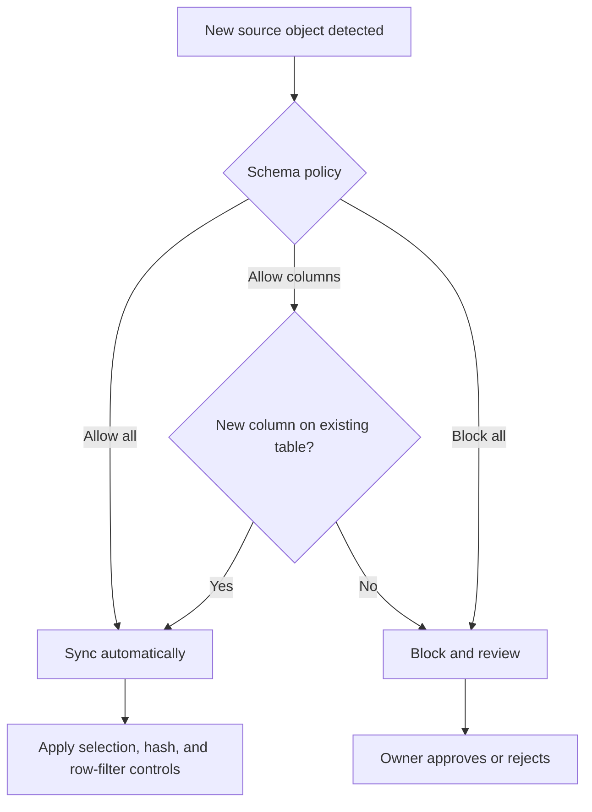

# Schema Change Handling and Data Selection Controls

> Control how new source objects propagate and limit which rows, tables, columns, or sensitive values are replicated.

## Executive Summary

- **What it is:** Connection-level schema-change policy plus table, column, hashing, and supported row-filter controls.
- **Why it matters:** Automatic discovery is convenient, but uncontrolled propagation can expose sensitive data, increase MAR, and break downstream contracts.
- **Mental model:** Schema policy controls future discovery; selection controls scope; hashing changes values; row filters restrict qualifying records.
- **Recommend when:** Review source scope before initial sync and use the least permissive policy compatible with the client's operating model.
- **Reconsider when:** The connector has non-configurable tables, filtering limitations, or compliance requirements that cannot tolerate data passing through Fivetran processing.

## What It Can Do

- `Allow all`: sync new schemas, configurable tables, and columns as Fivetran discovers them.
- `Allow columns`: accept new columns on existing tables while blocking new schemas and configurable tables.
- `Block all`: require explicit enablement for newly discovered schemas, configurable tables, and columns.
- Exclude selected tables or columns, hash supported non-key columns with salted SHA-256, and filter supported rows.
- Notify operators when new data objects are detected even if policy blocks automatic propagation.

## What It Cannot Do

- Block or hash primary-key columns.
- Guarantee that excluded data never passes temporarily through Fivetran systems during extraction.
- Reduce MAR merely by blocking a column; a row changed only in a blocked column can still be captured and written.
- Apply row filters identically to every connector, inherit a parent-table filter to child tables, or define more than one filter per table.
- Automatically re-enable columns previously blocked when policy changes from `Block all` to `Allow columns`.

## Core Concepts

| Concept | Plain-language meaning | Why it matters |
|---|---|---|
| Allow all | New source objects flow automatically | Lowest administration, highest change exposure |
| Allow columns | Existing tables may widen automatically | Balances convenience with table-level control |
| Block all | New objects wait for approval | Strongest change gate, highest operating effort |
| Data blocking | Omit selected tables or columns from the destination | Limits exposure, but has lifecycle and MAR caveats |
| Column hashing | Replace values with salted one-way SHA-256 hashes | Preserves equality joins without readable PII |
| Row filtering | Sync only rows matching supported criteria | Reduces replicated scope when connector support is adequate |

## How It Works (Simple Flow)

1. Fivetran discovers the source schema during setup or early extraction.
2. Review and explicitly select required tables and columns; identify sensitive and key fields.
3. Choose `Allow all`, `Allow columns`, or `Block all` for future source changes.
4. Configure supported hashing and row filters, recording purpose and control owner.
5. Start the initial sync and validate the destination contains only approved scope.
6. Route new-object notifications through a review process before enabling blocked data.
7. When changing filters, blocking, or hashing, decide whether a re-sync is required to remediate historical destination values.

## Visuals



## Readable Snippets

A practical pre-sync control record:

```yaml
connection: core_banking_prod
schema_change: block_all
selected_tables: [account, customer, transaction]
blocked_columns: [customer.national_id]
hashed_columns: [customer.email]
row_filter: "transaction.booking_date >= 2025-01-01"
owner: data-platform
approver: data-protection
```

Changing a control is not automatically retroactive:

```text
Block column now        -> choose drop or replace historical destination values with NULL
Hash column now         -> re-sync to hash historical values
Enable missed column    -> re-sync if historical values are required
Change existing filter  -> table re-sync is required
```

## Consultant Talking Points

- **Client question this answers:** "How do we stop new or sensitive source data from appearing in the warehouse without approval?"
- **Trade-offs to mention:** More permissive policies reduce administration; restrictive policies improve control but require active ownership and timely schema review.
- **Risk or governance angle:** Blocking and hashing are useful controls, not complete privacy architecture; document temporary processing, salts, re-sync behavior, and downstream copies.
- **Cost or operational angle:** Table and row scope can reduce MAR and destination cost, while column blocking alone does not necessarily reduce MAR.

## Common Pitfalls

- Choosing `Allow all` for a regulated source can replicate newly added PII before review.
- Choosing `Block all` without notifications and ownership can silently omit business-critical fields and break completeness.
- Hashing a column without re-syncing leaves historical values unhashed or null according to the selected action, creating inconsistent protection.
- Assuming a row filter on a parent applies to child tables can leak out-of-scope related records.
- Blocking or hashing a filter column removes the dependent row filter, which can unexpectedly broaden or change replicated scope.
- Treating hashing as encryption is incorrect: it is one-way and may still be personal data when linkability remains.

## When to Recommend What (Decision Table)

| Situation | Recommend | Why | Watch-outs |
|---|---|---|---|
| Low-risk source with rapid additive change | Allow columns | Existing tables evolve with modest review burden | New columns can still break strict downstream contracts |
| Regulated operational database | Block all plus notifications and approval | Prevents unreviewed propagation | Resource a timely schema-review process |
| Stable SaaS connector with trusted vendor schema | Allow all or allow columns after classification | Minimizes manual maintenance | Reassess custom fields and PII exposure |
| Join is needed but clear-text PII is not | Hash supported non-key column | Retains equality matching | Destination-specific salt and re-sync history |
| Only a defined time or tenant scope is permitted | Supported row filter plus reconciliation | Limits replicated rows | Connector limits, child tables, and re-sync effects |
| Column is unnecessary | Block at ingestion and remove historical copies | Data minimization | Blocking alone may not reduce MAR |

## Related Topics

- [[03 Fivetran/03 Destination Data History and Schema Change/Destination Data History and Schema Change Overview|Destination Data, History, and Schema Change Overview]]
- [[03 Fivetran/03 Destination Data History and Schema Change/14 Destination Schemas Naming and Data Type Mapping|Destination Schemas, Naming, and Data Type Mapping]]
- [[03 Fivetran/03 Destination Data History and Schema Change/16 Data Contracts Completeness and Reconciliation|Data Contracts, Completeness, and Reconciliation]]
- [[01 Snowflake/04 Data Engineering/29 Semi-structured Data, Schema Drift, and Data Contracts|Snowflake Schema Drift and Data Contracts]]

## Related Decision Notes

- [[80 Comparisons and Decision Notes/Decision Notes/Fivetran/Decisions - Designing a Fivetran Production Operating Model|Designing a Fivetran Production Operating Model]]

## Questions

- **Explain:** What is the difference between schema-change policy and data selection?
- **Apply:** Which policy and controls would you propose for a banking customer table?
- **Challenge:** What limitation means blocked data may still require a broader privacy assessment?

## Sources To Revisit

- [Fivetran - Configure Data Blocking and Column Hashing](https://fivetran.com/docs/core-concepts/features/data-blocking-column-hashing/config)
- [Fivetran - Data Blocking and Column Hashing](https://fivetran.com/docs/core-concepts/features/data-blocking-column-hashing)
- [Fivetran - Row Filtering](https://fivetran.com/docs/using-fivetran/features/row-filter)
- [Fivetran - Connection Schemas](https://fivetran.com/docs/using-fivetran/fivetran-dashboard/connectors/schema)
