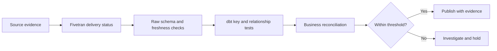

# Data Contracts, Completeness, and Reconciliation

> Define what downstream controls must prove even when Fivetran reports a successful sync.

## Executive Summary

- **What it is:** A layered control framework for schema expectations, delivery freshness, row completeness, key integrity, and business-value reconciliation.
- **Why it matters:** A technically successful sync proves pipeline execution, not that every expected source record arrived or financial meaning is correct.
- **Mental model:** Fivetran delivers source-shaped data; contracts define expected shape; reconciliation proves expected content.
- **Recommend when:** Assign controls and owners at source, ingestion, staging, and publication boundaries for every material dataset.
- **Reconsider when:** Source evidence is unavailable or expectations are undefined; in that case, confidence must be stated as limited rather than assumed.

## What It Can Do

- Use Fivetran status and metadata to establish whether extraction and loading completed.
- Use dbt source freshness to compare warehouse load timestamps against explicit warning and error thresholds.
- Test keys, nullability, accepted values, relationships, and current-row uniqueness in staging.
- Reconcile counts, control totals, balances, and bounded periods against independent source evidence.
- Produce durable evidence showing what was checked, when, against which source, and with what result.

## What It Cannot Do

- Infer the correct business totals, materiality thresholds, or close-period rules automatically.
- Prove completeness from `_fivetran_synced` alone.
- Recover data that a source API never exposed or whose retention window expired.
- Prevent all upstream breaking changes; contracts detect or gate defined violations after a boundary is established.
- Replace source-system ownership and sign-off for authoritative balances.

## Core Concepts

| Concept | Plain-language meaning | Why it matters |
|---|---|---|
| Data contract | Explicit schema, grain, semantics, and service expectations | Turns assumptions into testable obligations |
| Freshness | Delay between expected source availability and usable warehouse data | Distinguishes schedule from actual readiness |
| Completeness | Whether all expected records or scope arrived | A successful job can still be incomplete |
| Reconciliation | Comparison with independent source totals or records | Detects omissions, duplication, and semantic defects |
| Control total | Count, sum, balance, or hash used as evidence | Provides a measurable acceptance criterion |
| Materiality | Threshold determining whether a difference requires action | Prevents both silent errors and excessive false alarms |

## How It Works (Simple Flow)

1. Identify the authoritative source, table grain, business keys, expected scope, and availability SLA.
2. Define structural contracts for required columns, types, nullability, accepted values, and change policy.
3. Monitor Fivetran connection status and delivery timestamps to establish ingestion health.
4. Run dbt source freshness and staging tests after relevant syncs complete.
5. Compare independent source counts and business control totals to destination results for the same closed boundary.
6. Classify differences by timing, known transformation, source defect, ingestion defect, or model defect.
7. Block or warn publication according to materiality, record evidence, remediate, and re-run the controls.

## Visuals



## Readable Snippets

A compact dbt source definition separates delivery freshness from structural tests:

```yaml
sources:
  - name: core_banking_raw
    database: raw
    schema: core_banking
    loaded_at_field: _fivetran_synced
    freshness:
      warn_after: {count: 2, period: hour}
      error_after: {count: 4, period: hour}
    tables:
      - name: transaction
        columns:
          - name: transaction_id
            data_tests: [not_null, unique]
```

Reconcile the same business boundary on both sides:

```sql
select
    booking_date,
    count(*) as transaction_count,
    sum(amount) as booked_amount
from curated.finance.transaction
where booking_date >= :period_start
  and booking_date <  :period_end
group by booking_date;
```

## Consultant Talking Points

- **Client question this answers:** "If Fivetran says the sync succeeded, how do we prove the data is complete and safe to publish?"
- **Trade-offs to mention:** Strong reconciliation costs compute and operational effort; apply the deepest controls to material datasets and boundaries.
- **Risk or governance angle:** Preserve source extracts or signed control totals, code version, run IDs, timestamps, thresholds, exceptions, approvals, and remediation evidence.
- **Cost or operational angle:** Layer inexpensive freshness and key checks first, then run heavier record-level or aggregate reconciliation at appropriate cadences.

## Common Pitfalls

- Equating a successful connection status with complete business data can publish partial periods.
- Comparing source and destination at different cutoff times creates false discrepancies and wasted investigation.
- Using only row counts misses duplicate-and-missing pairs or value corruption that net to the same count.
- Using only sums misses offsetting errors and invalid dimensional allocation.
- Allowing every new source column while enforcing rigid downstream contracts without a change workflow causes avoidable incidents.
- Recording test results without source evidence, boundary, or code version produces weak audit evidence.

## When to Recommend What (Decision Table)

| Situation | Recommend | Why | Watch-outs |
|---|---|---|---|
| Low-risk exploratory data | Freshness plus basic key and null tests | Proportionate, fast feedback | Label confidence and avoid critical publication |
| Material financial transactions | Counts, sums, key integrity, and source control-total reconciliation | Detects financially meaningful defects | Align period, currency, status, and cutoff |
| Source has frequent additive columns | Permissive raw ingestion plus controlled staging contract | Keeps ingestion resilient and publication stable | Review sensitive fields before propagation |
| Closed-period reporting | Immutable reconciliation evidence and approval gate | Supports audit and restatement control | Late-arriving data needs explicit policy |
| Source cannot provide independent totals | Record-level sampling and documented limitation | Improves confidence without false certainty | Escalate inability to prove completeness |

## Related Topics

- [[03 Fivetran/03 Destination Data History and Schema Change/Destination Data History and Schema Change Overview|Destination Data, History, and Schema Change Overview]]
- [[03 Fivetran/03 Destination Data History and Schema Change/13 Keys Deletes and Fivetran System Columns|Keys, Deletes, and Fivetran System Columns]]
- [[03 Fivetran/03 Destination Data History and Schema Change/15 Schema Change Handling and Data Selection Controls|Schema Change Handling and Data Selection Controls]]
- [[02 dbt/02 Modeling Patterns and Layering/20 Reconciliation Models|dbt Reconciliation Models]]

## Related Decision Notes

- [[80 Comparisons and Decision Notes/Decision Notes/Fivetran/Decisions - Designing a Fivetran Production Operating Model|Designing a Fivetran Production Operating Model]]

## Questions

- **Explain:** What does a successful Fivetran sync prove, and what does it not prove?
- **Apply:** Which controls would you require before publishing daily transaction totals?
- **Challenge:** What limitation prevents a warehouse-only check from proving source completeness?

## Sources To Revisit

- [Fivetran - System Columns and Tables](https://fivetran.com/docs/core-concepts/system-columns-and-tables)
- [Fivetran - Fivetran Platform Connector](https://fivetran.com/docs/logs/fivetran-platform)
- [dbt - Source Freshness](https://docs.getdbt.com/docs/deploy/source-freshness)
- [dbt - Data Tests](https://docs.getdbt.com/docs/build/data-tests)
