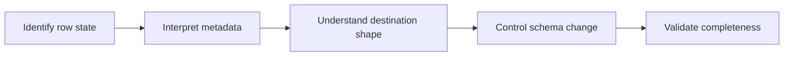

# Destination Data, History, and Schema Change Overview

> Interpret the destination correctly and manage the schema and data-quality boundary between ingestion and downstream consumers.

> [!abstract] Chapter outcome
> You should be able to explain row history and delete semantics, recognize Fivetran metadata, manage source schema changes, and define downstream validation responsibilities.

## Topics

- [[03 Fivetran/03 Destination Data History and Schema Change/12 Soft Delete Mode vs History Mode|12 - Soft Delete Mode vs History Mode]]
- [[03 Fivetran/03 Destination Data History and Schema Change/13 Keys Deletes and Fivetran System Columns|13 - Keys, Deletes, and Fivetran System Columns]]
- [[03 Fivetran/03 Destination Data History and Schema Change/14 Destination Schemas Naming and Data Type Mapping|14 - Destination Schemas, Naming, and Data Type Mapping]]
- [[03 Fivetran/03 Destination Data History and Schema Change/15 Schema Change Handling and Data Selection Controls|15 - Schema Change Handling and Data Selection Controls]]
- [[03 Fivetran/03 Destination Data History and Schema Change/16 Data Contracts Completeness and Reconciliation|16 - Data Contracts, Completeness, and Reconciliation]]

## Chapter Map

## How To Use This Area

Use these notes together when determining whether destination data can safely be consumed by dbt or other downstream workloads.

## Related Areas

- [[03 Fivetran/Fivetran Learning Map|Fivetran Learning Map]]
- [[03 Fivetran/02 Connectors and Sync Behavior/Connectors and Sync Behavior Overview|Previous: Connectors and Sync Behavior]]
- [[03 Fivetran/04 Fivetran with Snowflake and dbt/Fivetran with Snowflake and dbt Overview|Next: Fivetran with Snowflake and dbt]]
