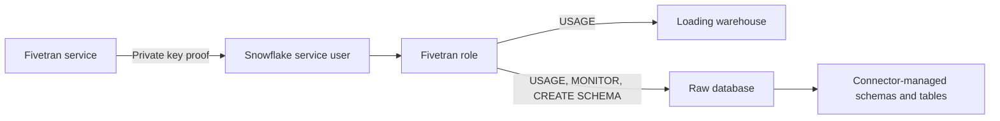

# Setting Up Snowflake as a Destination

> Connect Fivetran to Snowflake with a dedicated service identity, strong authentication, scoped privileges, connectivity, and setup validation.

## Executive Summary

- **What it is:** The Snowflake user, role, database, warehouse, authentication, network path, and Fivetran destination configuration used for loading.
- **Why it matters:** Destination setup determines blast radius, recoverability, cost attribution, and whether every connection can load reliably.
- **Mental model:** One non-human identity gets one loading role, approved landing database access, and warehouse usage—never broad administrative power.
- **Recommend when:** Use a dedicated `TYPE=SERVICE` user with key-pair authentication and a purpose-built role; test the complete path before enabling connectors.
- **Reconsider when:** Existing shared credentials, network policy, region, or privilege design cannot meet security and operational requirements.

## What It Can Do

- Authenticate Fivetran to Snowflake with key-pair credentials.
- Restrict loading to a designated database and warehouse through a custom role.
- Let Fivetran create and manage connector schemas and tables within the approved database.
- Use direct connectivity or supported private connectivity and SaaS or Hybrid deployment patterns.
- Run setup tests for connectivity, required privileges, staging access, and regional compatibility where applicable.

## What It Cannot Do

- Operate with `SELECT`-only access; Fivetran must create and mutate destination objects.
- Make a shared warehouse isolated from BI or dbt contention.
- Remove the need to rotate keys, review grants, monitor service-user activity, and test recovery.
- Bypass Snowflake network policies or private-connectivity prerequisites.
- Safely use a human password identity as a durable service-account design; Snowflake is enforcing stronger authentication for service users.

## Core Concepts

| Concept | Plain-language meaning | Why it matters |
|---|---|---|
| Destination | Fivetran configuration pointing at one database and warehouse | Multiple connections share its load and control boundary |
| Service user | Non-human Snowflake identity with `TYPE=SERVICE` | Separates automation from personal access |
| Key-pair authentication | Private key proves identity against Snowflake's stored public key | Passwordless machine authentication with rotation support |
| Fivetran role | Custom role granted only required destination capabilities | Limits blast radius and supports auditability |
| Loading warehouse | Compute used for staging, merges, and destination writes | Main Snowflake compute-cost and contention boundary |
| Setup tests | Fivetran checks connection and required capabilities | Catches many configuration defects before production sync |

## How It Works (Simple Flow)

1. Select SaaS or Hybrid deployment and the required direct or private network path.
2. Create a dedicated Fivetran role and `TYPE=SERVICE` user; keep administrative roles out of runtime access.
3. Create or select the landing database and loading warehouse with deliberate ownership, sizing, and auto-suspend.
4. Grant warehouse `USAGE` and the documented database privileges required for Fivetran-managed schemas and objects.
5. Generate a key pair, store the private key in Fivetran, and assign only the public key to the Snowflake user.
6. Enter account host, database, warehouse, user, role, timezone, and network settings in the destination.
7. Run Save & Test, review every result, perform a small controlled sync, and confirm query history, object ownership, and cost attribution.

## Visuals



## Readable Snippets

Recognition-level Snowflake setup based on Fivetran's documented privilege model:

```sql
use role securityadmin;
create role if not exists FIVETRAN_ROLE;
create user if not exists FIVETRAN_USER
  type = service
  default_role = FIVETRAN_ROLE
  default_warehouse = FIVETRAN_WH;
grant role FIVETRAN_ROLE to user FIVETRAN_USER;
alter user FIVETRAN_USER set rsa_public_key = '<PUBLIC_KEY>';

use role sysadmin;
grant usage on warehouse FIVETRAN_WH to role FIVETRAN_ROLE;
grant usage, monitor, create schema
  on database RAW to role FIVETRAN_ROLE;
```

Fivetran's setup tests also validate effective `CREATE TABLE` and `CREATE TEMPORARY TABLE` capability within its managed destination context. Validate the actual vendor script and target ownership model rather than copying this abbreviated example blindly.

## Consultant Talking Points

- **Client question this answers:** "What exactly must Fivetran be allowed to do in our Snowflake account?"
- **Trade-offs to mention:** A dedicated database and warehouse simplify isolation and attribution; shared resources reduce object count and potentially idle cost but couple workloads.
- **Risk or governance angle:** Use a service user, key rotation, network restrictions, separate administrative provisioning, and periodic effective-grant review.
- **Cost or operational angle:** A dedicated warehouse makes spend visible; sync frequency and resume cycles still determine billed seconds.

## Common Pitfalls

- Granting `ACCOUNTADMIN` or `SYSADMIN` to the runtime user creates an unnecessary high-impact credential.
- Using a password-based human user creates rotation, MFA, ownership, and Snowflake strong-authentication problems.
- Assigning a private key with incorrect formatting or failing to plan dual-key rotation can cause avoidable outages.
- Reusing the Fivetran user for dbt or ad hoc work destroys attribution and broadens compromise impact.
- Treating Save & Test as complete acceptance can miss naming, ownership, cost, and downstream-readiness issues only visible in a controlled sync.
- Forgetting private connectivity or IP safelisting for failover regions can make a nominal failover configuration unusable.

## When to Recommend What (Decision Table)

| Situation | Recommend | Why | Watch-outs |
|---|---|---|---|
| Standard production deployment | Service user plus key pair and custom role | Strong, auditable machine identity | Define rotation owner and runbook |
| Regulated network boundary | Private connectivity or approved Hybrid pattern | Reduces public network exposure | Plan edition, region, DNS, routing, and failover |
| Small pilot with low concurrency | Shared warehouse with dedicated user and role | Avoids premature warehouse sprawl | Tag and monitor Fivetran usage separately |
| Material production ingestion | Dedicated loading warehouse | Isolation and cost attribution | Right-size and auto-suspend |
| Multiple database or warehouse boundaries | Separate Fivetran destinations | Destination maps to one configured database/warehouse pair | More configuration and governance overhead |

## Related Topics

- [[03 Fivetran/04 Fivetran with Snowflake and dbt/Fivetran with Snowflake and dbt Overview|Fivetran with Snowflake and dbt Overview]]
- [[03 Fivetran/04 Fivetran with Snowflake and dbt/18 Snowflake Database Schema Warehouse and Cost Design|Snowflake Database, Schema, Warehouse, and Cost Design]]
- [[01 Snowflake/08 Enterprise Snowflake in Production/56 Authentication and Service Identity Patterns|Snowflake Authentication and Service Identity Patterns]]
- [[01 Snowflake/03 Security and Governance/12 RBAC Roles and Privileges|Snowflake RBAC Roles and Privileges]]

## Related Decision Notes

- [[80 Comparisons and Decision Notes/Comparisons/Fivetran/Comparison - SaaS vs Hybrid Deployment|SaaS vs Hybrid Deployment]]
- [[80 Comparisons and Decision Notes/Decision Notes/Fivetran/Decisions - Designing a Fivetran Production Operating Model|Designing a Fivetran Production Operating Model]]

## Questions

- **Explain:** Why does Fivetran need both a service user and a role?
- **Apply:** Which resources and privileges would you provision for an isolated production landing zone?
- **Challenge:** Which network, authentication, or ownership constraint could make the setup fail after initial testing?

## Sources To Revisit

- [Fivetran - Snowflake Destination Setup Guide](https://fivetran.com/docs/destinations/snowflake/setup-guide)
- [Fivetran - Snowflake Destination](https://fivetran.com/docs/destinations/snowflake)
- [Snowflake - Authentication Overview](https://docs.snowflake.com/en/user-guide/security-authentication-overview)
- [Snowflake - Key-Pair Authentication](https://docs.snowflake.com/en/user-guide/key-pair-auth)
