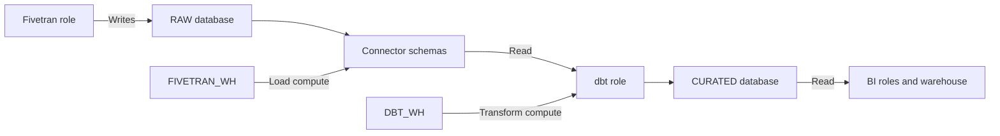

# Snowflake Database, Schema, Warehouse, and Cost Design

> Design the raw landing zone and loading compute so ingestion is isolated, recoverable, understandable, and cost-visible.

## Executive Summary

- **What it is:** The database, connector-schema, table-type, warehouse, scheduling, and ownership choices behind a Fivetran Snowflake destination.
- **Why it matters:** These choices control workload contention, recovery options, storage protection, cost attribution, and access boundaries.
- **Mental model:** Separate by responsibility: Fivetran owns raw writes, dbt owns transformation writes, and consumer roles get read access to approved outputs.
- **Recommend when:** Start with a clearly named raw database, connector-managed schemas, and a small dedicated load warehouse where production isolation or attribution matters.
- **Reconsider when:** Data cannot be reconstructed, syncs are highly bursty, or sharing infrastructure creates unacceptable contention or privilege coupling.

## What It Can Do

- Isolate raw replicated data from curated dbt models by database and schema.
- Isolate Fivetran load compute from transformation and BI compute with separate warehouses.
- Attribute warehouse usage to ingestion through dedicated compute and Snowflake query history.
- Use auto-suspend and auto-resume to limit idle warehouse runtime.
- Use transient landing objects where data is independently reproducible and reduced Fail-safe storage is worth lower recovery protection.

## What It Cannot Do

- Eliminate compute charges: Fivetran executes Snowflake SQL to stage and merge data.
- Make the smallest warehouse cheapest for every workload; long-running merges may benefit from measured resizing.
- Make transient data recoverable after its limited Time Travel period; transient objects have no Fail-safe.
- Fully isolate workloads on a shared warehouse.
- Guarantee cost efficiency from auto-suspend alone; frequent suspend/resume cycles repeatedly incur Snowflake's 60-second minimum per start.

## Core Concepts

| Concept | Plain-language meaning | Why it matters |
|---|---|---|
| Raw database | Governed landing boundary for source-shaped data | Simplifies grants, retention, and ownership |
| Connector schema | Fivetran-managed namespace for a connection or source schema | Avoid manual writes and name collisions |
| Dedicated warehouse | Compute used only for Fivetran loads | Provides isolation and clear attribution |
| Shared warehouse | Compute used by multiple workloads | Can reduce fragmentation but adds contention |
| Auto-suspend | Stop idle compute after a configured delay | Controls idle credits but must fit query cadence |
| Transient table | Persistent table with 0-1 day Time Travel and no Fail-safe | Reduces protection storage at the cost of recovery |

## How It Works (Simple Flow)

1. Classify source criticality, re-extract feasibility, freshness target, volume, and expected update pattern.
2. Choose the raw database and stable connector schema or schema-prefix convention.
3. Assign Fivetran ownership of raw schemas while keeping dbt and consumers read-only there.
4. Choose permanent or transient landing protection based on recovery objectives and source replay capability.
5. Choose a dedicated or shared warehouse, beginning with measured small capacity and appropriate auto-suspend.
6. Align sync schedules where practical so incremental loads batch efficiently without violating freshness needs.
7. Monitor warehouse runtime, queueing, query duration, storage history, failed loads, and downstream readiness; resize or isolate based on evidence.

## Visuals



## Readable Snippets

Start conservatively and measure:

```sql
create warehouse if not exists FIVETRAN_WH
  warehouse_size = 'XSMALL'
  auto_suspend = 60
  auto_resume = true
  initially_suspended = true;

-- Review actual ingestion consumption by warehouse.
select
  date_trunc('day', start_time) as usage_day,
  sum(credits_used)             as credits_used
from snowflake.account_usage.warehouse_metering_history
where warehouse_name = 'FIVETRAN_WH'
group by 1
order by 1;
```

Snowflake bills each warehouse start for at least 60 seconds, then per second. A one-minute auto-suspend is a starting point, not a universal optimum.

## Consultant Talking Points

- **Client question this answers:** "Should Fivetran have its own Snowflake database and warehouse, and what will that cost?"
- **Trade-offs to mention:** Dedicated resources improve isolation and attribution; shared resources can be economical at small scale but make queueing and ownership less clear.
- **Risk or governance angle:** Raw schemas should be vendor-managed, access-controlled, and treated as reconstructable evidence—not manually corrected business tables.
- **Cost or operational angle:** Total Snowflake cost includes load compute, storage, Time Travel/Fail-safe, and downstream transformations triggered by each delivery.

## Common Pitfalls

- Running Fivetran, dbt, and BI on one warehouse can make ingestion SLAs unpredictable during dashboard or build peaks.
- Setting aggressive auto-suspend between tightly spaced statements can cause repeated 60-second minimum charges and slower loads.
- Making all raw objects transient without proving source replay can turn a Snowflake incident into permanent data loss.
- Letting analysts write into connector schemas creates drift that Fivetran may overwrite or invalidate during re-syncs.
- Oversizing permanently to fix one backfill wastes credits during normal incremental loads.
- Ignoring high-churn Time Travel and Fail-safe bytes can make storage cost exceed expectations even when active tables look small.

## When to Recommend What (Decision Table)

| Situation | Recommend | Why | Watch-outs |
|---|---|---|---|
| Production with clear SLA or chargeback | Dedicated Fivetran warehouse | Isolation and attribution | Monitor resume frequency and utilization |
| Small pilot with light, non-overlapping use | Shared warehouse | Lower initial administration | Add query tags and contention alerts |
| Raw data is fully and quickly reproducible | Consider transient raw database | Avoids Fail-safe storage | Only 0-1 day Time Travel and no Fail-safe |
| Source history is limited or re-extract is slow | Permanent raw objects | Stronger recovery protection | Additional retained storage cost |
| Large temporary backfill | Temporarily resize or isolate warehouse | Reduces elapsed time and blast radius | Revert size and validate cost afterward |
| Frequent small syncs | Measure batching and auto-suspend behavior | May reduce repeated starts | Do not weaken freshness without agreement |

## Related Topics

- [[03 Fivetran/04 Fivetran with Snowflake and dbt/Fivetran with Snowflake and dbt Overview|Fivetran with Snowflake and dbt Overview]]
- [[03 Fivetran/04 Fivetran with Snowflake and dbt/17 Setting Up Snowflake as a Destination|Setting Up Snowflake as a Destination]]
- [[03 Fivetran/04 Fivetran with Snowflake and dbt/19 Fivetran to Snowflake to dbt Ownership Boundaries|Fivetran to Snowflake to dbt Ownership Boundaries]]
- [[01 Snowflake/06 Cost Management and Operations/46 Warehouse Scheduling and Auto-suspend|Warehouse Scheduling and Auto-suspend]]

## Related Decision Notes

- [[80 Comparisons and Decision Notes/Decision Notes/Fivetran/Decisions - Estimating and Controlling Fivetran Cost|Estimating and Controlling Fivetran Cost]]

## Questions

- **Explain:** What do database separation and warehouse separation each isolate?
- **Apply:** Would you use transient raw tables for a source that retains only seven days of history?
- **Challenge:** Which workload pattern can make a one-minute auto-suspend setting more expensive than expected?

## Sources To Revisit

- [Fivetran - Snowflake Destination](https://fivetran.com/docs/destinations/snowflake)
- [Fivetran - Snowflake Destination Setup Guide](https://fivetran.com/docs/destinations/snowflake/setup-guide)
- [Snowflake - Warehouse Considerations](https://docs.snowflake.com/en/user-guide/warehouses-considerations)
- [Snowflake - Storage Costs for Time Travel and Fail-safe](https://docs.snowflake.com/en/user-guide/data-cdp-storage-costs)
