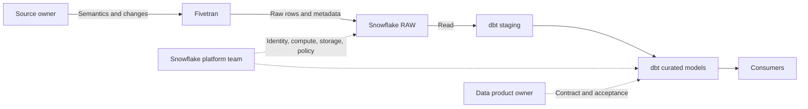

# Fivetran to Snowflake to dbt Ownership Boundaries

> Assign ingestion, storage, transformation, testing, documentation, orchestration, and publication responsibilities clearly.

## Executive Summary

- **What it is:** An operating model separating Fivetran data movement, Snowflake platform services, and dbt analytical transformation.
- **Why it matters:** Overlapping ownership creates untested assumptions, manual raw-table fixes, unclear incidents, and security gaps.
- **Mental model:** Fivetran moves source-shaped data; Snowflake stores and computes under policy; dbt turns raw data into governed analytical products.
- **Recommend when:** Give every boundary an accountable owner, observable handoff, explicit service expectation, and escalation path.
- **Reconsider when:** A chosen tool is being stretched to cover logic or controls better owned by another layer.

## What It Can Do

- Make Fivetran responsible for connector configuration, extraction state, sync completion, and destination write behavior.
- Make Snowflake responsible for service identities, RBAC, networking, compute, storage, recovery, and policy enforcement.
- Make dbt responsible for staging, business rules, tests, documentation, lineage, and curated publication.
- Separate raw evidence from modeled business truth.
- Define incident routing using the first failed boundary rather than one undifferentiated "data pipeline" owner.

## What It Cannot Do

- Remove shared responsibility: source changes, connector behavior, warehouse constraints, and model logic interact.
- Make Fivetran sync success prove dbt model correctness or dashboard freshness.
- Make Snowflake grants alone define business data ownership.
- Make dbt recover source changes that were never ingested.
- Eliminate the need for end-to-end reconciliation and service-level objectives.

## Core Concepts

| Concept | Plain-language meaning | Why it matters |
|---|---|---|
| Raw boundary | Source-shaped tables written by Fivetran | Preserves traceability and isolates vendor-managed objects |
| Staging boundary | dbt's typed, renamed, current-state interface | Shields business logic from raw connector quirks |
| Curated boundary | Tested business entities and measures | Becomes the governed consumer contract |
| Platform ownership | Snowflake security, compute, storage, and recovery | Controls shared infrastructure and cost |
| Handoff control | Observable condition proving one layer is ready for the next | Prevents "job ran" from being mistaken for "data ready" |
| RACI | Responsible, accountable, consulted, and informed roles | Prevents operational ambiguity |

## How It Works (Simple Flow)

1. The source owner communicates source semantics, planned changes, expected volume, and authoritative control totals.
2. Fivetran authenticates, extracts, checkpoints, and writes source-shaped records plus system metadata into raw Snowflake schemas.
3. Snowflake enforces the service identity, network, role, storage, warehouse, and recovery boundaries.
4. An orchestration gate checks relevant sync completion and required freshness before transformation.
5. dbt staging models normalize names, types, keys, delete semantics, and source tests.
6. dbt intermediate and marts apply reviewed business logic, contracts, documentation, and reconciliation.
7. Published outputs expose approved data to consumer roles while operational evidence spans all three layers.

## Visuals



## Readable Snippets

A compact responsibility matrix:

| Control | Primary owner | Evidence |
|---|---|---|
| Source permissions and sync configuration | Fivetran/platform operator | Connection config and sync logs |
| Snowflake role, warehouse, network, recovery | Snowflake platform team | Grants, policies, usage, recovery test |
| Raw delete and system-column interpretation | Analytics engineering | Staging SQL and tests |
| Business rules and published grain | Data product owner + dbt team | Reviewed models, docs, contracts |
| Source-to-report reconciliation | Data owner + analytics engineering | Control totals and signed exceptions |

```yaml
# dbt establishes the stable boundary; it does not edit raw Fivetran tables.
sources:
  - name: crm_raw
    database: raw
    schema: crm
models:
  - name: stg_crm__customer
    access: protected
```

## Consultant Talking Points

- **Client question this answers:** "Which tool and team owns each part of this pipeline?"
- **Trade-offs to mention:** Strong separation improves governance and troubleshooting; it adds explicit handoffs and requires cross-team service agreements.
- **Risk or governance angle:** Never correct business data manually in Fivetran-managed raw tables; fix the source, replication issue, or versioned dbt logic and retain evidence.
- **Cost or operational angle:** Separate warehouses and identities expose cost by responsibility, while integrated scheduling can couple ingestion and transformation runtime.

## Common Pitfalls

- Putting business transformations in raw ingestion conventions makes connector upgrades and re-syncs dangerous.
- Letting dbt write into Fivetran-managed schemas creates ownership conflicts and possible overwrite or drop behavior.
- Assigning source freshness only to the dbt team ignores connector and source availability failures.
- Treating the platform team as owner of business reconciliation leaves semantic defects without an accountable decision-maker.
- Sharing one service identity across Fivetran and dbt prevents reliable audit and cost attribution.
- Alerting every team on every failure without boundary-based routing creates noise and slow recovery.

## When to Recommend What (Decision Table)

| Situation | Recommend | Why | Watch-outs |
|---|---|---|---|
| Standard managed ELT | Fivetran raw, Snowflake platform, dbt curated | Clear strengths and ownership | Define handoff SLAs and evidence |
| Simple low-risk reporting | Thin dbt staging and marts | Still centralizes delete/type rules | Avoid direct BI access to raw |
| Source-specific transformation is required before loading | Reassess connector or preprocessing pattern | Fivetran is primarily ELT | Additional platform ownership and lineage |
| Regulated financial output | Data product owner approves contract and reconciliation | Business accountability cannot be delegated to tools | Formal exception and restatement process |
| Incident affects raw row counts | Start at source/Fivetran boundary | Earliest failed control narrows diagnosis | Check source cutoff and connector strategy |
| Raw is correct but measure is wrong | Route to dbt/data product owner | Defect is in semantic transformation | Assess downstream restatement impact |

## Related Topics

- [[03 Fivetran/04 Fivetran with Snowflake and dbt/Fivetran with Snowflake and dbt Overview|Fivetran with Snowflake and dbt Overview]]
- [[03 Fivetran/04 Fivetran with Snowflake and dbt/20 Transformation and Orchestration Options|Transformation and Orchestration Options]]
- [[03 Fivetran/03 Destination Data History and Schema Change/16 Data Contracts Completeness and Reconciliation|Data Contracts, Completeness, and Reconciliation]]
- [[02 dbt/08 dbt on Snowflake and Finance Patterns/81 Fivetran to Snowflake to dbt Flow|dbt Fivetran to Snowflake to dbt Flow]]

## Related Decision Notes

- [[80 Comparisons and Decision Notes/Decision Notes/Fivetran/Decisions - Designing a Fivetran Production Operating Model|Designing a Fivetran Production Operating Model]]

## Questions

- **Explain:** Where should raw delete handling end and business transformation begin?
- **Apply:** Who should own the decision to publish a financial report with a small reconciliation difference?
- **Challenge:** Which shared responsibility is most likely to fall between teams in your client context?

## Sources To Revisit

- [Fivetran - Core Concepts](https://fivetran.com/docs/core-concepts)
- [Fivetran - Transformations](https://fivetran.com/docs/transformations)
- [Snowflake - Access Control Overview](https://docs.snowflake.com/en/user-guide/security-access-control-overview)
- [dbt - Build and Document Data Projects](https://docs.getdbt.com/docs/build/projects)
