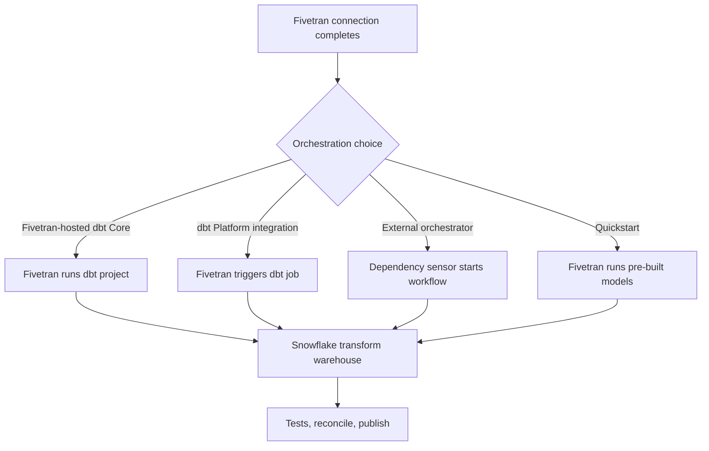

# Transformation and Orchestration Options

> Choose where dbt runs and how completed Fivetran syncs trigger transformations without confusing schedule with data readiness.

## Executive Summary

- **What it is:** The choice among Fivetran Quickstart models, Fivetran-hosted dbt Core, Fivetran-triggered dbt Platform jobs, or an external orchestrator.
- **Why it matters:** The option determines ownership, deployment controls, observability, dependency handling, cost, and whether ingestion is coupled to transformation runtime.
- **Mental model:** Fivetran may run or trigger transformations, but Snowflake still executes the SQL and the data team still owns model correctness.
- **Recommend when:** Use the simplest option that meets dependency, CI/CD, audit, environment, and incident-management needs.
- **Reconsider when:** Integrated scheduling delays source syncs, multiple non-Fivetran dependencies exist, or regulated deployment controls require a broader orchestrator.

## What It Can Do

- Run pre-built Quickstart data models or imported Fivetran data-model packages for supported sources.
- Host and run a Git-backed dbt Core project against supported destinations including Snowflake.
- Trigger dbt Platform jobs after selected connection syncs or on a configured schedule.
- Use integrated, custom/Smart Syncing, or cron-oriented schedules for supported Fivetran transformation types.
- Keep raw data available when a transformation fails so models can be corrected and rerun.

## What It Cannot Do

- Guarantee new rows landed merely because a connection sync completed; third-party integrated triggers can run even when no new data arrived.
- Prevent long integrated transformations from delaying the next connection sync in a sequential pipeline.
- Replace dbt development practices such as code review, environment isolation, tests, documentation, and artifact retention.
- Orchestrate every cross-platform dependency as flexibly as a general-purpose orchestrator.
- Eliminate Snowflake compute cost or Fivetran transformation usage considerations.

## Core Concepts

| Concept | Plain-language meaning | Why it matters |
|---|---|---|
| Quickstart model | Fivetran-managed pre-built model configured from the dashboard | Fast time to value with limited customization ownership |
| Fivetran data model | dbt package imported into a client-controlled project | Reusable starting logic under client version control |
| Hosted dbt Core | Fivetran checks out and executes a dbt project | Reduces orchestration infrastructure |
| Integrated scheduling | Relevant connection completion triggers downstream work | Aligns models to ingestion, but couples pipeline duration |
| Custom schedule | Transformation runs by time, optionally with Smart Syncing | Decouples cadence while optionally waiting for dependencies |
| External orchestration | Another platform owns the end-to-end DAG | Best for mixed tools, complex dependencies, and central operations |

## How It Works (Simple Flow)

1. Inventory upstream Fivetran connections, non-Fivetran dependencies, freshness objectives, and publication deadlines.
2. Decide whether to adopt a Quickstart model, import a Fivetran data-model package, or maintain custom dbt models.
3. Choose the execution owner: Fivetran-hosted dbt Core, dbt Platform, or an external orchestrator.
4. Define the trigger: integrated connection completion, custom/Smart Syncing schedule, cron, or external dependency event.
5. Run source freshness and staging gates before expensive or material downstream models.
6. Execute SQL in a separately governed Snowflake transformation warehouse and capture logs, artifacts, and tests.
7. Publish only after required controls pass; monitor end-to-end latency, skipped/duplicate runs, transformation duration, and effects on the next sync.

## Visuals



## Readable Snippets

A trigger should identify both dependency and acceptance gate:

```yaml
pipeline: daily_finance
trigger_connections:
  - core_banking
  - exchange_rates
preconditions:
  - source_freshness_passed
  - expected_business_date_present
command: dbt build --select tag:daily_finance
publication_gate: reconciliation_passed
```

Fivetran-hosted dbt Core can run explicit job commands from the project:

```text
dbt deps
dbt build --select path:models/staging+
```

Keep secrets and target credentials in the execution platform, not the Git repository.

## Consultant Talking Points

- **Client question this answers:** "Should Fivetran also run dbt, or should our existing orchestration platform own it?"
- **Trade-offs to mention:** Fivetran-hosted execution is simpler; dbt Platform provides a fuller dbt operating experience; external orchestration handles broader dependencies but adds platform ownership.
- **Risk or governance angle:** Separate code approval from runtime credentials and retain the code revision, invocation, test results, and reconciliation evidence for material runs.
- **Cost or operational angle:** Integrated pipelines can run models frequently and delay subsequent syncs; use selective commands, appropriate cadence, and separate Snowflake compute.

## Common Pitfalls

- Triggering a full dbt project after every frequent sync can multiply model runs and Snowflake compute without improving business freshness.
- Assuming integrated scheduling means "new data arrived" can create redundant dbt Platform runs when a sync completes without changed data.
- Running a two-hour transformation in a one-hour integrated pipeline can delay the next Fivetran sync.
- Mixing Fivetran-hosted and external schedules for the same outputs can create overlapping runs and write conflicts.
- Adopting Quickstart output as a governed final model without validating grain, logic, package version, and source configuration can publish incorrect semantics.
- Failing to preserve dbt artifacts and Fivetran run evidence makes cross-layer incident diagnosis slow.

## When to Recommend What (Decision Table)

| Situation | Recommend | Why | Watch-outs |
|---|---|---|---|
| Small team, Fivetran-centric pipeline, modest controls | Fivetran-hosted dbt Core | Low orchestration overhead | Confirm CI, environment, artifact, and alert needs |
| Team already standardizes on dbt Platform | Fivetran-triggered dbt Platform job or native dbt scheduling | Keeps dbt operations centralized | Avoid duplicate schedulers and no-change triggers |
| Many non-Fivetran dependencies or enterprise DAGs | External orchestrator | One end-to-end dependency and recovery model | More engineering and platform support |
| Need rapid supported-source analytics | Quickstart model for evaluation | Fast starting point | Validate logic before production adoption |
| Need customization and version control | Import Fivetran data-model package into owned dbt project | Reuse plus local governance | Pin versions and own upgrades |
| Long transformations reduce ingestion frequency | Decoupled custom or external schedule | Protects sync cadence | Add explicit freshness gates |

## Related Topics

- [[03 Fivetran/04 Fivetran with Snowflake and dbt/Fivetran with Snowflake and dbt Overview|Fivetran with Snowflake and dbt Overview]]
- [[03 Fivetran/04 Fivetran with Snowflake and dbt/19 Fivetran to Snowflake to dbt Ownership Boundaries|Fivetran to Snowflake to dbt Ownership Boundaries]]
- [[02 dbt/05 Deployment CI CD and Operations/44 Scheduling and Orchestration|dbt Scheduling and Orchestration]]
- [[02 dbt/08 dbt on Snowflake and Finance Patterns/74 dbt Projects on Snowflake vs dbt Platform vs Self-Operated dbt|dbt Execution Options]]

## Related Decision Notes

- [[80 Comparisons and Decision Notes/Decision Notes/dbt/Decisions - Choosing a dbt Scheduling and Orchestration Pattern|Choosing a dbt Scheduling and Orchestration Pattern]]

## Questions

- **Explain:** What is the difference between who triggers dbt and who executes the resulting SQL?
- **Apply:** Which option fits a client with Airflow, APIs, Fivetran, and a strict daily close dependency chain?
- **Challenge:** How could integrated scheduling unintentionally reduce ingestion freshness?

## Sources To Revisit

- [Fivetran - Transformations](https://fivetran.com/docs/transformations)
- [Fivetran - Transformations for dbt Core](https://fivetran.com/docs/transformations/dbt)
- [Fivetran - Transformation Scheduling](https://fivetran.com/docs/transformations/transformation-scheduling)
- [Fivetran - Third-Party Orchestration](https://fivetran.com/docs/transformations/orchestration)
