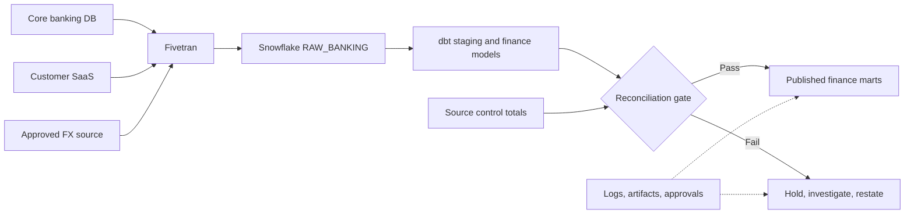

# Finance and Banking End-to-End Case Study

> Apply connector, schema, reconciliation, access, observability, and cost decisions to a regulated daily position and transaction flow.

## Executive Summary

- **What it is:** A reference design for loading core-banking transactions, customer data, and exchange rates through Fivetran into Snowflake and governed dbt outputs.
- **Why it matters:** A tool-level sync becomes trustworthy only when identity, data minimization, cutoffs, reconciliation, publication, and evidence work end to end.
- **Mental model:** Automate movement, isolate raw evidence, transform under version control, and prove every material reporting boundary.
- **Recommend when:** Sources have supported extraction patterns, security requirements fit SaaS or Hybrid deployment, and owners can supply authoritative control totals.
- **Reconsider when:** Required source history is unavailable, pre-load processing is mandatory, near-zero latency is essential, or Fivetran cannot meet network and regulatory constraints.

## What It Can Do

- Load selected operational and SaaS source tables incrementally into isolated Snowflake raw schemas.
- Preserve current or historical row state according to supported sync modes.
- Minimize replicated scope with schema policy, selection, hashing, and supported row filters.
- Trigger dbt after required source deliveries and run transformations on separate Snowflake compute.
- Combine platform metadata, dbt artifacts, and control totals into an auditable operating record.

## What It Cannot Do

- Certify regulatory correctness without business-owned definitions, reconciliation, approval, and exception handling.
- Reconstruct a transaction or attribute never exposed by the source or retained long enough to extract.
- Infer the correct business date, ledger status, reversal treatment, currency rate, or materiality threshold.
- Ensure a connector-complete event equals end-to-end report readiness.
- Replace segregation of duties, vendor risk assessment, retention policy, or disaster-recovery testing.

## Core Concepts

| Concept | Plain-language meaning | Why it matters |
|---|---|---|
| Booking-date cutoff | Closed business boundary for daily processing | Keeps source and warehouse comparisons aligned |
| Control total | Source-issued count, amount, or balance | Independent evidence of completeness and accuracy |
| Raw evidence | Unmodified source-shaped destination data plus metadata | Supports traceability and replay diagnosis |
| Data minimization | Replicate only approved rows and fields | Reduces privacy exposure and unnecessary cost |
| Publication gate | Required checks before consumers see a new period | Prevents partial or unreconciled reporting |
| Restatement | Governed correction to a previously published period | Preserves auditability when late or corrected data arrives |

## How It Works (Simple Flow)

1. Define the report: daily booked transactions and positions by legal entity, account, currency, and business date, with source-owned control totals.
2. Assess the database/API connectors for CDC, keys, deletes, historical retention, latency, permissions, and re-sync behavior.
3. Select SaaS or Hybrid and private connectivity as required; provision dedicated source and Snowflake service identities.
4. Land only approved tables and fields in `RAW_BANKING`, using restrictive schema-change settings for regulated sources and preserving Fivetran metadata.
5. Wait for core banking, customer reference, and approved FX-rate deliveries; verify Fivetran status and expected business dates.
6. Run dbt staging to normalize keys, delete semantics, types, currencies, and effective dates, then build transaction and position models.
7. Reconcile counts, booked amounts, currency conversion, and closing balances to authoritative totals; hold publication on material differences.
8. Publish through read-only roles, retain run and approval evidence, monitor freshness and cost, and use a controlled restatement path for late corrections.

## Visuals



## Readable Snippets

Example control record for one closed boundary:

```yaml
business_date: 2026-07-31
legal_entity: BANK_NO
source_cutoff_utc: 2026-08-01T01:00:00Z
expected_transactions: 1284932
expected_booked_amount_nok: 1842231902.44
allowed_amount_difference_nok: 0.00
required_sources: [core_banking, customer_master, approved_fx]
publication: blocked_until_reconciled
```

Example reconciliation result:

```sql
select
    business_date,
    legal_entity,
    count(*) as actual_transactions,
    sum(booked_amount_nok) as actual_booked_amount_nok
from finance.fct_booked_transaction
where business_date = '2026-07-31'
  and legal_entity = 'BANK_NO'
group by 1, 2;
```

## Consultant Talking Points

- **Client question this answers:** "What would a controlled Fivetran–Snowflake–dbt pipeline look like for material banking data?"
- **Trade-offs to mention:** Managed ingestion reduces connector maintenance, but the client retains ownership of data meaning, source controls, Snowflake security, dbt logic, and publication decisions.
- **Risk or governance angle:** Require least privilege, PII minimization, encrypted connectivity, segregation of duties, evidence retention, approved exceptions, and a formal restatement process.
- **Cost or operational angle:** Cost spans Fivetran usage, Snowflake load and dbt compute, retained history, re-syncs, and control execution; assign tags and budgets to the full service.

## Common Pitfalls

- Reconciling Fivetran data to a live source instead of the same closed cutoff produces false differences.
- Loading all customer fields "just in case" increases privacy exposure, storage, and breach impact without analytical value.
- Joining current customer attributes to historical transactions can rewrite past classifications unless effective-dated logic is used.
- Publishing when one source is fresh and another is late creates internally inconsistent positions or currency conversion.
- Treating late transactions as ordinary current-day data can silently change a closed period without restatement evidence.
- Using only technical tests while omitting source control totals can miss financially material but structurally valid errors.
- Re-syncing during close without impact analysis can change delete/history representation and delay downstream processing.

## When to Recommend What (Decision Table)

| Situation | Recommend | Why | Watch-outs |
|---|---|---|---|
| Supported source, hourly or daily analytics | Managed Fivetran connector | Low connector maintenance and incremental loading | Validate keys, deletes, history, and API limits |
| Policy restricts data-plane processing location | Supported Hybrid deployment and private path | Keeps processing within the approved environment | Edition, infrastructure, staging, and support ownership |
| PII not needed for analytics | Block fields before destination and remove historical copies | Data minimization | Understand temporary processing and MAR caveats |
| Equality joins need pseudonymous identity | Hash supported non-key fields | Retains joinability without clear text | Salt governance and re-sync existing rows |
| Closed daily finance output | Integrated dependency gate plus business reconciliation | Prevents partial publication | Transformation duration must not delay needed syncs |
| Historical customer classification required | History mode or governed dbt effective dating | Supports point-in-time joins | Cost, source support, and history start date |
| Source lacks reliable controls or retained history | Do not claim full regulatory completeness | Avoids false assurance | Add source remediation or alternative capture |

## Related Topics

- [[03 Fivetran/04 Fivetran with Snowflake and dbt/Fivetran with Snowflake and dbt Overview|Fivetran with Snowflake and dbt Overview]]
- [[03 Fivetran/03 Destination Data History and Schema Change/16 Data Contracts Completeness and Reconciliation|Data Contracts, Completeness, and Reconciliation]]
- [[03 Fivetran/04 Fivetran with Snowflake and dbt/19 Fivetran to Snowflake to dbt Ownership Boundaries|Fivetran to Snowflake to dbt Ownership Boundaries]]
- [[02 dbt/08 dbt on Snowflake and Finance Patterns/80 Regulatory Evidence and Auditability|Regulatory Evidence and Auditability]]

## Related Decision Notes

- [[80 Comparisons and Decision Notes/Decision Notes/Fivetran/Decisions - Evaluating Fivetran Connector Fit|Evaluating Fivetran Connector Fit]]
- [[80 Comparisons and Decision Notes/Decision Notes/Fivetran/Decisions - Designing a Fivetran Production Operating Model|Designing a Fivetran Production Operating Model]]
- [[80 Comparisons and Decision Notes/Decision Notes/Fivetran/Decisions - Estimating and Controlling Fivetran Cost|Estimating and Controlling Fivetran Cost]]

## Questions

- **Explain:** Which evidence proves technical delivery, and which evidence proves financial completeness?
- **Apply:** What would you block, hash, retain, and reconcile for a customer transaction pipeline?
- **Challenge:** Which source or regulatory constraint would make this managed pattern unsuitable?

## Sources To Revisit

- [Fivetran - Core Concepts](https://fivetran.com/docs/core-concepts)
- [Fivetran - Deployment Models](https://fivetran.com/docs/core-concepts/deployment-models)
- [Fivetran - Data Blocking and Column Hashing](https://fivetran.com/docs/core-concepts/features/data-blocking-column-hashing)
- [dbt - Source Freshness](https://docs.getdbt.com/docs/deploy/source-freshness)
