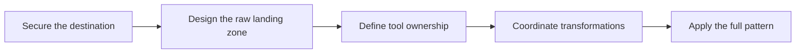

# Fivetran with Snowflake and dbt Overview

> Apply Fivetran to the target stack and keep ingestion, storage, transformation, quality, and orchestration responsibilities explicit.

> [!abstract] Chapter outcome
> You should be able to design a practical Fivetran-to-Snowflake landing pattern, integrate it with dbt, and explain the resulting ownership and cost decisions.

## Topics

- [[03 Fivetran/04 Fivetran with Snowflake and dbt/17 Setting Up Snowflake as a Destination|17 - Setting Up Snowflake as a Destination]]
- [[03 Fivetran/04 Fivetran with Snowflake and dbt/18 Snowflake Database Schema Warehouse and Cost Design|18 - Snowflake Database, Schema, Warehouse, and Cost Design]]
- [[03 Fivetran/04 Fivetran with Snowflake and dbt/19 Fivetran to Snowflake to dbt Ownership Boundaries|19 - Fivetran to Snowflake to dbt Ownership Boundaries]]
- [[03 Fivetran/04 Fivetran with Snowflake and dbt/20 Transformation and Orchestration Options|20 - Transformation and Orchestration Options]]
- [[03 Fivetran/04 Fivetran with Snowflake and dbt/21 Finance and Banking End-to-End Case Study|21 - Finance and Banking End-to-End Case Study]]

## Chapter Map

## Curated Cross-Tool Links

- [[01 Snowflake/04 Data Engineering/19 Stages and Data Loading|Stages and Data Loading]]
- [[01 Snowflake/03 Security and Governance/12 RBAC Roles and Privileges|Snowflake RBAC Roles and Privileges]]
- [[02 dbt/01 Core Concepts and Project Structure/07 Sources and Source Freshness|dbt Sources and Source Freshness]]
- [[02 dbt/08 dbt on Snowflake and Finance Patterns/81 Fivetran to Snowflake to dbt Flow|Fivetran to Snowflake to dbt Flow]]

## Related Areas

- [[03 Fivetran/Fivetran Learning Map|Fivetran Learning Map]]
- [[03 Fivetran/03 Destination Data History and Schema Change/Destination Data History and Schema Change Overview|Previous: Destination Data, History, and Schema Change]]
- [[03 Fivetran/05 Security Governance and Production Operations/Security Governance and Production Operations Overview|Next: Security, Governance, and Production Operations]]
