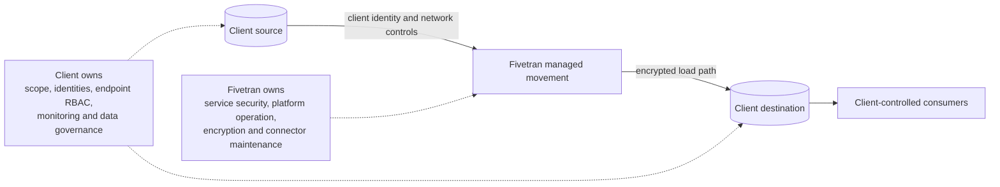

# Security Architecture and Shared Responsibility

> [!abstract] Mental model
> Fivetran secures and operates the managed movement service; the client still owns who can connect, what may move, how endpoints are protected, and how the resulting data is governed.

## Executive Summary

- **What it is:** A responsibility model that separates Fivetran platform safeguards from client controls over sources, destinations, identities, networks, data scope, and monitoring.
- **Why it matters:** Buying a managed connector reduces pipeline engineering, but it does not transfer accountability for data classification, least privilege, downstream access, or incident response.
- **Mental model:** Fivetran protects the transport mechanism; the client protects both endpoints and decides what is allowed through it.
- **Recommend when:** A client wants managed data movement and can name owners for source access, destination access, security configuration, data governance, and operations.
- **Reconsider when:** No approved deployment pattern can satisfy the data boundary, or no team accepts responsibility for credentials, access review, monitoring, and downstream controls.

## What It Can Do

- Encrypt connections and support TLS-based source, destination, and dashboard communication.
- Offer SaaS and Hybrid deployment models plus multiple private connectivity patterns.
- Store connection credentials through Fivetran's secure credential service, with customer-managed-key and external-secret-manager options where eligible.
- Provide platform RBAC, SAML SSO, SCIM provisioning, system keys, structured logs, and audit-trail capabilities.
- Block or hash supported columns before loading them to the destination.

## What It Cannot Do

- Decide whether a dataset is legally or contractually permitted to leave a source system.
- Secure a poorly governed source account or destination role on the client's behalf.
- Prevent authorized users from selecting unnecessary sensitive columns unless the client configures and reviews the scope.
- Prove end-to-end compliance merely because Fivetran has security certifications.

## Core Concepts

| Concept | Plain-language meaning | Why it matters |
|---|---|---|
| Shared responsibility | Vendor and client each own different controls | Prevents important controls from falling between teams |
| Data plane | The path where customer data is extracted, processed, and loaded | Determines the sensitive-data and network boundary |
| Control plane | Configuration, orchestration, metadata, status, and user administration | May remain SaaS-hosted even when data processing is local |
| Least privilege | Grant only the permissions needed for the connection | Limits blast radius if credentials are misused |
| Data minimization | Sync only required tables and columns | Reduces privacy exposure, destination cost, and governance work |
| Evidence | Logs, configuration records, access reviews, and reconciliation results | Makes controls demonstrable rather than assumed |

## How It Works (Simple Flow)

1. The client classifies the source data and approves which tables, columns, regions, and consumers are in scope.
2. The client chooses SaaS or Hybrid deployment and an approved network path.
3. Dedicated source and destination identities are granted the minimum connector-specific permissions.
4. Fivetran authenticates, extracts, processes, and loads data using its platform safeguards and configured deployment boundary.
5. The client applies destination RBAC, masking, retention, and downstream quality controls to the replicated data.
6. Fivetran exposes operational and audit signals; the client routes them into monitoring and evidence-retention processes.
7. Both parties handle incidents within their contractual and operational responsibilities.

## Visuals



## Readable Snippets

A practical responsibility check should be explicit rather than implied:

```text
Source owner:          CRM platform team
Destination owner:     Snowflake platform team
Fivetran admin owner:  Data platform team
Approved data scope:   customer_id, status, region; no free-text notes
Credential rotation:   every 90 days or on personnel change
Monitoring owner:      Data operations, 24x5
Business validation:   Finance data owner
```

## Consultant Talking Points

- **Client question this answers:** "If Fivetran is managed, which security and operational controls remain ours?"
- **Trade-offs to mention:** Managed operation reduces custom pipeline work, but adds a vendor control plane and requires disciplined endpoint and identity management.
- **Risk or governance angle:** Require data classification, an approved data-flow diagram, least-privilege identities, access reviews, audit evidence, retention rules, and named control owners.
- **Cost or operational angle:** Stronger controls such as Hybrid, private networking, customer-managed keys, or enterprise audit features can change plan cost and support effort.

## Common Pitfalls

- Treating vendor certifications as the client's compliance proof leaves data scope, lawful basis, access, and retention untested.
- Reusing broad administrator credentials increases the blast radius and makes attribution and rotation difficult.
- Allowing every source field by default can replicate regulated or unnecessary data before destination policies are ready.
- Monitoring only Fivetran status misses destination access failures, stale dbt models, and business-level reconciliation errors.
- Leaving ownership implicit causes slow incident response when the source, Fivetran, destination, and downstream teams each assume another team is responsible.

## When to Recommend What (Decision Table)

| Situation | Recommend | Why | Watch-outs |
|---|---|---|---|
| Standard analytical data with approved cloud processing | SaaS deployment plus least-privilege endpoint controls | Lowest operational burden | Confirm region, connector exceptions, and destination governance |
| Sensitive data must be processed inside the client's network | Evaluate Hybrid deployment | Keeps the data-processing path local while retaining managed orchestration | Client operates agent infrastructure; connector support and plan eligibility vary |
| Source can be reached securely over TLS and allowlisted addresses | Direct SaaS connection | Simple and supportable | Public routing may still violate policy |
| Public routing is prohibited | Private networking or Hybrid | Meets a stronger network-boundary requirement | Extra cloud configuration, cost, and ownership |
| No team owns access, monitoring, or data approval | Pause implementation | Managed technology cannot replace an operating model | Establish RACI and control evidence first |

## Related Topics

- [[03 Fivetran/05 Security Governance and Production Operations/Security Governance and Production Operations Overview|Security Governance and Production Operations Overview]]
- [[03 Fivetran/05 Security Governance and Production Operations/23 SaaS Hybrid and Private Connectivity Patterns|SaaS, Hybrid, and Private Connectivity Patterns]]
- [[03 Fivetran/05 Security Governance and Production Operations/24 Credentials RBAC SSO SCIM and Service Access|Credentials, RBAC, SSO, SCIM, and Service Access]]
- [[03 Fivetran/03 Destination Data History and Schema Change/15 Schema Change Handling and Data Selection Controls|Schema Change Handling and Data Selection Controls]]

## Related Decision Notes

- [[80 Comparisons and Decision Notes/Comparisons/Fivetran/Comparison - SaaS vs Hybrid Deployment|SaaS vs Hybrid Deployment]]
- [[80 Comparisons and Decision Notes/Decision Notes/Fivetran/Decisions - Designing a Fivetran Production Operating Model|Designing a Fivetran Production Operating Model]]

## Questions

- **Explain:** Which security responsibilities move to Fivetran, and which remain with the client?
- **Apply:** Who should own source access, destination access, configuration approval, monitoring, and business reconciliation in a bank?
- **Challenge:** Which data-boundary or ownership gap would make a managed connection unacceptable?

## Sources To Revisit

- [Fivetran Docs: Security](https://fivetran.com/docs/security-and-privacy/security)
- [Fivetran Docs: Deployment Models](https://fivetran.com/docs/deployment-models)
- [Fivetran Docs: Data and Credential Encryption](https://fivetran.com/docs/core-concepts/syncoverview/data-credential-encryption)
- [Fivetran Docs: Role-Based Access Control](https://fivetran.com/docs/using-fivetran/fivetran-dashboard/account-settings/role-based-access-control)
