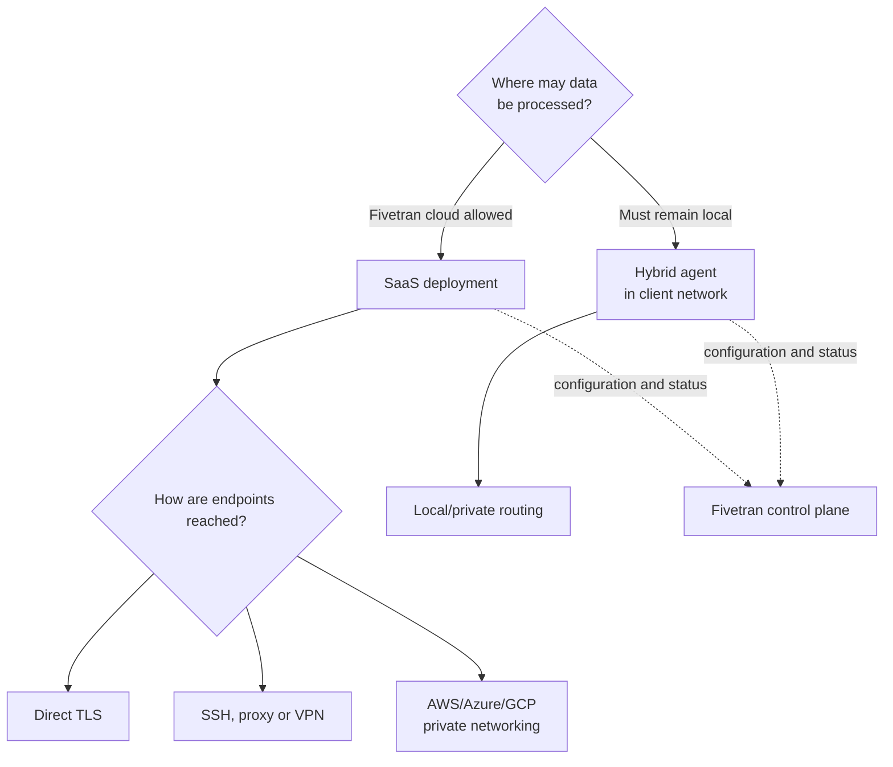

# SaaS, Hybrid, and Private Connectivity Patterns

> [!abstract] Mental model
> Deployment decides where Fivetran processes data; connectivity decides how each endpoint is reached. They are related choices, not synonyms.

## Executive Summary

- **What it is:** A choice between Fivetran-managed SaaS processing and locally hosted Hybrid processing, combined with direct, tunnel, proxy, VPN, or cloud-private endpoint connectivity.
- **Why it matters:** A connection can be encrypted yet still cross a public network, or process locally yet still depend on a SaaS control plane.
- **Mental model:** First choose the processing boundary; then choose a supported network path for source and destination.
- **Recommend when:** The chosen pattern satisfies data residency, network policy, connector support, plan eligibility, and the client's ability to operate its part.
- **Reconsider when:** The architecture is chosen from labels alone without verifying actual traffic paths, metadata boundaries, support matrix, failover, and ownership.

## What It Can Do

- Run extraction, processing, and loading in Fivetran's cloud with SaaS deployment.
- Run the data pipeline through a customer-hosted Hybrid Deployment Agent while Fivetran supplies the cloud control plane.
- Avoid public-internet exposure with AWS PrivateLink, Azure Private Link, or Google Cloud Private Service Connect for supported endpoints.
- Reach protected databases through SSH/reverse SSH, VPN, Proxy Agent, or other connector-supported methods.
- Select a Fivetran processing region at the destination level, subject to plan and connector behavior.

## What It Cannot Do

- Make Hybrid fully self-hosted; Fivetran still provides orchestration and configuration through its cloud control plane.
- Guarantee that every connector and destination supports every deployment or network method.
- Remove client responsibility for DNS, routing, firewall rules, certificates, capacity, patching, or Hybrid Agent availability.
- Make a public endpoint private merely by encrypting it with TLS.

## Core Concepts

| Concept | Plain-language meaning | Why it matters |
|---|---|---|
| SaaS deployment | Fivetran processes data in its managed cloud | Lowest client operational burden |
| Hybrid deployment | A customer-hosted agent processes data locally; Fivetran remains the control plane | Supports stricter data-boundary requirements but adds client infrastructure |
| Private networking | Cloud-provider private endpoints carry traffic without public-internet exposure | Addresses network policy independently of processing location |
| Proxy Agent | Customer-hosted outbound connectivity bridge | Useful when inbound access to a source is prohibited |
| SSH/VPN | Encrypted network tunnels to protected endpoints | Broader compatibility, with added keys, routing, and operational ownership |
| Processing region | Region assigned to the destination and its connections | A major residency and latency design input, not a complete compliance answer |

## How It Works (Simple Flow)

1. Classify data and document residency, public-network, and local-processing requirements.
2. Verify that the required source and destination support SaaS or Hybrid deployment.
3. Choose the processing region and deployment model.
4. Select a supported path independently for each endpoint: direct TLS, SSH, proxy, VPN, or cloud-private connectivity.
5. Configure routing, DNS, firewall rules, certificates, and least-privilege identities.
6. Run setup tests and prove the observed traffic path before enabling production syncs.
7. Monitor both connection health and the customer-owned network or agent components.

## Visuals



## Readable Snippets

Architecture decision record checklist:

```text
Processing boundary:     SaaS EU region / Hybrid client VPC
Source path:             PrivateLink / SSH / Proxy Agent / direct TLS
Destination path:        PrivateLink / direct TLS
Public IP exposure:      yes/no, with approved exception
Control-plane metadata:  documented and approved
Client-operated pieces:  owner, patching, capacity, monitoring, DR
Connector support:       confirmed in current feature table
Plan requirement:        confirmed before commercial approval
```

## Consultant Talking Points

- **Client question this answers:** "Does private connectivity mean our data is processed inside our network?"
- **Trade-offs to mention:** SaaS minimizes operations; Hybrid increases boundary control but makes the client responsible for agent infrastructure. Private connectivity strengthens the route but can be added to SaaS.
- **Risk or governance angle:** Confirm data path, metadata path, region, connector exceptions, certificate trust, and disaster-recovery behavior—not just the product name.
- **Cost or operational angle:** Hybrid and some connectivity features are plan-gated; private endpoints, VPNs, agents, egress, and on-call ownership add non-Fivetran cost.

## Common Pitfalls

- Equating Hybrid with a fully disconnected product understates the continuing Fivetran control-plane dependency.
- Equating TLS with private connectivity can violate a policy that forbids public routing even when traffic is encrypted.
- Selecting Hybrid before checking connector and destination support can force an expensive redesign.
- Ignoring agent sizing, disk, patching, and monitoring creates a customer-owned availability bottleneck.
- Assuming a configured region covers every connector ignores documented exceptions for some event, webhook, email, or support flows.

## When to Recommend What (Decision Table)

| Situation | Recommend | Why | Watch-outs |
|---|---|---|---|
| Cloud processing and public TLS are approved | SaaS plus direct connectivity | Simplest managed pattern | Allowlisting, certificate validation, and region still matter |
| SaaS processing is approved but public routing is not | SaaS plus cloud-private networking | Keeps managed operation while avoiding public-internet exposure | Supported services, plan, DNS, endpoint fees, and setup lead time |
| Inbound source access is prohibited | Proxy Agent or supported reverse-tunnel pattern | Customer component initiates outbound access | Agent availability, keys, upgrades, and network ownership |
| Data processing must remain in the client perimeter | Hybrid deployment | Local data processing with Fivetran orchestration | Enterprise/Business Critical eligibility, support matrix, agent operations |
| Complex multi-network on-premises estate | VPN or Hybrid after architecture review | Can fit broader routing requirements | Latency, change coordination, and troubleshooting complexity |

## Related Topics

- [[03 Fivetran/05 Security Governance and Production Operations/Security Governance and Production Operations Overview|Security Governance and Production Operations Overview]]
- [[03 Fivetran/05 Security Governance and Production Operations/22 Security Architecture and Shared Responsibility|Security Architecture and Shared Responsibility]]
- [[03 Fivetran/04 Fivetran with Snowflake and dbt/17 Setting Up Snowflake as a Destination|Setting Up Snowflake as a Destination]]
- [[03 Fivetran/05 Security Governance and Production Operations/27 Incident Response Re-syncs and Recovery Runbooks|Incident Response, Re-syncs, and Recovery Runbooks]]

## Related Decision Notes

- [[80 Comparisons and Decision Notes/Comparisons/Fivetran/Comparison - SaaS vs Hybrid Deployment|SaaS vs Hybrid Deployment]]
- [[80 Comparisons and Decision Notes/Decision Notes/Fivetran/Decisions - Designing a Fivetran Production Operating Model|Designing a Fivetran Production Operating Model]]

## Questions

- **Explain:** How do deployment location and network connectivity answer different questions?
- **Apply:** Which pattern would you evaluate for a bank that permits SaaS orchestration but forbids data processing outside its VPC?
- **Challenge:** Which control-plane, support-matrix, or disaster-recovery constraint could invalidate the preferred pattern?

## Sources To Revisit

- [Fivetran Docs: Deployment Models](https://fivetran.com/docs/deployment-models)
- [Fivetran Docs: Hybrid Deployment](https://fivetran.com/docs/core-concepts/deployment-models/hybrid-deployment)
- [Fivetran Docs: Private Networking](https://fivetran.com/docs/getting-started/fivetran-dashboard/account-settings/connection-methods/private-networking)
- [Fivetran Docs: Choose a Database Connection Option](https://fivetran.com/docs/connectors/databases/troubleshooting/database-connection-options)
