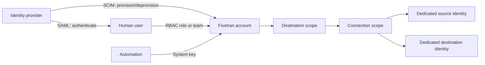

# Credentials, RBAC, SSO, SCIM, and Service Access

> [!abstract] Mental model
> Separate endpoint credentials, human identity, and automation identity; give each the narrowest scope, owner, lifetime, and audit trail it needs.

## Executive Summary

- **What it is:** The identity and access-control layer for source/destination credentials, dashboard users, teams, roles, SAML sessions, SCIM lifecycle management, and API keys.
- **Why it matters:** Most control failures come from over-privileged, shared, long-lived, or orphaned access—not from connector logic.
- **Mental model:** SSO authenticates people, SCIM manages their lifecycle, RBAC authorizes actions, and system keys identify automation.
- **Recommend when:** Access is tied to named owners, least-privilege roles, automated joiner/mover/leaver processes, secret storage, rotation, and logging.
- **Reconsider when:** Production access depends on personal accounts, shared administrator credentials, manual offboarding, or unscoped API keys.

## What It Can Do

- Scope Fivetran permissions at account, destination, and connection levels with standard or eligible custom roles and teams.
- Authenticate users through SAML SSO and provision supported user attributes and account-level roles through SCIM.
- Use scoped user API keys that inherit the user's RBAC permissions.
- Use centrally managed system keys with resource- and action-level permissions for automation.
- Support dedicated source read identities and destination write identities, plus secure credential storage and rotation patterns.

## What It Cannot Do

- Provision destination- or connection-level roles through the Fivetran SCIM API; SCIM role assignment is account-level.
- Map identity-provider groups directly to Fivetran team roles through SCIM.
- Make a user-bound API key a durable service identity; it remains coupled to that user's lifecycle and permissions.
- Enforce least privilege in source and destination systems unless the client designs those roles correctly.

## Core Concepts

| Concept | Plain-language meaning | Why it matters |
|---|---|---|
| SAML SSO | The identity provider authenticates the human user | Centralizes login policy and reduces separate passwords |
| SCIM | Automated user provisioning and deprovisioning | Supports timely joiner/mover/leaver controls |
| Fivetran RBAC | Permissions over account, destination, connection, and transformation resources | Limits who can see or change production pipelines |
| Team | A group used to delegate Fivetran access at scale | Reduces individual permission administration |
| Scoped API key | User-owned key that inherits that user's RBAC | Appropriate for user-context automation, but coupled to the person |
| System key | Organization-managed API credential with explicit resource/action scope | Better default for durable machine automation |
| Endpoint identity | Dedicated account used by Fivetran in a source or destination | Controls what data can be read and where it can be written |

## How It Works (Simple Flow)

1. Define personas such as account administrator, destination operator, connection operator, auditor, and automation service.
2. Configure SAML SSO for human authentication and SCIM where supported for lifecycle management.
3. Assign account, destination, and connection permissions through roles and teams; review inherited access from higher levels.
4. Create dedicated, least-privilege source and destination identities with named owners and rotation procedures.
5. Use system keys for durable automation; use user-scoped keys only when the automation intentionally acts as that user.
6. Store secrets outside code and CI logs, rotate them safely, and revoke them during incidents or decommissioning.
7. Review users, roles, teams, validated certificates, and key activity on a schedule.

## Visuals

## Readable Snippets

Access matrix for a controlled production setup:

| Persona | Fivetran scope | Endpoint access | Authentication |
|---|---|---|---|
| Account security admin | Account settings and roles | None | SAML + strong IdP policy |
| Data operations | Selected destination/connections | None | SAML; team-assigned role |
| Auditor | Read-only metadata and logs | Read-only audit views | SAML |
| Provisioning pipeline | Explicit API actions/resources | Secrets supplied at deployment | System key in secret manager |
| Fivetran runtime | N/A | Source read; destination create/write in owned schemas | Dedicated endpoint credentials |

## Consultant Talking Points

- **Client question this answers:** "How should people and automation access Fivetran without sharing an administrator account?"
- **Trade-offs to mention:** Central identity improves control but requires IdP integration and careful mapping because SCIM does not cover every resource-level role.
- **Risk or governance angle:** Separate security administration from pipeline operation, review inherited roles, and remove human identities from production automation.
- **Cost or operational angle:** Advanced RBAC features may depend on plan; system-key rotation and secret-manager integration still need runbooks and monitoring.

## Common Pitfalls

- Giving every data engineer Account Administrator creates excessive deletion, billing, key, and security-setting privileges.
- Assuming SSO also provisions and authorizes users leaves new users with missing or inappropriate access.
- Depending on SCIM for destination- or connection-level roles fails because those assignments are not supported through the SCIM API.
- Running production automation with an employee's API key can break jobs on offboarding or permission change and weakens attribution.
- Rotating endpoint credentials without coordinated overlap and setup tests can stop all syncs using the credential.
- Sharing one source identity across unrelated integrations obscures ownership and enlarges the blast radius.

## When to Recommend What (Decision Table)

| Situation | Recommend | Why | Watch-outs |
|---|---|---|---|
| Human dashboard access | SAML SSO plus RBAC | Central login policy with explicit Fivetran authorization | Handle break-glass access and multiple-account limitations |
| Large user population with frequent change | SCIM plus governed role assignment | Faster provisioning and deprovisioning | Account-level roles only; no SCIM team-role mapping |
| Durable CI/CD or platform automation | System key | Not tied to an employee and can be narrowly scoped | System keys are documented as Beta; govern creation and rotation |
| Personal exploration or short-lived script | Scoped user API key | Inherits existing user RBAC | Avoid for shared production services |
| Source and destination access | Separate dedicated service identities | Least privilege and better auditability | Connector-specific grants and rotation coordination |

## Related Topics

- [[03 Fivetran/05 Security Governance and Production Operations/Security Governance and Production Operations Overview|Security Governance and Production Operations Overview]]
- [[03 Fivetran/05 Security Governance and Production Operations/22 Security Architecture and Shared Responsibility|Security Architecture and Shared Responsibility]]
- [[03 Fivetran/05 Security Governance and Production Operations/25 Privacy Compliance Audit and Vendor Risk|Privacy, Compliance, Audit, and Vendor Risk]]
- [[03 Fivetran/05 Security Governance and Production Operations/28 REST API Terraform and Configuration Automation|REST API, Terraform, and Configuration Automation]]

## Related Decision Notes

- [[80 Comparisons and Decision Notes/Decision Notes/Fivetran/Decisions - Designing a Fivetran Production Operating Model|Designing a Fivetran Production Operating Model]]

## Questions

- **Explain:** What distinct problems do SSO, SCIM, RBAC, and system keys solve?
- **Apply:** How would you design access for platform admins, connection operators, auditors, and a Terraform pipeline?
- **Challenge:** Which SCIM or key-lifecycle limitation could undermine the proposed design?

## Sources To Revisit

- [Fivetran Docs: Role-Based Access Control](https://fivetran.com/docs/using-fivetran/fivetran-dashboard/account-settings/role-based-access-control)
- [Fivetran Docs: Single Sign-On](https://fivetran.com/docs/getting-started/fivetran-dashboard/account-settings/sso)
- [Fivetran Docs: SCIM](https://fivetran.com/docs/using-fivetran/fivetran-dashboard/account-settings/scim)
- [Fivetran Docs: REST API Getting Started](https://fivetran.com/docs/rest-api/getting-started)
