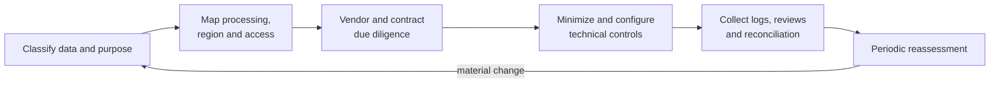

# Privacy, Compliance, Audit, and Vendor Risk

> [!abstract] Mental model
> Compliance is a chain of evidence about data, purpose, location, access, retention, and suppliers—not a badge inherited from the integration vendor.

## Executive Summary

- **What it is:** The assessment and control process for sensitive-data movement, processing location, retention, auditability, contractual obligations, and third-party dependency.
- **Why it matters:** Fivetran sits between systems and may process credentials, records, and metadata; regulated clients must understand that flow and prove it is controlled.
- **Mental model:** Certifications support vendor due diligence; the client still needs workload-specific approval and operating evidence.
- **Recommend when:** Data scope, region, deployment, subprocessor and support access, contracts, retention, audit logs, and exit plans have been reviewed.
- **Reconsider when:** Required evidence is unavailable, a connector exception breaks residency requirements, or sensitive data cannot be minimized adequately.

## What It Can Do

- Offer selectable data-processing locations for destinations and document residency behavior and exceptions.
- Provide security and compliance documentation for vendor review.
- Produce structured logs for connection activity, API calls, user actions, schema changes, role membership, and consumption.
- Provide Audit Trail events on eligible plans for important administrative and configuration actions.
- Reduce copied sensitive data through table/column selection, blocking, and supported hashing.

## What It Cannot Do

- Determine the client's lawful basis, purpose limitation, retention requirement, or regulatory classification.
- Guarantee every flow remains inside the selected region; documented connector and support exceptions must be reviewed.
- Prove source-to-report completeness or business correctness through audit logs alone.
- Eliminate vendor concentration, outage, contract, subprocessor, or exit risk.

## Core Concepts

| Concept | Plain-language meaning | Why it matters |
|---|---|---|
| Data residency | Where data is processed or temporarily stored | May be a legal, contractual, or policy requirement |
| Data minimization | Move only what the approved purpose needs | Reduces exposure, cost, and deletion obligations |
| Control evidence | Records showing a control operated | Required for audit and regulatory defensibility |
| Audit Trail | Logged administrative and configuration actions | Supports attribution and change investigation; availability is plan-dependent |
| Subprocessor/support path | Other parties or personnel that may support service delivery | Must fit third-party and cross-border requirements |
| Exit plan | How connections, credentials, data, and dependencies are retired or replaced | Controls lock-in and termination risk |

## How It Works (Simple Flow)

1. Inventory data categories, subjects, source owners, destination consumers, and business purposes.
2. Map the actual flow: source, network path, processing region, destination, logs, support paths, and subprocessors.
3. Review Fivetran's current security, privacy, retention, compliance, and contractual materials against client policy.
4. Minimize selected tables and columns, and choose appropriate blocking, hashing, deployment, encryption, and access controls.
5. Approve the vendor and workload with explicit exceptions, control owners, retention periods, and incident-notification terms.
6. Collect logs, configuration snapshots, access reviews, and reconciliation evidence during operation.
7. Reassess on connector changes, new regions, new data categories, contract renewal, incidents, and exit.

## Visuals



## Readable Snippets

Minimum workload evidence pack:

```text
Data-flow diagram and approved processing region
Connector and destination configuration export
Selected/blocked/hashed field inventory
Source and destination service-account grants
Fivetran user, team, role, and key review
Audit and operational log retention evidence
Monthly completeness/reconciliation control result
Incident contacts, DPA/SLA references, and exit runbook
```

## Consultant Talking Points

- **Client question this answers:** "Is Fivetran compliant enough for customer or financial data?"
- **Trade-offs to mention:** Vendor assurance can accelerate approval, but stricter residency, private networking, keys, logs, or support conditions may require higher plans and more client operation.
- **Risk or governance angle:** Assess the concrete workload and data flow. A platform certification does not approve every connector, dataset, purpose, or destination use.
- **Cost or operational angle:** Audit retention, SIEM ingestion, access reviews, private connectivity, regional requirements, and exit testing all belong in TCO.

## Common Pitfalls

- Copying certification logos into an architecture decision without mapping actual data flows produces weak compliance evidence.
- Treating the destination region as proof of universal residency ignores documented connector and support exceptions.
- Replicating free-text or broad source schemas by default can move unnecessary personal or confidential data.
- Retaining logs without alerting, ownership, or review creates evidence after the fact but little preventive control.
- Omitting an exit and credential-revocation plan increases vendor lock-in and leaves active access after decommissioning.

## When to Recommend What (Decision Table)

| Situation | Recommend | Why | Watch-outs |
|---|---|---|---|
| Low-sensitivity operational analytics | Standard due diligence and data minimization | Proportionate control | Confirm region and retention anyway |
| Regulated customer, payment, health, or financial data | Formal workload assessment and eligible enterprise controls | Stronger evidence and access requirements | Plan gates, contractual terms, connector exceptions |
| Strict local-processing requirement | Evaluate Hybrid deployment | Can keep data processing inside the client network | Control-plane metadata and support paths still need review |
| Sensitive fields are unnecessary downstream | Block them at the connector | Avoids creating another governed copy | Primary keys cannot be blocked; connector support varies |
| Required evidence or contractual protection is missing | Do not approve production use yet | Unaccepted third-party risk is a decision blocker | Use a time-boxed non-production pilot only if policy allows |

## Related Topics

- [[03 Fivetran/05 Security Governance and Production Operations/Security Governance and Production Operations Overview|Security Governance and Production Operations Overview]]
- [[03 Fivetran/05 Security Governance and Production Operations/22 Security Architecture and Shared Responsibility|Security Architecture and Shared Responsibility]]
- [[03 Fivetran/05 Security Governance and Production Operations/26 Monitoring Logging Freshness and the Platform Connector|Monitoring, Logging, Freshness, and the Platform Connector]]
- [[03 Fivetran/03 Destination Data History and Schema Change/16 Data Contracts Completeness and Reconciliation|Data Contracts, Completeness, and Reconciliation]]

## Related Decision Notes

- [[80 Comparisons and Decision Notes/Comparisons/Fivetran/Comparison - SaaS vs Hybrid Deployment|SaaS vs Hybrid Deployment]]
- [[80 Comparisons and Decision Notes/Decision Notes/Fivetran/Decisions - Designing a Fivetran Production Operating Model|Designing a Fivetran Production Operating Model]]

## Questions

- **Explain:** Why does a vendor certification not make a specific data pipeline compliant automatically?
- **Apply:** What evidence would you request before approving a customer-data connection in a bank?
- **Challenge:** Which residency exception, retention gap, or third-party term could block production use?

## Sources To Revisit

- [Fivetran Docs: Privacy and Data Residency](https://fivetran.com/docs/privacy)
- [Fivetran Docs: Security](https://fivetran.com/docs/security-and-privacy/security)
- [Fivetran Docs: Logs and Audit Trail](https://fivetran.com/docs/logs)
- [Fivetran Docs: Connection Schemas and Data Controls](https://fivetran.com/docs/using-fivetran/fivetran-dashboard/connectors/schema)
