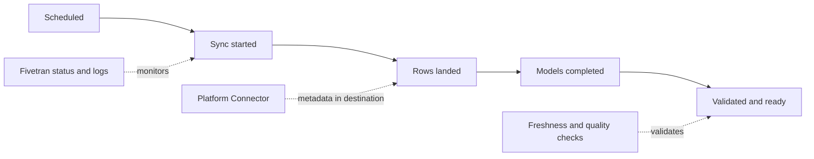

# Monitoring, Logging, Freshness, and the Platform Connector

> [!abstract] Mental model
> A connection can be enabled and green while the business data is still late; monitor configuration, sync execution, destination arrival, and downstream readiness separately.

## Executive Summary

- **What it is:** A production-observability model combining Fivetran status, structured events, Platform Connector metadata, destination checks, and downstream freshness.
- **Why it matters:** Sync frequency is an intention; useful data freshness is the measured age of a validated downstream output.
- **Mental model:** Observe four clocks: scheduled, started, landed, and ready for use.
- **Recommend when:** Every critical connection has freshness objectives, routed alerts, an owner, a runbook, and destination-side evidence.
- **Reconsider when:** The organization relies only on dashboard color or email alerts and cannot measure end-to-end delay.

## What It Can Do

- Expose connection state, setup state, sync history, warnings, errors, delays, and structured log events.
- Deliver logs and account/destination metadata through the free Fivetran Platform Connector.
- Load consumption, connection, role, membership, schema, and eligible lineage metadata into the destination.
- Forward events to supported external logging services for centralized operations.
- Support destination-side SQL and models for status, usage, schema change, and audit analysis.

## What It Cannot Do

- Guarantee business freshness merely because a sync completed successfully.
- Detect every source-side semantic defect or downstream dbt/BI failure.
- Reconstruct unlimited log history: `LOG` and `CONNECTOR_SDK_LOG` initial or full re-sync history is limited to the documented seven-day window where data exists.
- Provide every metadata table or Audit Trail feature on every pricing plan.

## Core Concepts

| Concept | Plain-language meaning | Why it matters |
|---|---|---|
| Sync frequency | Requested interval between Fivetran runs | Does not equal actual delivery or business freshness |
| Connection health | Setup, warning, failure, delay, and recent-sync state | Identifies platform and endpoint problems |
| Platform Connector | Free connection that loads Fivetran logs and metadata into a destination | Enables SQL-based monitoring, history, usage, and audit analysis |
| External logging | Structured events forwarded to an operations platform | Supports centralized alerting and retention |
| Landing freshness | Age of the newest trustworthy source event in raw destination data | More meaningful than last successful job time |
| End-to-end freshness | Age of validated data at the consumer boundary | Captures ingestion, transformation, quality, and BI delays |

## How It Works (Simple Flow)

1. Define business freshness and reliability objectives for each critical dataset.
2. Configure connector schedules and document expected source/API latency.
3. Collect Fivetran statuses and structured events through the Platform Connector or an external log service.
4. Query connection events, sync metadata, schema changes, and consumption in the destination.
5. Compare the newest source business timestamp, Fivetran landing time, dbt completion, and consumer refresh time.
6. Route severity-based alerts to a named owner with deduplication and an attached runbook.
7. Review trends, repeated warnings, incident duration, freshness breaches, and alert quality.

## Visuals



## Readable Snippets

A destination query can identify recent severe platform events using the current Platform Connector table reference:

```sql
select
    time,
    connection_id,
    event,
    message_event,
    message_data
from fivetran_metadata.log
where time >= dateadd('hour', -24, current_timestamp())
  and event in ('SEVERE', 'WARNING')
order by time desc;
```

Older destination-level Platform Connector schemas may still expose legacy names such as `TIME_STAMP` and `CONNECTOR_ID`; confirm the deployed schema before operationalizing the query. The alert should also measure a business timestamp, not only `_fivetran_synced`.

## Consultant Talking Points

- **Client question this answers:** "How do we know the data is actually fresh and usable?"
- **Trade-offs to mention:** Dashboard monitoring is quick; destination and SIEM monitoring provides historical analysis and integration but adds queries, retention, and alert engineering.
- **Risk or governance angle:** Distinguish technical delivery evidence from business completeness and approval evidence.
- **Cost or operational angle:** Platform Connector MAR is free, but its destination storage, compute, transformation, and alerting are not necessarily free.

## Common Pitfalls

- Treating sync frequency as an SLA hides source delay, long-running syncs, transformation queues, and BI refresh delay.
- Alerting on every warning without severity and ownership creates fatigue and ignored incidents.
- Using `_fivetran_synced` alone as business freshness can mislead because it reflects Fivetran processing rather than the source event time.
- Assuming the Platform Connector has unlimited historical logs can leave gaps after late onboarding or a full re-sync.
- Monitoring ingestion without dbt and consumer readiness can report success while dashboards remain stale or tests fail.

## When to Recommend What (Decision Table)

| Situation | Recommend | Why | Watch-outs |
|---|---|---|---|
| Small, non-critical estate | Dashboard alerts plus simple destination freshness checks | Low setup effort | Limited central history and coverage |
| Multiple production destinations | Account-level Platform Connector where appropriate | Central view of metadata and operations | Destination access and blast radius must be governed |
| Enterprise operations or SIEM standard | External logging plus Platform Connector analytics | Real-time routing plus warehouse analysis | Duplicate alerts, retention cost, and plan gates |
| Regulatory or financial reporting | End-to-end freshness and reconciliation controls | A successful sync alone is insufficient evidence | Define source timestamp and business owner carefully |
| Platform Connector monitoring tables | Treat as operational data product | Makes usage, status, and changes reviewable | Secure metadata and budget Snowflake compute |

## Related Topics

- [[03 Fivetran/05 Security Governance and Production Operations/Security Governance and Production Operations Overview|Security Governance and Production Operations Overview]]
- [[03 Fivetran/02 Connectors and Sync Behavior/11 Scheduling Latency Checkpoints and Recovery|Scheduling, Latency, Checkpoints, and Recovery]]
- [[03 Fivetran/05 Security Governance and Production Operations/27 Incident Response Re-syncs and Recovery Runbooks|Incident Response, Re-syncs, and Recovery Runbooks]]
- [[03 Fivetran/06 Cost and Consultant Decision-Making/30 Forecasting Cost Drivers and Usage Optimization|Forecasting, Cost Drivers, and Usage Optimization]]

## Related Decision Notes

- [[80 Comparisons and Decision Notes/Decision Notes/Fivetran/Decisions - Designing a Fivetran Production Operating Model|Designing a Fivetran Production Operating Model]]

## Questions

- **Explain:** Why are schedule frequency, last successful sync, landing freshness, and business freshness different?
- **Apply:** Which signals and owners would you define for a critical finance feed?
- **Challenge:** Which monitoring gap could allow a green connection to serve incomplete or stale reporting data?

## Sources To Revisit

- [Fivetran Docs: Fivetran Platform Connector](https://fivetran.com/docs/logs/fivetran-platform)
- [Fivetran Docs: Platform Connector Table Reference](https://fivetran.com/docs/logs/fivetran-platform/table-reference)
- [Fivetran Docs: Logs](https://fivetran.com/docs/logs)
- [Fivetran Docs: Fivetran Platform Data Model](https://fivetran.com/docs/transformations/data-models/fivetran-platform-connector-data-model)
