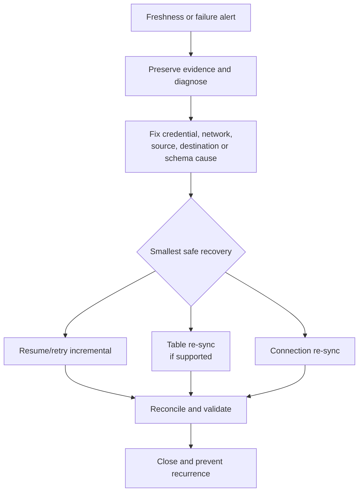

# Incident Response, Re-syncs, and Recovery Runbooks

> [!abstract] Mental model
> Restore the smallest broken layer: access, connectivity, incremental progress, one table, or the whole connection. A re-sync is reconstruction, not a universal retry button.

## Executive Summary

- **What it is:** A repeatable process to triage connection incidents, contain risk, restore data movement, validate completeness, and document recovery.
- **Why it matters:** Large re-syncs can overwrite destination state, consume destination compute, delay fresh data, and complicate downstream interpretation.
- **Mental model:** Diagnose first, repair the cause, recover at the narrowest safe scope, then reconcile.
- **Recommend when:** Runbooks define severity, owner, evidence, recovery choices, stakeholder communication, and business validation.
- **Reconsider when:** A re-sync is proposed before the source window, destination impact, history-mode behavior, connector support, and downstream dependencies are understood.

## What It Can Do

- Retry normal operation after resolving expired credentials, permissions, network, source quota, or destination issues.
- Re-run setup tests and inspect connection status, sync history, alerts, and logs.
- Trigger connection-level or supported table-level historical re-syncs through the dashboard or API.
- Identify certain database table re-sync warnings through Platform Connector log events.
- Track re-sync progress in sync history and validate destination results afterward.

## What It Cannot Do

- Recover source history that the source API, transaction log, or retention window no longer exposes.
- Stop a manually triggered full connection re-sync once it has started; current documentation requires it to finish.
- Guarantee table-level recovery for every connector.
- Replace destination backups, downstream reconciliation, or business-owner sign-off.

## Core Concepts

| Concept | Plain-language meaning | Why it matters |
|---|---|---|
| Retry/resume | Continue normal incremental operation after the cause is fixed | Least disruptive recovery |
| Setup test | Validate credentials, permissions, network, and endpoint configuration | Separates configuration failure from data failure |
| Table re-sync | Rebuild one supported table from available source history | Reduces blast radius versus a full connection re-sync |
| Connection re-sync | Reset progress and rebuild the entire connection | Broad and potentially long-running |
| Source retention window | How long APIs or database logs retain recoverable changes | Determines whether a gap can be replayed |
| Reconciliation | Compare source, raw destination, and downstream results | Proves recovery instead of assuming it |

## How It Works (Simple Flow)

1. Declare severity from data criticality, freshness breach, affected scope, and possible confidentiality or integrity impact.
2. Preserve evidence: timestamps, connection ID, sync ID, error, recent changes, source and destination state.
3. Classify the cause as source, authentication, network, Fivetran, destination, schema, or downstream.
4. Repair the underlying cause and run the relevant setup or connectivity tests.
5. Resume or retry normal sync first; use table-level re-sync when supported and justified; use full connection re-sync only when necessary.
6. Monitor progress, downstream disruption, source load, and destination compute.
7. Reconcile counts, keys, deletes, business totals, and freshness before closing the incident.
8. Record root cause, evidence, recovery choice, communication, and preventive action.

## Visuals



## Readable Snippets

Minimal recovery record:

```text
Connection / tables:
Business impact and severity:
First bad and last known-good timestamps:
Recent credential, network, source, schema, or destination changes:
Source replay/retention window remaining:
Chosen recovery: retry | table re-sync | connection re-sync
Expected source and Snowflake impact:
Validation: counts | keys | deletes | totals | freshness
Owner, approver, and stakeholder communication:
```

## Consultant Talking Points

- **Client question this answers:** "The connection failed—should we re-sync everything?"
- **Trade-offs to mention:** Narrow recovery is faster and less disruptive; broad reconstruction may be necessary when progress state or destination completeness cannot be trusted.
- **Risk or governance angle:** In regulated outputs, recovery is incomplete until reconciliation and sign-off establish integrity.
- **Cost or operational angle:** Updated post-March-2025 pricing treats historical re-sync MAR as free for eligible contracts, but source load, Snowflake compute/storage, runtime, and delayed downstream jobs remain real costs.

## Common Pitfalls

- Triggering a full re-sync before fixing the cause can repeat the failure and expand the incident.
- Assuming a pause preserves recoverability can be wrong when database logs or source APIs have short retention windows.
- Starting a full connection re-sync casually is dangerous because it cannot be stopped through the supported workflow once running.
- Validating only row count misses duplicate keys, missing deletes, version-state errors, and incorrect financial totals.
- Treating historical re-syncs as operationally free because paid MAR is waived ignores destination compute, source impact, and delayed freshness.

## When to Recommend What (Decision Table)

| Situation | Recommend | Why | Watch-outs |
|---|---|---|---|
| Expired credential or temporary destination failure with intact cursor | Fix and resume/retry | Preserves incremental state and minimizes disruption | Confirm retention window has not expired |
| One supported table is incomplete | Table-level re-sync | Smallest reconstruction scope | Parent-child dependencies and connector behavior |
| Entire destination schema is untrusted or cursor must reset | Connection re-sync with approval | Re-establishes full state | Cannot stop once started; broad compute and freshness impact |
| Source history is no longer available | Restore from backup or design alternate remediation | Fivetran cannot replay unavailable source data | Document residual gap and business acceptance |
| Security incident involves credentials | Revoke/rotate, contain, then recover | Stops continued unauthorized access | Preserve evidence and coordinate endpoint changes |

## Related Topics

- [[03 Fivetran/05 Security Governance and Production Operations/Security Governance and Production Operations Overview|Security Governance and Production Operations Overview]]
- [[03 Fivetran/02 Connectors and Sync Behavior/10 Initial Incremental Re-import and Re-sync Strategies|Initial, Incremental, Re-import, and Re-sync Strategies]]
- [[03 Fivetran/02 Connectors and Sync Behavior/11 Scheduling Latency Checkpoints and Recovery|Scheduling, Latency, Checkpoints, and Recovery]]
- [[03 Fivetran/05 Security Governance and Production Operations/26 Monitoring Logging Freshness and the Platform Connector|Monitoring, Logging, Freshness, and the Platform Connector]]

## Related Decision Notes

- [[80 Comparisons and Decision Notes/Decision Notes/Fivetran/Decisions - Designing a Fivetran Production Operating Model|Designing a Fivetran Production Operating Model]]

## Questions

- **Explain:** Why is a re-sync different from retrying an incremental sync?
- **Apply:** What recovery would you choose when one large table is incomplete but all other tables are healthy?
- **Challenge:** Which source-retention, connector, or downstream constraint could make the proposed recovery unsafe?

## Sources To Revisit

- [Fivetran Docs: Trigger Historical Re-syncs](https://fivetran.com/docs/connectors/troubleshooting/re-sync-a-connector)
- [Fivetran Docs: Stop a Connection Re-sync](https://fivetran.com/docs/connectors/troubleshooting/stop-resync)
- [Fivetran Docs: Identify Tables Requiring Re-sync](https://fivetran.com/docs/connectors/databases/troubleshooting/identify-tables-requiring-resync-rest-api)
- [Fivetran Docs: Usage-Based Pricing](https://fivetran.com/docs/getting-started/pricing)
