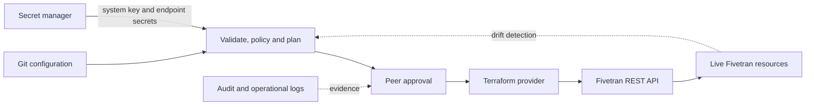

# REST API, Terraform, and Configuration Automation

> [!abstract] Mental model
> Automation turns configuration into a controlled product only when identity, secrets, state, review, imports, and drift ownership are designed with it.

## Executive Summary

- **What it is:** Programmatic management through the Fivetran REST API and the official Terraform provider for repeatable connection, destination, access, and operational workflows.
- **Why it matters:** Console-only administration becomes difficult to review, reproduce, and govern as the estate grows.
- **Mental model:** API performs actions; Terraform declares desired supported state; Git and CI govern change.
- **Recommend when:** Repeated configurations, multiple environments, separation of duties, or auditability justify an infrastructure-as-code operating model.
- **Reconsider when:** Connector fields are poorly supported, OAuth requires interactive authorization, secrets/state cannot be protected, or no team owns upgrades and drift.

## What It Can Do

- Create and manage many Fivetran resources, trigger syncs, run setup tests, and inspect status through the REST API.
- Authenticate API calls with user-scoped keys or organization-managed system keys.
- Declare supported resources through the official Terraform provider and review changes before application.
- Import existing resources into Terraform state for gradual adoption.
- Integrate connection provisioning with CI/CD, secret managers, policy checks, and change records.

## What It Cannot Do

- Automate every connector authorization flow; some require Connect Cards or interactive OAuth and connector support varies.
- Guarantee complete Terraform coverage or immediate support for every new dashboard/API field.
- Prevent out-of-band dashboard changes unless drift is detected, reviewed, and corrected by an owner.
- Make Terraform state safe by default; sensitive values can appear in state and logs.

## Core Concepts

| Concept | Plain-language meaning | Why it matters |
|---|---|---|
| REST API | Imperative calls to create, update, inspect, or trigger resources | Good for workflows and operational actions |
| Terraform provider | Declarative configuration for supported Fivetran resources | Good for repeatability, review, and drift detection |
| System key | Organization-managed, permission-scoped API credential | Preferable for durable automation, subject to current Beta status |
| State | Terraform's record of managed resource values | Must be secured, backed up, and access-controlled |
| Import | Bring an existing resource under Terraform management | Enables migration without rebuilding it |
| Drift | Difference between declared configuration and live Fivetran state | Reveals out-of-band change or provider/API mismatch |
| Rate limit | Account-level cap on API activity over time | Requires backoff, batching, and safe retries |

## How It Works (Simple Flow)

1. Inventory resources and decide which supported settings will be managed as code.
2. Create a narrowly scoped system key for the automation pipeline and store it in an approved secret manager.
3. Import existing resources or define new destinations, connections, roles, and related configuration.
4. Run formatting, validation, policy checks, and a Terraform plan in CI.
5. Require review for destructive, security-sensitive, schema, networking, and schedule changes.
6. Apply changes, run setup tests, and confirm connection health without exposing secrets.
7. Monitor API errors, rate limits, provider upgrades, and configuration drift; reconcile approved emergency console changes back into code.

## Visuals



## Readable Snippets

A small Terraform shape illustrates the relationship; exact connector fields must be checked in the current provider documentation:

```hcl
terraform {
  required_providers {
    fivetran = {
      source  = "fivetran/fivetran"
      version = "~> 1.9"
    }
  }
}

provider "fivetran" {
  api_key    = var.fivetran_api_key
  api_secret = var.fivetran_api_secret
}

resource "fivetran_group" "analytics" {
  name = "analytics-prod"
}
```

Do not hard-code the key, secret, source password, or destination password in the file or commit them to Git.

## Consultant Talking Points

- **Client question this answers:** "Should we manage Fivetran through the UI, API, or Terraform?"
- **Trade-offs to mention:** Terraform improves repeatability and review but introduces provider/state lifecycle; API workflows are flexible but need idempotency, retries, and reconciliation.
- **Risk or governance angle:** Protect state and secrets, scope system keys, review plans, separate production apply rights, and log both API and dashboard changes.
- **Cost or operational angle:** Automation reduces repetitive administration but creates a maintained codebase, pipeline, provider-upgrade process, and support boundary.

## Common Pitfalls

- Placing credentials in `.tf` files, command output, or CI logs creates a secret leak even if Fivetran itself stores credentials securely.
- Applying Terraform to existing resources without import can duplicate or replace production configuration.
- Letting dashboard edits coexist without a drift process causes later applies to overwrite emergency changes unexpectedly.
- Assuming all connector authorization is API-only can block deployment on interactive OAuth or unsupported fields.
- Ignoring HTTP 429 responses and `Retry-After` guidance makes bulk provisioning unreliable.
- Pinning the provider forever avoids planned upgrades but accumulates compatibility and security debt.

## When to Recommend What (Decision Table)

| Situation | Recommend | Why | Watch-outs |
|---|---|---|---|
| Few manually managed connections | Dashboard with change procedure | Lowest setup overhead | Harder to reproduce and review as estate grows |
| Repeatable destinations and connections across environments | Terraform | Declarative review and drift detection | State security and provider coverage |
| Trigger sync, read status, or implement event-driven operations | REST API | Better fit for imperative runtime actions | Rate limits, retries, idempotency, and audit |
| Existing dashboard estate moving to IaC | Inventory and import gradually | Avoids disruptive rebuild | Reconcile secrets and unsupported fields |
| OAuth delegated by source owner or end customer | Supported Connect Card/authorization flow plus IaC around it | Separates consent from resource configuration | Not all authorization can be automated identically |

## Related Topics

- [[03 Fivetran/05 Security Governance and Production Operations/Security Governance and Production Operations Overview|Security Governance and Production Operations Overview]]
- [[03 Fivetran/05 Security Governance and Production Operations/24 Credentials RBAC SSO SCIM and Service Access|Credentials, RBAC, SSO, SCIM, and Service Access]]
- [[03 Fivetran/05 Security Governance and Production Operations/26 Monitoring Logging Freshness and the Platform Connector|Monitoring, Logging, Freshness, and the Platform Connector]]
- [[03 Fivetran/01 Foundations and Platform Mental Model/03 The Connection Lifecycle|The Connection Lifecycle]]

## Related Decision Notes

- [[80 Comparisons and Decision Notes/Decision Notes/Fivetran/Decisions - Designing a Fivetran Production Operating Model|Designing a Fivetran Production Operating Model]]

## Questions

- **Explain:** When is the REST API a better fit than Terraform, and vice versa?
- **Apply:** How would you bring twenty existing production connections under governed Terraform management?
- **Challenge:** Which secret, state, OAuth, provider-coverage, or drift constraint could invalidate full IaC adoption?

## Sources To Revisit

- [Fivetran Docs: REST API Getting Started](https://fivetran.com/docs/rest-api/getting-started)
- [Fivetran Docs: REST API Rate Limiting](https://fivetran.com/docs/rest-api/getting-started/rate-limiting)
- [Fivetran Docs: System Keys](https://fivetran.com/docs/rest-api/getting-started/system-keys)
- [Terraform Registry: Fivetran Provider](https://registry.terraform.io/providers/fivetran/fivetran/latest/docs)
