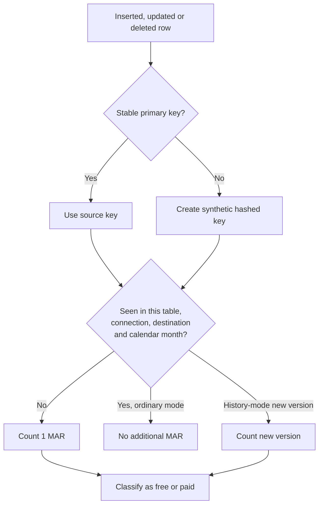

# Monthly Active Rows

> [!abstract] Mental model
> MAR measures distinct row identities that changed during a calendar month—not table size, bytes moved, query count, or ordinary sync frequency.

## Executive Summary

- **What it is:** Fivetran's core connection-usage measure: distinct primary keys inserted, updated, or deleted in a calendar month, counted at specific account, destination, connection, and table scopes.
- **Why it matters:** A billion-row table can have modest MAR if few rows change, while a smaller high-churn or history-mode table can be expensive.
- **Mental model:** Count changed identities once per month per scope; then check the exceptions that create new identities or repeated versions.
- **Recommend when:** Forecasts use observed change behavior by connection and table, not source row counts alone.
- **Reconsider when:** The source lacks stable keys, history mode records repeated changes, the same data is replicated through multiple connections, or contract rules predate current pricing.

## What It Can Do

- Measure usage from distinct source row identities rather than charging every time the same ordinary row is updated in a month.
- Count inserts, updates, and deletes as activity.
- Use a synthetic hashed key when a source table has no primary key.
- Expose incremental, historical, free, and paid usage details in the dashboard and Platform Connector.
- Separate connection MAR from transformation monthly model runs and Activation MAR.

## What It Cannot Do

- Predict spend from total source rows without knowing monthly change behavior and connection design.
- Deduplicate MAR across separate connections or destinations that replicate the same source rows.
- Treat every repeated update as one MAR in history mode; new historical versions count as new rows.
- Guarantee that every customer's contract follows the latest post-March-1-2025 re-sync rules; legacy annual contracts must be checked.

## Core Concepts

| Concept | Plain-language meaning | Why it matters |
|---|---|---|
| MAR | Distinct rows active during a calendar month | Core connection and Activation usage measure |
| Primary key | Stable identity used to recognize the same source row | Determines whether repeated updates are deduplicated |
| Synthetic key | Hash Fivetran creates when no primary key is available | Column composition changes can create new identities |
| Incremental MAR | New or changed source data since previous syncs | Usually the recurring paid usage to forecast |
| Historical/free MAR | Initial, re-sync, trial, or other eligible usage reported but not charged | Must be distinguished from paid MAR |
| History-mode version | A new destination row created for a source-record change | Repeated source changes can generate repeated paid MAR |
| Counting scope | Account, destination, connection, table, and relevant activation scope | The same key in another scope can count again |

## How It Works (Simple Flow)

1. Fivetran reads a row inserted, updated, or deleted during a sync.
2. It identifies the row by source primary key or a synthetic hashed key.
3. It attributes that identity to its account, destination, connection, and table for the current calendar month.
4. In ordinary incremental behavior, later updates to the same identity in the same scope and month do not add another MAR.
5. A different identity, table, connection, destination, or new calendar month creates a separate count.
6. History mode inserts a new version when a value changes, so repeated changes can add MAR.
7. Fivetran classifies usage as free or paid according to sync type, trial, connector, and the customer's pricing terms.

## Visuals



## Readable Snippets

Simplified monthly example:

```text
CUSTOMER 42 updated 10 times in soft-delete mode:  1 MAR
CUSTOMER 42 updated 10 times in history mode:      up to 10 version rows/MAR
CUSTOMER 43 deleted once:                           1 MAR
Same CUSTOMER 42 copied by a second connection:     counted again there
Same CUSTOMER 42 changes next calendar month:       counted again next month
```

The exact bill also depends on plan, consumption curve, free usage, contract terms, and applicable connection charges.

## Consultant Talking Points

- **Client question this answers:** "Are we charged for every row in the source or every sync?"
- **Trade-offs to mention:** MAR is change-based and usually stable against repeated ordinary updates, but history requirements and duplicated replication alter the economics.
- **Risk or governance angle:** A stable key is a data-quality and cost control; key changes can look like new rows and complicate delete tracking.
- **Cost or operational angle:** Initial syncs and eligible historical re-syncs are free under current pricing, but recurring changes, history versions, duplicate connections, transformations, and destination compute remain billable elsewhere.

## Common Pitfalls

- Forecasting MAR from total table size alone can overstate append-only archives or understate small high-churn tables.
- Assuming sync frequency multiplies ordinary MAR is generally wrong; unique changed identities drive MAR, although frequency can affect freshness and destination compute.
- Replicating the same source to development and production with separate connections counts activity separately.
- Enabling history mode broadly can turn repeated changes into multiple new destination versions and higher MAR.
- Using unstable or synthetic keys can make unchanged business entities appear new after key-composition or source changes.
- Assuming all re-syncs are free without checking contract date and current terms can create a billing surprise.

## When to Recommend What (Decision Table)

| Situation | Recommend | Why | Watch-outs |
|---|---|---|---|
| Stable-key incremental table with low monthly churn | Estimate from changed unique keys | Closest match to normal MAR behavior | Include deletes and month-boundary behavior |
| Append-only event table | Estimate monthly new event keys | Nearly every new event becomes MAR | Retention and event volume can dominate |
| Frequently changing audit-critical entity | Model history-mode versions explicitly | Repeated changes may each create a counted version | Limit history mode to justified tables |
| Table without a stable source key | Investigate synthetic-key composition and pilot | Key behavior affects both correctness and MAR | Schema changes can alter hashes |
| Same source needed in multiple environments | Prefer one governed raw landing when architecture allows | Avoids duplicated connection MAR | Environment isolation and policy may require separation |

## Related Topics

- [[03 Fivetran/06 Cost and Consultant Decision-Making/Cost and Consultant Decision-Making Overview|Cost and Consultant Decision-Making Overview]]
- [[03 Fivetran/03 Destination Data History and Schema Change/12 Soft Delete Mode vs History Mode|Soft Delete Mode vs History Mode]]
- [[03 Fivetran/03 Destination Data History and Schema Change/13 Keys Deletes and Fivetran System Columns|Keys, Deletes, and Fivetran System Columns]]
- [[03 Fivetran/06 Cost and Consultant Decision-Making/30 Forecasting Cost Drivers and Usage Optimization|Forecasting, Cost Drivers, and Usage Optimization]]

## Related Decision Notes

- [[80 Comparisons and Decision Notes/Decision Notes/Fivetran/Decisions - Estimating and Controlling Fivetran Cost|Estimating and Controlling Fivetran Cost]]
- [[80 Comparisons and Decision Notes/Comparisons/Fivetran/Comparison - Soft Delete Mode vs History Mode|Soft Delete Mode vs History Mode]]

## Questions

- **Explain:** Why can two tables with the same row count have very different MAR?
- **Apply:** How would you estimate MAR for a current-state customer table and an append-only transaction table?
- **Challenge:** Which history-mode, key, duplicated-connection, or contract detail could invalidate that estimate?

## Sources To Revisit

- [Fivetran Docs: Usage-Based Pricing and MAR](https://fivetran.com/docs/getting-started/pricing)
- [Fivetran Docs: Monitor and Optimize Usage](https://fivetran.com/docs/core-concepts/usage-based-pricing/tracking-and-optimizing-usage)
- [Fivetran Docs: Connection Usage](https://fivetran.com/docs/using-fivetran/fivetran-dashboard/connectors/usage)
- [Fivetran Docs: History Mode](https://fivetran.com/docs/core-concepts/sync-modes/history-mode)
