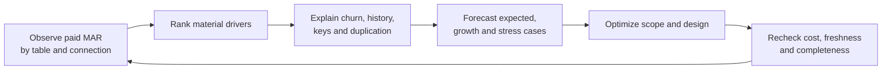

# Forecasting, Cost Drivers, and Usage Optimization

> [!abstract] Mental model
> Forecast from observed changed rows by table and connection, then optimize unnecessary scope and duplication—not business-required freshness blindly.

## Executive Summary

- **What it is:** A measurement-led process to estimate Fivetran consumption, identify the tables and design choices driving it, and reduce waste safely.
- **Why it matters:** Source row count and data volume are weak proxies for MAR; source behavior, keys, history, and duplicated connection paths matter more.
- **Mental model:** Baseline, segment, explain, optimize, and re-measure.
- **Recommend when:** A representative pilot and Platform Connector data can show paid MAR by connection/table and distinguish structural growth from anomalies.
- **Reconsider when:** Savings proposals remove required data, weaken recovery, or reduce freshness without stakeholder approval.

## What It Can Do

- Estimate database MAR roughly from source counts and more accurately from a representative trial or production usage history.
- Break down usage by destination, connection, table, and time with dashboard and Platform Connector data.
- Identify duplicate connections, high-churn history tables, append-only events, unstable keys, rollback windows, and connector-specific spikes.
- Reduce usage through table/column scope, connection consolidation, appropriate sync mode, and source-side behavior changes.
- Track forecast variance and establish budget alerts or chargeback views.

## What It Cannot Do

- Produce a reliable forecast from one initial sync because historical initial usage is free and unlike steady-state change behavior.
- Assume shorter sync intervals create proportionally more MAR; ordinary MAR counts unique changed identities per month.
- Optimize connector behavior that is fixed by source API semantics without changing requirements or architecture.
- Replace a contract quote: rate curves, plan gates, credits, minimums, and legacy terms must be confirmed commercially.

## Core Concepts

| Concept | Plain-language meaning | Why it matters |
|---|---|---|
| Representative period | A month or pilot window containing normal and peak business activity | Avoids forecasting from an unusually quiet or busy sample |
| Change ratio | Unique changed rows divided by table population | Better recurring-use signal than table size alone |
| Usage concentration | Share of paid MAR produced by top tables/connections | Directs optimization to material drivers |
| Duplicate path | Same source rows replicated by separate connections/destinations | Counts separately and may be avoidable |
| Plan/contract | Commercial rules applied to measured usage | Converts technical consumption into money |
| Forecast range | Expected, low, and high scenarios | Communicates uncertainty honestly |

## How It Works (Simple Flow)

1. Inventory connections, tables, sync modes, keys, destinations, schedules, and contract model.
2. Observe at least one representative period, separating free historical/trial usage from paid incremental MAR.
3. Rank paid MAR by connection and table and calculate change ratios and month-over-month behavior.
4. Explain drivers: new business volume, mass updates, history mode, rollback/re-import behavior, duplicates, or key/schema changes.
5. Build expected, growth, and stress scenarios using observed drivers and commercial terms.
6. Remove unnecessary scope, consolidate paths where governance allows, and narrow history mode to justified entities.
7. Re-measure freshness, completeness, paid MAR, and destination cost after each change.

## Visuals



## Readable Snippets

Illustrative planning calculation—not a Fivetran quote:

```text
CRM customer table:       2,000,000 rows × 12% changed/month =   240,000 MAR
Orders append-only:         400,000 new rows/month            =   400,000 MAR
Status history versions:     60,000 entities × 3 changes      =   180,000 MAR
Duplicate test connection:   same CRM changes                 =   240,000 MAR
Expected technical volume:                                    1,060,000 MAR
```

Apply current plan, connection-level pricing, discounts, credits, and contract terms separately.

## Consultant Talking Points

- **Client question this answers:** "What will Fivetran cost next year, and what can we control?"
- **Trade-offs to mention:** Table selection and consolidation reduce cost; reduced history or isolated environments may conflict with audit, resilience, and team autonomy.
- **Risk or governance angle:** Cost controls must not silently remove required records or collapse mandated environment segregation.
- **Cost or operational angle:** Current documentation includes plan-dependent consumption curves and a connection base charge for certain low-usage connections; verify the live contract rather than hard-coding list pricing into architecture.

## Common Pitfalls

- Annualizing the free initial sync misrepresents recurring incremental MAR.
- Using a quiet partial month misses month-end, quarter-end, campaign, or regulatory update peaks.
- Reducing sync frequency solely to cut MAR may hurt freshness without reducing unique monthly changed rows.
- Blocking tables before confirming downstream use creates silent data gaps and emergency re-enablement work.
- Ignoring many low-volume connections can miss current per-connection minimum/base-charge effects.
- Treating a vendor estimate as a forecast without reconciling actual Platform Connector usage hides drift.

## When to Recommend What (Decision Table)

| Situation | Recommend | Why | Watch-outs |
|---|---|---|---|
| New source with unknown change behavior | Use the 14-day connection trial and a representative business window | Observed usage beats total-row guesses | Trial may miss month/quarter peaks |
| A few tables dominate paid MAR | Investigate those tables first | Highest optimization leverage | Driver may be legitimate business growth |
| Same raw source copied to several analytical environments | Consider one governed landing plus downstream separation | Can avoid duplicate connection MAR | Security or residency may require separate destinations |
| History mode drives repeated versions | Limit history to audit-required tables/columns where possible | Preserves value with narrower cost | Do not weaken regulatory evidence |
| Many tiny connections | Consolidate where source ownership and schema design permit | Reduces operational and possible base-charge overhead | Failure domain and team autonomy change |

## Related Topics

- [[03 Fivetran/06 Cost and Consultant Decision-Making/Cost and Consultant Decision-Making Overview|Cost and Consultant Decision-Making Overview]]
- [[03 Fivetran/06 Cost and Consultant Decision-Making/29 Monthly Active Rows|Monthly Active Rows]]
- [[03 Fivetran/05 Security Governance and Production Operations/26 Monitoring Logging Freshness and the Platform Connector|Monitoring, Logging, Freshness, and the Platform Connector]]
- [[03 Fivetran/06 Cost and Consultant Decision-Making/31 Destination Cost and End-to-End Total Cost of Ownership|Destination Cost and End-to-End Total Cost of Ownership]]

## Related Decision Notes

- [[80 Comparisons and Decision Notes/Decision Notes/Fivetran/Decisions - Estimating and Controlling Fivetran Cost|Estimating and Controlling Fivetran Cost]]

## Questions

- **Explain:** Why is a representative change profile more useful than total source size for forecasting MAR?
- **Apply:** Which three investigations would you run when one connection's paid MAR doubles?
- **Challenge:** Which freshness, audit, segregation, or contract constraint could make the cheapest design unacceptable?

## Sources To Revisit

- [Fivetran Docs: Monitor and Optimize Usage](https://fivetran.com/docs/core-concepts/usage-based-pricing/tracking-and-optimizing-usage)
- [Fivetran Docs: Usage-Based Pricing](https://fivetran.com/docs/getting-started/pricing)
- [Fivetran Docs: Plans and Billing](https://fivetran.com/docs/usage-based-pricing/billing-and-plans)
- [Fivetran Docs: Fivetran Platform Connector](https://fivetran.com/docs/logs/fivetran-platform)
