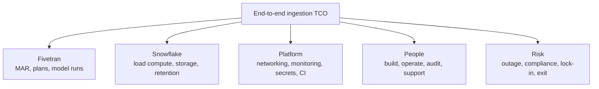

# Destination Cost and End-to-End Total Cost of Ownership

> [!abstract] Mental model
> Fivetran is one line item in a service: add Snowflake load compute and storage, networking, transformation, monitoring, controls, people, incidents, and change.

## Executive Summary

- **What it is:** A full-lifecycle cost model for managed ingestion from commercial subscription through destination operation and organizational ownership.
- **Why it matters:** A lower MAR bill can coexist with an expensive Snowflake design or a heavy manual support model.
- **Mental model:** TCO = vendor usage + destination resources + surrounding platform + people/risk cost.
- **Recommend when:** Managed ingestion removes more engineering and reliability burden than its total incremental cost adds.
- **Reconsider when:** The connector fit is poor, required controls create disproportionate overhead, or existing capabilities can meet the requirement reliably at lower lifecycle cost.

## What It Can Do

- Separate direct Fivetran charges from Snowflake compute, storage, and other cloud costs.
- Compare shared versus dedicated Snowflake loading warehouses and their operational consequences.
- Include setup, security review, monitoring, incident response, upgrades, reconciliation, and support ownership.
- Compare managed ingestion with custom pipelines on a like-for-like reliability and lifecycle basis.
- Identify measurable TCO drivers and assign cost owners.

## What It Cannot Do

- Reduce TCO to public list prices; negotiated contracts, cloud region, Snowflake edition, discounts, and internal labor rates vary.
- Assume a custom pipeline is free because engineers are already employed.
- Assume a dedicated warehouse is always cheaper or always safer than a shared one.
- Quantify outage, compliance, or concentration risk precisely without client-specific probabilities and impacts.

## Core Concepts

| Concept | Plain-language meaning | Why it matters |
|---|---|---|
| Direct cost | Fivetran MAR, model runs, plan, connection charges, and contract commitment | Visible vendor spend |
| Load compute | Snowflake warehouse time used by Fivetran SQL/DML | Separate bill driven by warehouse configuration and sync pattern |
| Storage/retention | Raw tables, history versions, Time Travel, and Fail-safe implications | Grows beyond Fivetran's own charge |
| Shared warehouse | Loading and other workloads use the same compute | Can improve utilization but introduces contention and weak attribution |
| Dedicated warehouse | Isolated compute for Fivetran loading | Better attribution and isolation, with minimum-start/resume cost |
| Operating cost | People, monitoring, incident, access, audit, and change effort | Often the reason managed ingestion wins |
| Risk-adjusted TCO | Expected financial impact of reliability, compliance, and vendor risks | Prevents false savings from under-controlled designs |

## How It Works (Simple Flow)

1. Define service scope, criticality, freshness, retention, security, and support targets.
2. Estimate Fivetran paid usage and plan/contract cost from representative data.
3. Measure Snowflake load warehouse credits, storage growth, history retention, and downstream transformation/test compute.
4. Add networking, private endpoints, Hybrid infrastructure, observability, SIEM, backup, and metadata costs.
5. Add implementation, security review, access administration, monitoring, incidents, upgrades, and vendor-management effort.
6. Build equivalent managed and custom scenarios with the same reliability, controls, and service level.
7. Review actual unit cost, freshness, incidents, and owner effort after adoption.

## Visuals



## Readable Snippets

Use one comparable cost model for managed and custom options:

```text
Annual Fivetran subscription/consumption       €____
Snowflake ingestion warehouse credits          €____
Raw/history storage and retention               €____
Networking, Hybrid agents, logs, monitoring     €____
dbt transformation and quality compute          €____
Engineering and platform operations             €____
Security, audit and vendor management            €____
Expected incident and recovery impact            €____
Migration, exit and contingency reserve          €____
------------------------------------------------------
Risk-adjusted annual TCO                         €____
```

## Consultant Talking Points

- **Client question this answers:** "Is Fivetran cheaper than building and running ingestion ourselves?"
- **Trade-offs to mention:** Dedicated Snowflake compute improves isolation and attribution; sharing can reduce idle cost. Managed connectors reduce maintenance but add subscription and vendor dependency.
- **Risk or governance angle:** Compare equivalent control levels, including audit logs, access review, recovery testing, data reconciliation, and vendor exit.
- **Cost or operational angle:** Fivetran recommends a small Snowflake warehouse with aggressive auto-suspend for many loads, but actual sizing and schedule should be measured; per-second billing still has minimum billable runtime effects.

## Common Pitfalls

- Comparing Fivetran fees with only the initial custom-code build ignores years of API changes, on-call, recovery, and security maintenance.
- Ignoring Snowflake warehouse resumes and minimum billable time can make many small frequent syncs more expensive than expected.
- Sharing a warehouse without query tagging or attribution hides ingestion cost and allows contention with dbt or BI.
- Choosing transient raw tables solely to reduce Fail-safe cost can weaken recovery options and violate retention requirements.
- Omitting history-mode storage, downstream tests, logging, and reconciliation understates the destination layer.
- Treating engineer time as sunk cost hides opportunity cost and capacity removed from higher-value work.

## When to Recommend What (Decision Table)

| Situation | Recommend | Why | Watch-outs |
|---|---|---|---|
| Many standard connectors and limited ingestion engineering capacity | Managed Fivetran pattern | Transfers connector maintenance and much operation | Plan, MAR, destination, and vendor risk remain |
| Stable high-throughput loading needs clear attribution | Dedicated Snowflake loading warehouse | Isolation and measurable cost | Tune size and auto-suspend; avoid idle resumes |
| Small intermittent estate with compatible workloads | Shared warehouse initially | May improve utilization | Contention, ownership, and cost attribution |
| Strict recovery and audit retention | Permanent data and explicit retention design | Stronger recovery posture | Higher storage and governance cost |
| Unsupported or heavily customized source behavior | Custom/alternative ingestion evaluation | Managed connector may not fit | Price equivalent reliability and maintenance, not just build effort |

## Related Topics

- [[03 Fivetran/06 Cost and Consultant Decision-Making/Cost and Consultant Decision-Making Overview|Cost and Consultant Decision-Making Overview]]
- [[03 Fivetran/04 Fivetran with Snowflake and dbt/18 Snowflake Database Schema Warehouse and Cost Design|Snowflake Database, Schema, Warehouse, and Cost Design]]
- [[03 Fivetran/06 Cost and Consultant Decision-Making/30 Forecasting Cost Drivers and Usage Optimization|Forecasting, Cost Drivers, and Usage Optimization]]
- [[03 Fivetran/06 Cost and Consultant Decision-Making/32 Fivetran Recommendation and Enterprise Adoption Framework|Fivetran Recommendation and Enterprise Adoption Framework]]

## Related Decision Notes

- [[80 Comparisons and Decision Notes/Decision Notes/Fivetran/Decisions - Estimating and Controlling Fivetran Cost|Estimating and Controlling Fivetran Cost]]
- [[80 Comparisons and Decision Notes/Comparisons/Fivetran/Comparison - Fivetran vs Custom Ingestion|Fivetran vs Custom Ingestion]]

## Questions

- **Explain:** Which cost categories sit outside the Fivetran invoice?
- **Apply:** How would you compare a managed connector with an internally built pipeline fairly?
- **Challenge:** Which recovery, compliance, staffing, or Snowflake assumption could reverse the TCO result?

## Sources To Revisit

- [Fivetran Docs: Snowflake Destination and Data Load Costs](https://fivetran.com/docs/destinations/snowflake)
- [Fivetran Docs: Snowflake Setup Guide](https://fivetran.com/docs/destinations/snowflake/setup-guide)
- [Fivetran Docs: Usage-Based Pricing](https://fivetran.com/docs/getting-started/pricing)
- [Snowflake Docs: Virtual Warehouse Credit Usage](https://docs.snowflake.com/en/user-guide/warehouses-considerations)
