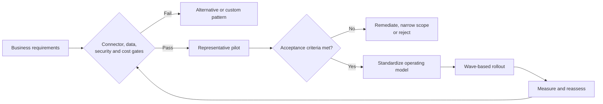

# Fivetran Recommendation and Enterprise Adoption Framework

> [!abstract] Mental model
> Recommend Fivetran connector by connector, prove the difficult assumptions in a pilot, and scale only after the operating model works.

## Executive Summary

- **What it is:** A structured decision and rollout method covering source fit, destination behavior, security, operations, economics, ownership, pilot evidence, and exit risk.
- **Why it matters:** "Fivetran has the connector" is only the start; enterprise suitability depends on data correctness, controls, recoverability, and lifecycle cost.
- **Mental model:** Gate, pilot, prove, standardize, scale, and reassess.
- **Recommend when:** Supported connectors meet requirements and a representative pilot proves correctness, freshness, security, operability, and acceptable TCO.
- **Reconsider when:** Critical sources need unsupported logic, data boundaries cannot be approved, recovery cannot meet objectives, or economics remain poor after optimization.

## What It Can Do

- Frame a defensible recommendation with explicit evidence and unresolved conditions.
- Use a pilot to validate connector behavior, schema, keys, deletes, history, latency, source impact, MAR, and Snowflake cost.
- Define platform standards for identities, networks, naming, schema selection, monitoring, recovery, automation, and ownership.
- Stage adoption by business value and risk rather than onboarding every connector at once.
- Preserve alternatives for exceptional sources instead of forcing one product into every ingestion pattern.

## What It Cannot Do

- Turn one successful connector pilot into proof that every connector will behave the same way.
- Resolve missing business ownership, data contracts, or regulatory approval through technology.
- Guarantee future connector, API, pricing, plan, or vendor-roadmap stability.
- Eliminate the need for portability, exit planning, and periodic commercial review.

## Core Concepts

| Concept | Plain-language meaning | Why it matters |
|---|---|---|
| Decision gate | A non-negotiable condition that must pass | Stops unsuitable designs early |
| Representative pilot | Limited production-like test covering normal and difficult behavior | Replaces marketing assumptions with evidence |
| Acceptance criterion | Measurable threshold for success | Makes pilot decisions auditable |
| Operating model | Owners, standards, monitoring, support, change, and recovery | Determines whether the platform remains reliable at scale |
| Exception path | Approved alternative for sources that do not fit | Prevents tool standardization from becoming tool dogma |
| Conditional recommendation | Approval subject to named actions or controls | Communicates uncertainty honestly |
| Reassessment trigger | Change that forces the decision to be revisited | Protects against silent drift in risk or economics |

## How It Works (Simple Flow)

1. Define business outcome, critical datasets, consumers, freshness, history, controls, support, and budget.
2. Gate each source on connector maturity, field coverage, API/CDC behavior, keys, deletes, schema evolution, region, network, and deployment support.
3. Design the Snowflake/dbt ownership boundary and the human, service, monitoring, recovery, and automation model.
4. Pilot representative high-value and high-risk sources through normal operation, failures, schema change, credential rotation, and recovery.
5. Measure completeness, latency, source impact, paid MAR, Snowflake cost, operator effort, and control evidence against acceptance criteria.
6. Recommend adopt, adopt with conditions, targeted use, or reject; record assumptions and exception routes.
7. Roll out in waves with templates, owners, training, observability, budget controls, and change governance.
8. Reassess on contract renewal, material connector change, new regulation, repeated incidents, cost variance, or strategic platform change.

## Visuals

## Readable Snippets

Example decision scorecard:

| Dimension | Evidence | Gate |
|---|---|---|
| Connector fit | Required entities, keys, deletes, history, schema changes tested | No critical gap |
| Freshness/reliability | Normal and failure recovery measured | Meets dataset objective |
| Security/compliance | Region, path, identities, logs, contract approved | Formal approval |
| Data quality | Source-to-raw and raw-to-mart reconciliation | Within agreed tolerance |
| Cost | Paid MAR, Snowflake, controls, and owner effort | Within TCO range |
| Operations | Alerts, runbook, RACI, rotation, re-sync test | Production owner accepts |
| Exit | Data, credentials, dependencies, and replacement path documented | Feasible and tested proportionately |

## Consultant Talking Points

- **Client question this answers:** "Should we standardize on Fivetran, and how do we adopt it safely?"
- **Trade-offs to mention:** Standardization improves speed, support, and governance; exceptions preserve fit for unusual sources but increase platform diversity.
- **Risk or governance angle:** Make approval connector- and dataset-specific, with measurable gates and named residual risks.
- **Cost or operational angle:** Use pilot evidence for MAR and Snowflake TCO, and include platform-team capacity, plan gates, incident ownership, and exit cost.

## Common Pitfalls

- Selecting the platform from connector catalog coverage alone misses field, key, delete, history, latency, and maturity limitations.
- Piloting only a small easy SaaS source gives false confidence for high-volume databases or regulated datasets.
- Scaling before monitoring, access, reconciliation, and recovery standards exist multiplies operational debt.
- Declaring Fivetran the only allowed ingestion path forces bad-fit sources into fragile workarounds.
- Using a weighted score to average away a failed compliance or correctness gate produces a misleading recommendation.
- Negotiating a long commitment before representative usage data is available increases commercial risk.

## When to Recommend What (Decision Table)

| Situation | Recommend | Why | Watch-outs |
|---|---|---|---|
| Many supported standard sources and small ingestion team | Adopt Fivetran as default managed path | High leverage from standardized connectors and operations | Maintain connector-level gates and exception route |
| Mixed estate with several unusual or unsupported sources | Targeted Fivetran standard plus alternative patterns | Uses managed value where fit is strong | Governance across multiple ingestion methods |
| Strong connector fit but unresolved security or operating controls | Adopt with explicit conditions after remediation | Technology may fit while production readiness does not | Conditions need owner, date, and evidence |
| Critical connector fails correctness, retention, or recovery needs | Reject it for that workload | Non-negotiable service requirement is unmet | Revisit vendor roadmap only with proof |
| Uncertain change rate and cost | Time-boxed representative pilot before commitment | Produces MAR, Snowflake, and support evidence | Include peak business behavior and failure tests |

## Related Topics

- [[03 Fivetran/06 Cost and Consultant Decision-Making/Cost and Consultant Decision-Making Overview|Cost and Consultant Decision-Making Overview]]
- [[03 Fivetran/01 Foundations and Platform Mental Model/05 When to Recommend Fivetran|When to Recommend Fivetran]]
- [[03 Fivetran/02 Connectors and Sync Behavior/06 Connector Types Coverage and Maturity|Connector Types, Coverage, and Maturity]]
- [[03 Fivetran/04 Fivetran with Snowflake and dbt/21 Finance and Banking End-to-End Case Study|Finance and Banking End-to-End Case Study]]

## Related Decision Notes

- [[80 Comparisons and Decision Notes/Decision Notes/Fivetran/Decisions - Evaluating Fivetran Connector Fit|Evaluating Fivetran Connector Fit]]
- [[80 Comparisons and Decision Notes/Comparisons/Fivetran/Comparison - Fivetran vs Custom Ingestion|Fivetran vs Custom Ingestion]]
- [[80 Comparisons and Decision Notes/Decision Notes/Fivetran/Decisions - Estimating and Controlling Fivetran Cost|Estimating and Controlling Fivetran Cost]]

## Questions

- **Explain:** Why should a Fivetran recommendation be connector-specific rather than platform-wide?
- **Apply:** Which pilot criteria would you make mandatory before a bank standardizes on Fivetran?
- **Challenge:** Which failed gate should override an otherwise strong commercial and operational score?

## Sources To Revisit

- [Fivetran Docs: Core Concepts](https://fivetran.com/docs/core-concepts)
- [Fivetran Docs: Core Concepts and Release Phases](https://fivetran.com/docs/core-concepts)
- [Fivetran Docs: Deployment Models](https://fivetran.com/docs/deployment-models)
- [Fivetran Docs: Plans and Billing](https://fivetran.com/docs/usage-based-pricing/billing-and-plans)
