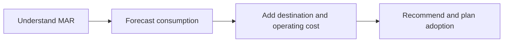

# Cost and Consultant Decision-Making Overview

> Connect usage behavior to commercial outcomes and turn the technical assessment into a defensible client recommendation.

> [!abstract] Chapter outcome
> You should be able to explain MAR, forecast major cost drivers, include destination and operating costs, and propose a controlled enterprise adoption path.

## Topics

- [[03 Fivetran/06 Cost and Consultant Decision-Making/29 Monthly Active Rows|29 - Monthly Active Rows]]
- [[03 Fivetran/06 Cost and Consultant Decision-Making/30 Forecasting Cost Drivers and Usage Optimization|30 - Forecasting, Cost Drivers, and Usage Optimization]]
- [[03 Fivetran/06 Cost and Consultant Decision-Making/31 Destination Cost and End-to-End Total Cost of Ownership|31 - Destination Cost and End-to-End Total Cost of Ownership]]
- [[03 Fivetran/06 Cost and Consultant Decision-Making/32 Fivetran Recommendation and Enterprise Adoption Framework|32 - Fivetran Recommendation and Enterprise Adoption Framework]]

## Chapter Map

## How To Use This Area

Study this chapter after the platform mechanics. Cost estimates and recommendations are only credible when they reflect source behavior, controls, and operational ownership.

## Related Areas

- [[03 Fivetran/Fivetran Learning Map|Fivetran Learning Map]]
- [[03 Fivetran/05 Security Governance and Production Operations/Security Governance and Production Operations Overview|Previous: Security, Governance, and Production Operations]]
- [[80 Comparisons and Decision Notes/Comparisons and Decision Notes Overview|Comparisons and Decision Notes]]
