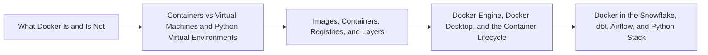

# Foundations and Container Mental Model Overview

> Explain what Docker standardizes, distinguish its main objects, and place it correctly in the Snowflake, dbt Core, Airflow, and Python stack.

> [!abstract] Chapter outcome
> Explain what Docker standardizes, distinguish its main objects, and place it correctly in the Snowflake, dbt Core, Airflow, and Python stack.

## Topics

- [[04 Docker/01 Foundations and Container Mental Model/01 What Docker Is and Is Not|01 - What Docker Is and Is Not]]
- [[04 Docker/01 Foundations and Container Mental Model/02 Containers vs Virtual Machines and Python Virtual Environments|02 - Containers vs Virtual Machines and Python Virtual Environments]]
- [[04 Docker/01 Foundations and Container Mental Model/03 Images Containers Registries and Layers|03 - Images, Containers, Registries, and Layers]]
- [[04 Docker/01 Foundations and Container Mental Model/04 Docker Engine Docker Desktop and the Container Lifecycle|04 - Docker Engine, Docker Desktop, and the Container Lifecycle]]
- [[04 Docker/01 Foundations and Container Mental Model/05 Docker in the Snowflake dbt Airflow and Python Stack|05 - Docker in the Snowflake, dbt, Airflow, and Python Stack]]

## Chapter Map

## How To Use This Area

Study this first. The goal is a durable mental model before learning commands.

## Related Areas

- [[04 Docker/Docker Learning Map|Docker Learning Map]]
- [[04 Docker/02 Building Reproducible Images/Building Reproducible Images Overview|Next: Building Reproducible Images]]
