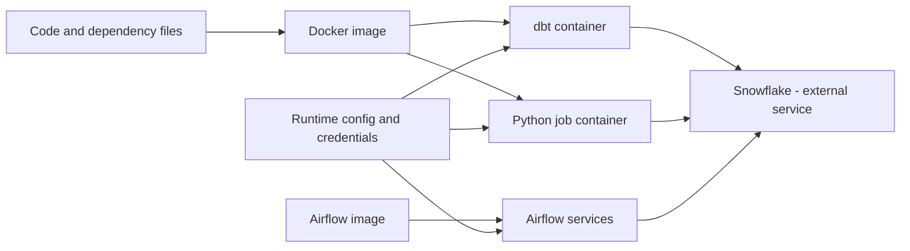

# What Docker Is and Where It Fits

> [!abstract] Learning target
> Position Docker in the stack and distinguish containers from virtual machines and Python virtual environments.

> **Curriculum priority:** Essential

## Executive Summary

- **What it is:** Docker is a way to package software and its runtime dependencies into an image, then run that image as an isolated process called a container.
- **Why it matters:** The same dbt, Python, or Airflow runtime can be used by developers, CI jobs, and deployed environments instead of being rebuilt by hand on every machine.
- **Mental model:** An image is a versioned runtime package; a container is one running copy of it.
- **Best used when:** A team needs repeatable tools, isolated dependencies, quick setup, or the same runtime in several environments.
- **Avoid or reconsider when:** A simple local command with few dependencies is already reliable, or the target platform does not run containers.

Docker helps standardize the **runtime starting point**. It does not make environments identical by itself. Configuration, credentials, mounted files, CPU architecture, external services, and data can still differ.

## What It Can Do

- Package a chosen operating-system base, Python version, dbt adapter, Airflow providers, and other dependencies together.
- Isolate one project's processes and dependencies from another project's runtime.
- Give developers and automated pipelines a shared command such as `docker run ...` or `docker compose up`.
- Start short-lived jobs, such as `dbt build`, or long-running services, such as the Airflow scheduler.
- Make a tested image portable between machines that support the same container platform and CPU architecture.

## What It Cannot Do

- Guarantee identical results when runtime configuration, credentials, source data, or external services differ.
- Replace Git, dependency version pinning, testing, CI/CD, monitoring, or access governance.
- Turn a local Docker Compose setup into a production-ready Airflow platform automatically.
- Contain Snowflake itself in this stack; Snowflake remains an external managed service reached over the network.
- Provide the same isolation boundary as a full virtual machine in every threat model.

## Core Concepts

| Concept | Plain-language meaning | Why it matters |
|---|---|---|
| Host | The laptop or server providing CPU, memory, disk, and networking | Containers still depend on the host and must be given sensible resource and access limits |
| Image | A packaged, read-only runtime blueprint | This is the artifact the team builds, tests, versions, and shares |
| Container | An isolated process started from an image | This is where dbt, Python, or an Airflow component actually runs |
| Virtual machine (VM) | A virtual computer with its own guest operating system | VMs usually provide a broader isolation boundary but are heavier to start and manage |
| Python virtual environment | An isolated set of Python packages built on an existing Python installation | Useful for Python dependencies, but it does not package system libraries or the wider runtime |
| Docker Engine | The software that creates and manages images, containers, networks, and volumes | The Docker command sends requests to this engine |
| Docker Compose | A way to describe and operate several related containers together | Common for a local Airflow, dbt, and supporting-service environment |

## How It Works (Simple Flow)

1. The team describes the runtime in files such as a `Dockerfile` and `compose.yaml`.
2. Docker builds an image containing the selected base system, tools, dependencies, and application code.
3. The image is stored locally or pushed to a registry for reuse by other machines.
4. Docker starts one or more containers from that image with runtime configuration, storage, and networking attached.
5. The main process runs: for example, `dbt build`, a Python job, or an Airflow scheduler.
6. Logs and exit status show whether the process succeeded; durable outputs are written outside the container when required.
7. The container can be replaced while the versioned image remains available for another run.

## Visuals



The image standardizes what runs. Runtime inputs still determine where it connects and what it is allowed to do.

## Readable Snippets

Run Python without installing that Python version directly on the host:

```powershell
docker run --rm python:3.12-slim python --version
```

Read the command from right to left:

- `python --version` is the process inside the container.
- `python:3.12-slim` is the image and tag.
- `--rm` removes the stopped container after the command finishes.
- `docker run` creates and starts the container.

This proves that a packaged Python runtime can run. It does not yet pin the image to an immutable digest or install project dependencies.

## Consultant Talking Points

- **Client question this answers:** “Why introduce Docker when our scripts already run on a developer laptop?”
- **Trade-offs to mention:** More consistent runtimes and easier onboarding come with image maintenance, local resource use, and another layer to debug.
- **Risk or governance angle:** Approved base images, dependency pinning, controlled registries, secrets handling, and non-root execution remain team responsibilities.
- **Cost or operational angle:** Docker can reduce setup drift and support effort, but poorly maintained images, duplicate builds, and oversized local stacks consume time, storage, and CI capacity.

## Common Pitfalls

- Saying “it works in Docker, so every environment is identical” while configuration, credentials, data, or CPU architecture still differ.
- Treating a container as a small VM and manually installing fixes inside a running container instead of rebuilding the image.
- Assuming isolation means a container is automatically secure; excessive privileges or host mounts can weaken the boundary.
- Containerizing Snowflake conceptually. The container holds the client tools and code; Snowflake runs outside it.
- Using Docker for a trivial workflow when a pinned Python virtual environment would be simpler and sufficient.

## When to Recommend What (Decision Table)

| Situation | Recommend | Why | Watch-outs |
|---|---|---|---|
| Several developers need the same dbt and Python versions | Docker image | Packages the wider runtime and reduces machine-specific setup | Pin dependencies and support the developer workflow |
| One developer needs isolation only between Python package sets | Python virtual environment | Lower overhead for a Python-only need | Relies on the host Python and system libraries |
| Workload needs a separate operating system or stronger isolation boundary | Virtual machine or managed platform | A VM controls more of the operating-system boundary | Slower startup and greater operational overhead |
| Local Airflow needs several coordinated services | Docker Compose for development | Starts the related services from one declared configuration | Not a production architecture by itself |
| Snowflake transformations need repeatable dbt execution | Containerize dbt; keep Snowflake external | Standardizes the client runtime without misplacing the data platform | Network, authentication, roles, and warehouses remain external concerns |

## Related Topics

- [[04 Docker/01 Foundations and Everyday Docker/Foundations and Everyday Docker Overview|Foundations and Everyday Docker Overview]]
- [[04 Docker/01 Foundations and Everyday Docker/02 Images Containers Registries Layers and Lifecycle|Images, Containers, Registries, Layers, and Lifecycle]]
- [[04 Docker/02 Reproducible Images and Docker Compose/08 Docker Compose Services Storage Networking and Readiness|Docker Compose Services, Storage, Networking, and Readiness]]
- [[04 Docker/03 Data Stack Integration Patterns/09 Local Airflow dbt Python and Snowflake Environment|Local Airflow, dbt, Python, and Snowflake Environment]]

## Related Decision Notes

- No dedicated decision note yet; the decision table above covers the current durable guidance.

## Questions

- **Explain:** How is a Docker container different from both a virtual machine and a Python virtual environment?
- **Apply:** Which parts of a dbt Core runtime would go into an image, and which settings should arrive when the container starts?
- **Challenge:** Which remaining differences could still make a tested image behave differently in development and production?

## Sources To Revisit

- [Docker Docs: What is Docker?](https://docs.docker.com/get-started/docker-overview/)
- [Docker Docs: What is a container?](https://docs.docker.com/get-started/docker-concepts/the-basics/what-is-a-container/)
- [Docker Docs: Docker Compose](https://docs.docker.com/compose/)
- [Python Docs: `venv` — Creation of virtual environments](https://docs.python.org/3/library/venv.html)
