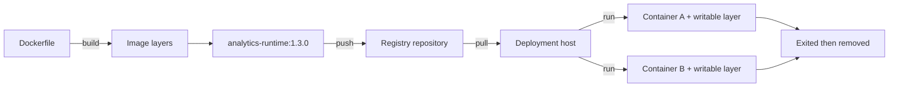

# Images, Containers, Registries, Layers, and Lifecycle

> [!abstract] Learning target
> Connect the build artifact, running instance, distribution mechanism, layered filesystem, and container states in one mental model.

> **Curriculum priority:** Essential

## Executive Summary

- **What it is:** Docker turns build instructions into a layered image, stores images locally or in a registry, and starts disposable containers from them.
- **Why it matters:** Teams can test and promote one known artifact rather than reinstalling dependencies during every deployment.
- **Mental model:** The image is a sealed recipe result; a container is a working copy with a thin writable layer.
- **Best used when:** A runtime must be versioned, shared, tested once, and started repeatedly.
- **Avoid or reconsider when:** The team plans to maintain important state only inside a container or relies on untracked changes made after startup.

## What It Can Do

- Build a repeatable package from a `Dockerfile`.
- Reuse unchanged image layers to speed up builds and transfers.
- Give an image a readable tag and an immutable content digest.
- Store and distribute images through a registry such as Docker Hub or a private cloud registry.
- Start many independent containers from the same image.
- Retain an exited container temporarily so its logs and final state can be inspected.

## What It Cannot Do

- Make a movable tag such as `latest` identify the same content forever.
- Persist important output after a container is removed unless storage is mounted or data is sent elsewhere.
- Guarantee that an image is trusted, patched, or compatible merely because it is in a registry.
- Preserve manual package installations made inside a container when that container is replaced.
- Make images free: layers consume local, CI, and registry storage and require retention policies.

## Core Concepts

| Concept | Plain-language meaning | Why it matters |
|---|---|---|
| Dockerfile | Text instructions used to build an image | Makes runtime construction reviewable and repeatable |
| Image | Immutable package of files, runtime settings, and a default command | The artifact to test and promote |
| Layer | One reusable set of filesystem changes in an image | Layer order affects cache reuse, build time, and image size |
| Container | A running or stopped instance of an image | Each execution gets its own runtime state |
| Writable container layer | Temporary changes made while that container runs | Useful for scratch work, unsafe for durable data |
| Registry | Service that stores and distributes image repositories | Allows CI, developers, and deployment platforms to pull the same artifact |
| Repository | Related images under one name in a registry | Groups versions of a service or tool image |
| Tag | Human-readable pointer such as `1.8.7` | Convenient, but the pointer can be moved |
| Digest | Content-based identifier such as `sha256:...` | Identifies exact image content for strict reproducibility |

## How It Works (Simple Flow)

1. A `Dockerfile` starts from a base image and adds dependencies, code, and runtime settings.
2. `docker build` creates immutable layers and produces an image ID.
3. The image receives a repository name and tag, such as `analytics-runtime:1.3.0`.
4. CI may push the image layers to a registry; other machines pull only layers they do not already have.
5. `docker run` creates a container with a thin writable layer on top of the image.
6. The image's main process starts and the container stays running while that process runs.
7. When the process exits, the container becomes stopped; its exit code and logs remain until it is removed.
8. A new run should start a new container from the desired image rather than repairing the old one manually.

## Visuals



Both containers share the image definition but have separate runtime state.

## Readable Snippets

```powershell
# Download a specific tagged image
docker pull python:3.12-slim

# See local images
docker image ls

# Start a disposable container from the image
docker run --rm python:3.12-slim python --version

# Inspect the exact repository digest Docker recorded
docker image inspect python:3.12-slim --format '{{json .RepoDigests}}'
```

A typical image name has this shape:

```text
registry.example.com/data-platform/dbt-runtime:1.8.7
| registry         | repository                 | tag |
```

For controlled deployment, a pipeline can record or deploy the resulting digest. Tags remain useful labels for people; digests answer “which exact content ran?”

## Consultant Talking Points

- **Client question this answers:** “Are we deploying our source code or a tested runtime artifact?”
- **Trade-offs to mention:** Images speed reuse and promotion, but poor layer design creates slow builds and large transfers.
- **Risk or governance angle:** Control who can publish images, prefer trusted base images, scan them, and retain provenance from source commit to digest.
- **Cost or operational angle:** Registry retention, cache strategy, image size, and rebuild frequency affect storage and pipeline duration.

## Common Pitfalls

- Using `latest` as if it were a stable version; it is merely the default tag when no tag is supplied.
- Deploying by tag without recording the digest, then being unable to prove which content ran.
- Installing a fix interactively inside a running container and losing it when the container is replaced.
- Writing dbt artifacts, logs, or important job output only to the writable container layer.
- Pulling unknown public images without checking publisher, maintenance, supported architecture, and security posture.
- Keeping every old image indefinitely on developer machines, CI runners, and registries.

## When to Recommend What (Decision Table)

| Situation | Recommend | Why | Watch-outs |
|---|---|---|---|
| Human-friendly development and release selection | Versioned tag such as `1.3.0` | Easy to understand and operate | A tag may be moved unless the registry prevents it |
| Audited or tightly controlled deployment | Image digest, usually alongside a release tag | Selects exact content | Digests are harder for people to read and must be recorded by automation |
| Several runtimes share the same Python base | Reuse a maintained base image and shared layers | Reduces duplicate build and transfer work | Base updates still require rebuilds and tests |
| Temporary dbt or Python execution | New disposable container per run | Produces clean, repeatable runtime state | Send artifacts and logs to durable locations |
| Stateful local support service | Container plus a named volume | Allows the service container to be replaced | Backup and lifecycle of the volume are separate concerns |

## Related Topics

- [[04 Docker/01 Foundations and Everyday Docker/Foundations and Everyday Docker Overview|Foundations and Everyday Docker Overview]]
- [[04 Docker/01 Foundations and Everyday Docker/01 What Docker Is and Where It Fits|What Docker Is and Where It Fits]]
- [[04 Docker/02 Reproducible Images and Docker Compose/06 Build Context Layers Cache and Reproducibility|Build Context, Layers, Cache, and Reproducibility]]
- [[04 Docker/02 Reproducible Images and Docker Compose/07 Image Optimization Versioning and Registries|Image Optimization, Versioning, and Registries]]

## Related Decision Notes

- No dedicated decision note yet; image tag versus digest guidance is captured in the decision table.

## Questions

- **Explain:** Why can many containers start from one image without sharing all of their runtime changes?
- **Apply:** How would you identify and promote the exact dbt runtime tested in CI?
- **Challenge:** What evidence would you need before approving a third-party base image for a regulated client?

## Sources To Revisit

- [Docker Docs: What is an image?](https://docs.docker.com/get-started/docker-concepts/the-basics/what-is-an-image/)
- [Docker Docs: Understanding image layers](https://docs.docker.com/get-started/docker-concepts/building-images/understanding-image-layers/)
- [Docker Docs: What is a registry?](https://docs.docker.com/get-started/docker-concepts/the-basics/what-is-a-registry/)
- [Docker Docs: Build, tag, and publish an image](https://docs.docker.com/get-started/docker-concepts/building-images/build-tag-and-publish-an-image/)
