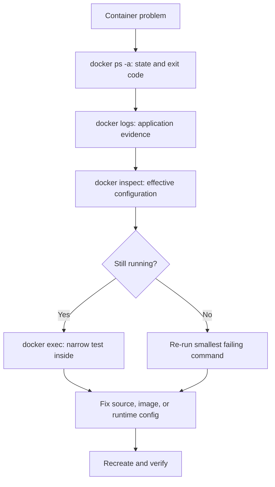

# Essential Commands, Processes, Logs, and Debugging

> [!abstract] Learning target
> Use the small command set needed to run, inspect, enter, stop, and diagnose containers while understanding exit codes and signals.

> **Curriculum priority:** Essential

## Executive Summary

- **What it is:** A practical workflow for observing a container's state, reading its logs, inspecting its configuration, and testing from inside it.
- **Why it matters:** Most everyday Docker incidents reduce to four questions: Did the container start? Is its main process still running? What did it log? Did it receive the expected configuration and connectivity?
- **Mental model:** A container lives as long as its main process. Diagnose that process before changing the image or platform.
- **Best used when:** A dbt job exits, a Python process fails, an Airflow service restarts, or a container cannot reach another service.
- **Avoid or reconsider when:** Interactive changes are being used as a permanent fix; durable fixes belong in source, build, or runtime configuration.

## What It Can Do

- Start a foreground job or a long-running background container.
- List running and stopped containers and see their exit status.
- Read standard output and standard error collected by Docker's configured logging system.
- Inspect the effective image, command, environment, mounts, networks, health, and restart count.
- Run a temporary diagnostic command inside a running container.
- Stop a process gracefully and remove containers that are no longer needed.
- Observe current CPU and memory use as a diagnostic clue.

## What It Cannot Do

- Recover logs that an application never wrote to standard output/error or another collected destination.
- Explain the business cause of a failed dbt model or Python job without application-level evidence.
- Make an exited container stay alive; the main process must remain running for a service container.
- Turn an interactive repair into a repeatable solution.
- Replace centralized logs, metrics, alerting, traces, or Airflow task history in a production environment.

## Core Concepts

| Concept | Plain-language meaning | Why it matters |
|---|---|---|
| Main process | The first application process in the container, often called PID 1 | The container stops when this process exits |
| Foreground run | Your terminal is attached to the container's output | Useful for short jobs and immediate feedback |
| Detached run | The container runs in the background with `-d` | Useful for services; inspect it with `ps` and `logs` |
| Exit code | Number returned when the main process finishes | `0` normally means success; non-zero means failure by convention |
| Log stream | Output written by the process to standard output or error | The quickest evidence for most startup and job failures |
| Inspect | Structured metadata about the container's actual configuration and state | Confirms what Docker really applied, not what was intended |
| Exec | Start an additional command in an already running container | Useful for diagnostics; it does not replace the main process |
| Signal | Request sent to a process, such as a graceful termination request | Applications need time and correct handling to shut down cleanly |

## How It Works (Simple Flow)

1. Run the container with a clear name and an explicit command.
2. Check `docker ps -a` to distinguish running, exited, and restarting states.
3. Read recent logs and note the first meaningful error, timestamp, and exit code.
4. Inspect the container to verify the image, command, environment names, mounts, network, and resource settings actually applied.
5. If it is still running, use `docker exec` for a narrow check such as listing files, printing a tool version, or testing DNS.
6. Reproduce the failure with the smallest command possible.
7. Fix source, image, or runtime configuration and create a fresh container.
8. Stop gracefully, then remove obsolete containers after required evidence has been captured.

## Visuals



This sequence keeps debugging evidence-led and reduces random changes.

## Readable Snippets

### The everyday command set

```powershell
# Start a named background container
docker run -d --name demo-web nginx:alpine

# List running containers; add -a to include stopped ones
docker ps
docker ps -a

# Follow the latest log lines with timestamps
docker logs --tail 100 --follow --timestamps demo-web

# Show the effective runtime details
docker inspect demo-web

# Run a diagnostic command inside the running container
docker exec demo-web nginx -v

# Observe current resource use
docker stats demo-web

# Request graceful shutdown, then remove the stopped container
docker stop demo-web
docker rm demo-web
```

### A short-lived data job

```powershell
docker run --rm my-python-job:1.2 python -m jobs.load_customers
```

For a job container, exiting is expected. Capture its logs and exit code; do not add a fake endless process merely to keep it visible.

### Useful Compose equivalents

```powershell
docker compose ps
docker compose logs --tail 100 --follow airflow-scheduler
docker compose exec airflow-scheduler airflow version
docker compose config
```

`docker compose config` renders the resolved Compose model and is especially useful for spotting unexpected variable substitution.

## Consultant Talking Points

- **Client question this answers:** “What evidence do we collect before blaming Docker, the application, or the network?”
- **Trade-offs to mention:** Shell access speeds diagnosis, but minimal production images may intentionally contain few diagnostic tools.
- **Risk or governance angle:** `docker exec` can expose configuration and data; production access should be controlled and auditable.
- **Cost or operational angle:** Restart loops, noisy logs, and containers without resource limits can consume host and logging capacity while hiding the root cause.

## Common Pitfalls

- Looking only at `docker ps`, which hides stopped containers; use `docker ps -a` when a job seems to disappear.
- Expecting a container to stay running after its main process completes.
- Reading only the last error line and missing the earlier root cause.
- Using `docker kill` or forced removal before allowing graceful shutdown or collecting evidence.
- Logging credentials, private keys, connection strings, or raw sensitive data.
- Treating `docker exec` changes as a fix; recreated containers will not contain them.
- Repeatedly restarting a deterministic failure and creating cost and log noise.

## When to Recommend What (Decision Table)

| Situation | Recommend | Why | Watch-outs |
|---|---|---|---|
| Short dbt or Python command | Foreground run with `--rm` | Immediate output and automatic cleanup | Send required artifacts to mounted or remote storage |
| Long-running local Airflow service | Detached Compose service | Keeps the terminal free and groups service operations | Use logs and health checks; do not confuse “running” with “ready” |
| Container exits immediately | `ps -a`, then `logs` and `inspect` | Preserves the simplest evidence trail | Do not remove it before evidence is captured |
| Need to confirm a file, version, or DNS result | Narrow `docker exec` command | Tests from the container's actual runtime context | Container must be running; avoid broad interactive repair |
| Repeatable production diagnosis | Central logs, metrics, health checks, and orchestrator tooling | Provides history and team visibility | Direct shell access should be exceptional and governed |
| Process needs time to finish cleanly | `docker stop` with an appropriate timeout | Sends a graceful signal before forced termination | Application must handle the signal and finish within the window |

## Related Topics

- [[04 Docker/01 Foundations and Everyday Docker/Foundations and Everyday Docker Overview|Foundations and Everyday Docker Overview]]
- [[04 Docker/01 Foundations and Everyday Docker/02 Images Containers Registries Layers and Lifecycle|Images, Containers, Registries, Layers, and Lifecycle]]
- [[04 Docker/01 Foundations and Everyday Docker/04 Files Mounts Networks Configuration and Secrets|Files, Mounts, Networks, Configuration, and Secrets]]
- [[04 Docker/04 Security Operations and Team Standards/18 Operations Troubleshooting and Production Boundaries|Operations, Troubleshooting, and Production Boundaries]]

## Related Decision Notes

- No dedicated decision note yet; the diagnostic sequence above is the current durable operating guidance.

## Questions

- **Explain:** Why does a container stop when its main process exits, even if the image is valid?
- **Apply:** Which commands would you use, in order, when an Airflow scheduler container repeatedly restarts?
- **Challenge:** When should production shell access be refused even though `docker exec` could speed up diagnosis?

## Sources To Revisit

- [Docker Docs: Docker container command reference](https://docs.docker.com/reference/cli/docker/container/)
- [Docker Docs: `docker container logs`](https://docs.docker.com/reference/cli/docker/container/logs/)
- [Docker Docs: `docker container exec`](https://docs.docker.com/reference/cli/docker/container/exec/)
- [Docker Docs: `docker container stop`](https://docs.docker.com/reference/cli/docker/container/stop/)
