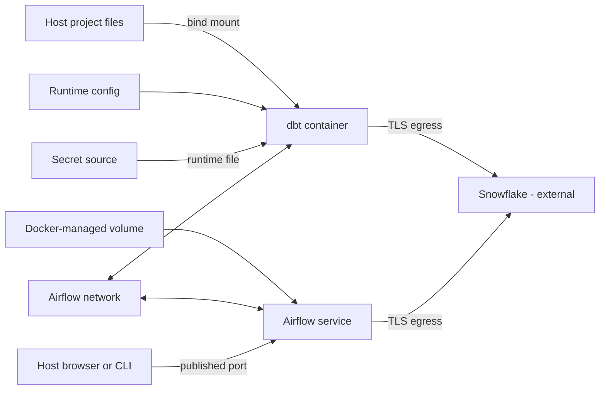

# Files, Mounts, Networks, Configuration, and Secrets

> [!abstract] Learning target
> Understand the main boundaries through which containers persist data, reach services, receive settings, and obtain credentials.

> **Curriculum priority:** Essential

## Executive Summary

- **What it is:** Containers receive external inputs through mounted storage, networks, runtime configuration, and secret delivery mechanisms.
- **Why it matters:** Most real Docker failures in a data stack happen at these boundaries: missing files, wrong hostnames, unpublished ports, absent variables, or mishandled credentials.
- **Mental model:** Keep the image generic; attach environment-specific files, routes, settings, and credentials when the container starts.
- **Best used when:** dbt needs project files and profiles, Airflow services need to communicate, Python jobs need settings, or containers must connect to Snowflake.
- **Avoid or reconsider when:** Sensitive or durable data would be baked into the image, stored only in the container layer, or exposed more broadly than required.

## What It Can Do

- Bind a host folder into a container for fast local code editing.
- Attach Docker-managed volumes for data that must outlive a replaceable container.
- Use temporary in-memory storage for disposable data where supported.
- Let containers on a user-defined network reach one another by service or container name.
- Publish a container port when the host or an external client needs access.
- Supply non-secret settings through environment variables or configuration files.
- Grant a container a secret as a file without baking it into the image.
- Allow dbt, Python, and Airflow containers to make outbound connections to Snowflake.

## What It Cannot Do

- Make data in the container's writable layer durable after the container is removed.
- Make `localhost` refer to another container; inside a container it normally refers to that same container.
- Make a bind mount portable when other hosts do not have the same path, permissions, or file behavior.
- Turn an environment variable or ordinary `.env` file into a secure secret store.
- Bypass corporate DNS, proxy, firewall, certificate, or Snowflake network-policy requirements.
- Back up, classify, rotate, or govern mounted data and credentials automatically.

## Core Concepts

| Concept | Plain-language meaning | Why it matters |
|---|---|---|
| Writable container layer | Temporary per-container filesystem changes | Disappears when the container is removed; do not rely on it for important output |
| Bind mount | Direct mapping from a known host path into a container | Excellent for local source code, but coupled to host paths and permissions |
| Named volume | Storage managed by Docker and attached by name | Better for persistent service data that should survive container replacement |
| tmpfs | Temporary storage held in host memory | Useful for disposable or sensitive temporary files, but lost when stopped |
| User-defined network | Private network joining selected containers on one Docker host | Provides service-name discovery and useful isolation for local stacks |
| Port publishing | Mapping from a host port to a container port | Needed only when something outside the Docker network must initiate access |
| Environment variable | Runtime key-value setting | Good for ordinary configuration; visible to the process and often to operators |
| Secret | Sensitive value granted only to workloads that require it | Should arrive at runtime from an approved source and support rotation |
| Egress | Outbound traffic from a container to another system | Required for Snowflake, package registries, APIs, or identity services |

## How It Works (Simple Flow)

1. An image provides application code, tools, and default runtime behavior.
2. At startup, Docker attaches required bind mounts, named volumes, and temporary storage.
3. Docker connects the container to one or more networks and gives it DNS and routing information.
4. Ordinary environment-specific settings are injected as variables or mounted configuration files.
5. Credentials are supplied separately through an approved secret mechanism and only to services that need them.
6. Containers on the same user-defined network address each other by service name, not by `localhost`.
7. dbt, Python, or Airflow connects outward to Snowflake using corporate networking, TLS, and an appropriate identity.
8. Durable outputs go to mounted or external storage; disposable container state can be deleted safely.

## Visuals



Internal service traffic and host access are different paths. A port does not need to be published merely for two containers on the same network to communicate.

## Readable Snippets

### Recognize the boundaries in Compose

```yaml
services:
  dbt:
    image: company/dbt-snowflake:1.8
    working_dir: /workspace
    volumes:
      - ./analytics:/workspace
    environment:
      DBT_TARGET: dev
      SNOWFLAKE_ACCOUNT: ${SNOWFLAKE_ACCOUNT}
      SNOWFLAKE_USER: ${SNOWFLAKE_USER}
    secrets:
      - snowflake_private_key

secrets:
  snowflake_private_key:
    file: ./secrets/snowflake_private_key.p8
```

Interpretation:

- The bind mount makes local project changes visible at `/workspace`.
- Account and user names are configuration, not passwords.
- The private key is presented as a file, normally under `/run/secrets/snowflake_private_key` in a Linux container.
- The local source file still needs strict permissions and must not be committed. In production, prefer the platform's approved secret manager and delivery mechanism.

### Recognize network addressing

```text
From the host:                 http://localhost:8080
From another Compose service:  http://airflow-webserver:8080
From the webserver itself:      http://localhost:8080
Snowflake from a container:     account hostname over outbound TLS
```

### Inspect effective boundaries

```powershell
docker inspect <container-name>
docker network inspect <network-name>
docker volume ls
docker compose config
```

Do not paste the output into tickets without checking whether it contains sensitive values.

## Consultant Talking Points

- **Client question this answers:** “Which data and settings belong in the image, and which must be supplied by the environment?”
- **Trade-offs to mention:** Bind mounts improve local feedback; immutable images improve controlled deployment. Volumes outlive containers but add a separate data lifecycle.
- **Risk or governance angle:** Minimize mounts, make them read-only where possible, separate configuration from secrets, restrict service access, and rotate credentials outside the image lifecycle.
- **Cost or operational angle:** Unmanaged volumes consume disk, published services increase exposure, and network or certificate failures can look like application failures.

## Common Pitfalls

- Writing Airflow metadata, dbt artifacts, logs, or job output only inside the replaceable container layer.
- Mounting a host directory over a non-empty image directory and unintentionally hiding the files already in the image.
- Giving a container write access to a broad host folder when it needs only one read-only path.
- Using `localhost` for another Compose service instead of its service name.
- Publishing every port even though only internal container-to-container access is required.
- Committing `.env` files, private keys, `profiles.yml`, or cloud credentials to Git.
- Assuming Compose `secrets` makes an unprotected local secret file safe or provides enterprise rotation.
- Confusing a healthy local network with production access through proxies, private connectivity, certificate inspection, or Snowflake network policies.

## When to Recommend What (Decision Table)

| Situation | Recommend | Why | Watch-outs |
|---|---|---|---|
| Edit dbt models locally and see changes immediately | Bind mount the project directory | Fast developer feedback without rebuilding each edit | Host path, ownership, line-ending, and file-performance differences |
| Persist local service data across container replacement | Named volume | Docker manages the location and lifecycle independently of one container | Define backup, cleanup, and ownership expectations |
| Store temporary sensitive or high-I/O scratch data | tmpfs where supported | Avoids durable disk writes and is automatically temporary | Consumes memory and is lost on stop or restart |
| Pass a non-sensitive target name or log level | Environment variable | Simple runtime configuration | Precedence can be confusing; values may be inspectable |
| Supply a password or private key | Approved secret manager and runtime file delivery | Separates credentials from image and source code | Local Compose files are only a development bridge, not the whole control model |
| Let Compose services communicate | User-defined network and service names | Built-in name resolution without exposing ports to the host | Segment services that should not communicate |
| Let a host browser reach Airflow locally | Publish only the required web port | Creates an explicit host-to-container path | Bind to an appropriate host interface; avoid unnecessary exposure |
| Connect dbt or Airflow to Snowflake | Outbound TLS plus governed identity and network policy | Snowflake remains an external managed service | DNS, proxy, certificates, private connectivity, roles, and key rotation |

## Related Topics

- [[04 Docker/01 Foundations and Everyday Docker/Foundations and Everyday Docker Overview|Foundations and Everyday Docker Overview]]
- [[04 Docker/01 Foundations and Everyday Docker/03 Essential Commands Processes Logs and Debugging|Essential Commands, Processes, Logs, and Debugging]]
- [[04 Docker/02 Reproducible Images and Docker Compose/08 Docker Compose Services Storage Networking and Readiness|Docker Compose Services, Storage, Networking, and Readiness]]
- [[04 Docker/03 Data Stack Integration Patterns/14 Snowflake Connectivity Authentication and Environment Parity|Snowflake Connectivity, Authentication, and Environment Parity]]

## Related Decision Notes

- No dedicated decision note yet; storage, configuration, secret, and networking choices are summarized above.

## Questions

- **Explain:** Why does `localhost` usually fail when one container uses it to reach another container?
- **Apply:** Which parts of a local dbt setup would you bind mount, provide as ordinary configuration, and provide as secrets?
- **Challenge:** What must change when moving from a developer's local secret file to a governed production deployment?

## Sources To Revisit

- [Docker Docs: Storage](https://docs.docker.com/engine/storage/)
- [Docker Docs: Bind mounts](https://docs.docker.com/engine/storage/bind-mounts/)
- [Docker Docs: Networking overview](https://docs.docker.com/engine/network/)
- [Docker Docs: Secrets in the Compose file](https://docs.docker.com/reference/compose-file/secrets/)
