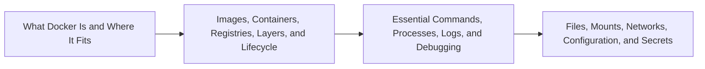

# Foundations and Everyday Docker Overview

> [!abstract] Chapter outcome
> Explain Docker's role and confidently navigate the containers, commands, files, networking, configuration, and debugging concepts used in everyday development.

## Topics

- [[04 Docker/01 Foundations and Everyday Docker/01 What Docker Is and Where It Fits|01 - What Docker Is and Where It Fits]]
- [[04 Docker/01 Foundations and Everyday Docker/02 Images Containers Registries Layers and Lifecycle|02 - Images, Containers, Registries, Layers, and Lifecycle]]
- [[04 Docker/01 Foundations and Everyday Docker/03 Essential Commands Processes Logs and Debugging|03 - Essential Commands, Processes, Logs, and Debugging]]
- [[04 Docker/01 Foundations and Everyday Docker/04 Files Mounts Networks Configuration and Secrets|04 - Files, Mounts, Networks, Configuration, and Secrets]]

## Chapter Map

## How To Use This Area

Study this first and practice alongside the explanations. These four topics provide the vocabulary used everywhere else.

## Related Areas

- [[04 Docker/Docker Learning Map|Docker Learning Map]]
- [[04 Docker/02 Reproducible Images and Docker Compose/Reproducible Images and Docker Compose Overview|Next: Reproducible Images and Docker Compose]]
