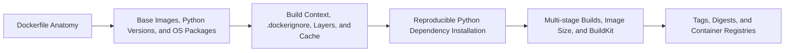

# Building Reproducible Images Overview

> Read and create a maintainable Dockerfile for a Python-based data workload, and explain how versioning, caching, and image distribution affect reproducibility.

> [!abstract] Chapter outcome
> Read and create a maintainable Dockerfile for a Python-based data workload, and explain how versioning, caching, and image distribution affect reproducibility.

## Topics

- [[04 Docker/02 Building Reproducible Images/06 Dockerfile Anatomy|06 - Dockerfile Anatomy]]
- [[04 Docker/02 Building Reproducible Images/07 Base Images Python Versions and OS Packages|07 - Base Images, Python Versions, and OS Packages]]
- [[04 Docker/02 Building Reproducible Images/08 Build Context dockerignore Layers and Cache|08 - Build Context, .dockerignore, Layers, and Cache]]
- [[04 Docker/02 Building Reproducible Images/09 Reproducible Python Dependency Installation|09 - Reproducible Python Dependency Installation]]
- [[04 Docker/02 Building Reproducible Images/10 Multi-stage Builds Image Size and BuildKit|10 - Multi-stage Builds, Image Size, and BuildKit]]
- [[04 Docker/02 Building Reproducible Images/11 Tags Digests and Container Registries|11 - Tags, Digests, and Container Registries]]

## Chapter Map

## How To Use This Area

Focus on recognizing good build structure and making small changes safely; deep BuildKit optimization is optional.

## Related Areas

- [[04 Docker/Docker Learning Map|Docker Learning Map]]
- [[04 Docker/01 Foundations and Container Mental Model/Foundations and Container Mental Model Overview|Previous: Foundations and Container Mental Model]]
- [[04 Docker/03 Running Containers and Local Development/Running Containers and Local Development Overview|Next: Running Containers and Local Development]]
