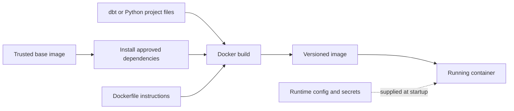

# Dockerfile Anatomy, Base Images, and Dependencies

> [!abstract] Learning target
> Read the main Dockerfile instructions and evaluate the Python version, operating-system packages, and application dependencies baked into an image.

> **Curriculum priority:** Essential

## Executive Summary

- **What it is:** A Dockerfile is a short, ordered recipe for building an image that contains an operating-system starting point, required software, project files, and a default command.
- **Why it matters:** It makes the runtime setup reviewable and repeatable instead of relying on each developer to install the correct Python, dbt adapter, and system libraries manually.
- **Mental model:** The Dockerfile is the recipe; the image is the sealed meal prepared from it; a container is one running serving of that image.
- **Best used when:** A dbt command, Python job, or Airflow component must run with the same approved dependencies across laptops, CI, test, and production.
- **Avoid or reconsider when:** The task is a one-off local experiment, or the target platform already supplies and controls the complete runtime and does not accept custom images.

## What It Can Do

- Choose a known starting point such as an official Python image or an approved Apache Airflow image.
- Install operating-system packages and Python packages during the image build.
- Copy dbt projects, Python jobs, or other runtime files into known locations.
- Set the default working directory, user, and command.
- Make the runtime definition reviewable in Git and buildable by CI.

## What It Cannot Do

- Guarantee identical behavior if base images and dependencies are allowed to change between builds.
- Safely supply runtime credentials merely because `ENV` exists; secrets need a separate runtime delivery method.
- Make application code correct, secure, or compatible with Snowflake.
- Replace Airflow orchestration, Snowflake access controls, monitoring, or production deployment standards.
- Remove all host differences, especially CPU architecture, available memory, mounted files, and network policy.

## Core Concepts

| Concept | Plain-language meaning | Why it matters |
|---|---|---|
| `FROM` | Selects the image used as the starting point | It fixes the available operating system, Python runtime, and inherited tools |
| Base image | The prebuilt foundation that the team extends | Trusted, supported bases reduce maintenance and supply-chain risk |
| `WORKDIR` | Sets the default folder for later build steps and commands | It avoids unclear paths and repeated `cd` commands |
| `COPY` | Places selected project files into the image | Only files inside the build context can be copied |
| `RUN` | Executes a command while building the image | Commonly used to install operating-system or Python dependencies |
| `CMD` | Defines the default command when a container starts | It describes the image's normal job but can be replaced at runtime |
| `ENTRYPOINT` | Defines the main executable for a purpose-built image | Useful when the image should always behave like one tool; easier to misuse than `CMD` |
| `USER` | Selects the account used by later steps and by the running container | Running as a non-root user limits the impact of mistakes or compromise |
| OS dependency | A library or command installed by the operating-system package manager | Some Python packages and Snowflake connectivity features rely on system libraries |
| Python dependency | A package installed by `pip` from an approved requirements or lock file | Version control prevents different developers from silently receiving different packages |

## How It Works (Simple Flow)

1. Choose a trusted base image that matches the required runtime, such as Python for a data job or Apache Airflow for an Airflow component.
2. Set a predictable working directory.
3. Copy the dependency file before the rest of the project so dependency installation can be cached separately.
4. Install only the operating-system and Python packages the workload needs.
5. Copy the dbt project or Python code into the image.
6. Set a non-root runtime user where the chosen base image supports it.
7. Define the normal startup command and build the image.
8. Start containers from the image while supplying environment-specific configuration and secrets at runtime.

## Visuals



The image contains code and dependencies. Environment-specific Snowflake credentials should enter only when a container starts, not when the image is built.

## Readable Snippets

```dockerfile
FROM python:3.12-slim

WORKDIR /app

# The team creates and reviews this pinned dependency file.
COPY requirements.lock ./requirements.txt
RUN pip install --no-cache-dir -r requirements.txt

COPY jobs/ ./jobs/

RUN useradd --create-home appuser
USER appuser

CMD ["python", "jobs/daily_load.py"]
```

Read this from top to bottom: start with Python, install the approved packages, add the job, stop running as root, and define the normal command. A production team may also pin the base image by digest; that is covered in [[04 Docker/02 Reproducible Images and Docker Compose/07 Image Optimization Versioning and Registries|Image Optimization, Versioning, and Registries]].

> [!warning] Keep secrets out of image builds
> Do not put a Snowflake password, private key, `profiles.yml` containing credentials, or a populated `.env` file in `COPY`, `RUN`, `ARG`, or `ENV`. Removing a secret in a later Dockerfile line does not reliably remove it from earlier image layers.

## Consultant Talking Points

- **Client question this answers:** "How do we know every dbt or Python run uses the same runtime and dependencies?"
- **Trade-offs to mention:** Smaller base images reduce download size and unnecessary software, but very minimal images can make package installation and troubleshooting harder.
- **Risk or governance angle:** Approve the base image source, pin important versions, run as non-root, scan the finished image, and define who owns patching.
- **Cost or operational angle:** Reusable images reduce workstation setup and environment-related incidents, but they introduce build, registry, patching, and support responsibilities.

## Common Pitfalls

- Using `latest` or a broad base tag and assuming a rebuild weeks later will produce the same image.
- Installing Python packages without a reviewed, pinned requirements or lock file.
- Copying the whole repository too early, including local credentials, logs, virtual environments, or Git history.
- Confusing `RUN` with `CMD`: `RUN` happens while the image is built; `CMD` runs when a container starts.
- Starting from a generic Python image for Airflow and rebuilding Airflow from scratch instead of extending the approved Apache Airflow image.
- Running as root because it is convenient, then discovering file-permission and security problems later.
- Adding compilers and debugging utilities to a production image even though the running workload does not need them.

## When to Recommend What (Decision Table)

| Situation | Recommend | Why | Watch-outs |
|---|---|---|---|
| Small Python data job | Start from an approved Python image | It already provides the expected Python runtime | Align the Python version with team support and package compatibility |
| Airflow scheduler, worker, or task image | Extend the approved Apache Airflow image | It preserves Airflow's expected layout and dependency constraints | Match provider packages and Airflow version; do not casually replace inherited settings |
| Image needs common build tools but not at runtime | Consider a multi-stage build | Build tools can stay out of the final image | Extra stages add complexity; use only when size or exposure improves materially |
| Runtime value differs by environment | Supply it when the container starts | One image can move through dev, test, and production | Secrets need a proper secret mechanism, not plain Compose files or image `ENV` |
| Image always acts as one command-line tool | Consider `ENTRYPOINT` with overridable `CMD` arguments | It gives the image a clear, consistent purpose | Plain `CMD` is easier for a beginner and more flexible for general job images |

## Related Topics

- [[04 Docker/02 Reproducible Images and Docker Compose/Reproducible Images and Docker Compose Overview|Reproducible Images and Docker Compose Overview]]
- [[04 Docker/02 Reproducible Images and Docker Compose/06 Build Context Layers Cache and Reproducibility|Build Context, Layers, Cache, and Reproducibility]]
- [[04 Docker/03 Data Stack Integration Patterns/11 Containerizing Python Data Jobs|Containerizing Python Data Jobs]]
- [[04 Docker/03 Data Stack Integration Patterns/12 Extending the Apache Airflow Image|Extending the Apache Airflow Image]]

## Related Decision Notes

- [[80 Comparisons and Decision Notes/Decision Notes/dbt/Decisions - Approving a dbt Package for Production|Decisions - Approving a dbt Package for Production]]

## Questions

- **Explain:** What is the difference between `RUN` and `CMD`, and when does each execute?
- **Apply:** Which base image and dependency file would you expect for a Python job compared with an Airflow component?
- **Challenge:** Why is deleting a copied Snowflake key in a later Dockerfile step not an acceptable secret-control strategy?

## Sources To Revisit

- [Docker Docs: Dockerfile overview](https://docs.docker.com/build/concepts/dockerfile/)
- [Docker Docs: Dockerfile reference](https://docs.docker.com/reference/dockerfile/)
- [Docker Docs: Base images](https://docs.docker.com/build/building/base-images/)
- [Docker Docs: Building best practices](https://docs.docker.com/build/building/best-practices/)
