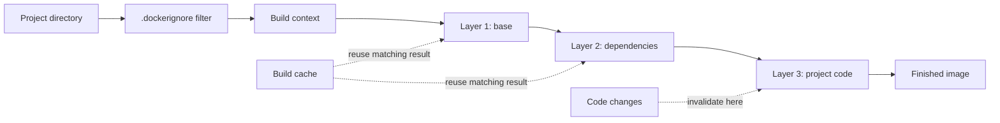

# Build Context, Layers, Cache, and Reproducibility

> [!abstract] Learning target
> Understand what reaches the builder, how cache invalidation works, and why dependency locks and instruction order affect repeatability.

> **Curriculum priority:** Working depth

## Executive Summary

- **What it is:** A Docker build reads files from a defined build context and processes Dockerfile instructions as reusable layers.
- **Why it matters:** The selected files and instruction order determine build speed, accidental data exposure, and how reliably an image can be rebuilt.
- **Mental model:** Treat the build context as the builder's inbox and each Dockerfile instruction as a checkpoint. A changed input invalidates that checkpoint and the dependent checkpoints after it.
- **Best used when:** Builds are slow, behave differently between developers and CI, or may be receiving files they should never see.
- **Avoid or reconsider when:** Do not spend hours tuning cache behavior for a tiny, rarely built image; correct and secure inputs come first.

## What It Can Do

- Limit which repository files are available to `COPY` and other build steps.
- Reuse unchanged layers to make repeated builds much faster.
- Separate slow-changing dependencies from frequently changing dbt or Python code.
- Produce a traceable image when the Dockerfile, base image, dependencies, and build inputs are controlled.
- Share build cache with CI when the team has an approved cache strategy.

## What It Cannot Do

- Make an image reproducible when inputs are unpinned or downloaded from changing locations.
- Guarantee correctness because a cached step succeeded in an earlier build.
- Hide a secret that was included in the build context or copied into an image layer.
- Make two different CPU architectures produce one identical runtime automatically.
- Replace tests, vulnerability scanning, or recording the built image digest.

## Core Concepts

| Concept | Plain-language meaning | Why it matters |
|---|---|---|
| Build context | The folder or other source supplied to `docker build` | The builder cannot `COPY` files outside it, but unnecessary files inside it may still be transferred |
| `.dockerignore` | A list of context files and folders to exclude | Keeps credentials, Git history, logs, artifacts, and local environments away from the builder |
| Layer | The result associated with a Dockerfile step | Unchanged layers can be reused; changed layers affect the steps that follow |
| Build cache | Previously calculated build results Docker can reuse | Saves time and network traffic but is not a correctness guarantee |
| Cache invalidation | Docker decides an earlier result no longer matches its inputs | A small source-code change should not force dependency installation if instructions are ordered well |
| Lock file | A reviewed list that fixes dependency versions | Makes package resolution more predictable across builds |
| Deterministic input | An input that identifies exact content rather than "whatever is current" | Base-image digests and fixed artifacts improve repeatability |

## How It Works (Simple Flow)

1. The build command identifies a Dockerfile and a build context, commonly the current project directory.
2. Docker reads `.dockerignore` and removes matching files from the context before sending it to the builder.
3. The builder processes Dockerfile instructions in order.
4. For each step, it compares the instruction and relevant inputs with available cache records.
5. If they still match, Docker reuses the cached result; otherwise it rebuilds that step.
6. Later steps that depend on a changed result are rebuilt as well.
7. The finished layers and metadata form an image with a content identity.
8. CI records the image reference or digest so the exact result can be tested and promoted.

## Visuals



Copying dependency files before frequently changing project code lets Docker reuse the expensive dependency layer when only SQL or Python code changes.

## Readable Snippets

```dockerfile
FROM python:3.12-slim
WORKDIR /app

# Slow-changing input first
COPY requirements.lock ./requirements.txt
RUN pip install --no-cache-dir -r requirements.txt

# Frequently changing input later
COPY jobs/ ./jobs/

CMD ["python", "jobs/daily_load.py"]
```

```text
# .dockerignore
.git/
.venv/
.env
logs/
target/
*.pem
```

```powershell
docker build --tag data-job:dev .
```

The final `.` is the build context. `.dockerignore` should be a safety net, not the only control: real credentials should not live unprotected in the project directory in the first place.

## Consultant Talking Points

- **Client question this answers:** "Why does changing one SQL or Python file reinstall every dependency, and can we trust a rebuild to be the same?"
- **Trade-offs to mention:** More deliberate Dockerfile ordering and lock files improve speed and repeatability, but require ownership and dependency-update routines.
- **Risk or governance angle:** A broad build context can expose keys or configuration to builders and image layers. CI builders and remote caches also need access controls.
- **Cost or operational angle:** Good cache use reduces build time, developer waiting, CI compute, and repeated downloads; stale or poorly controlled caches can make diagnosis confusing.

## Common Pitfalls

- Running `docker build .` from a repository root that contains unrelated services, large artifacts, or local credentials.
- Using `.gitignore` and assuming Docker automatically applies it; Docker uses `.dockerignore`.
- Writing `COPY . .` before dependency installation, so every code change invalidates the expensive package-install step.
- Treating an unpinned base tag or package requirement as reproducible because the Dockerfile itself is in Git.
- Fetching an installer from a changing URL without a fixed version or integrity check.
- Using `--no-cache` as a routine fix instead of understanding which input changed; it discards the speed benefit and can pull newer dependencies.
- Sharing CI cache across untrusted projects without considering whether cached data or credentials could cross boundaries.

## When to Recommend What (Decision Table)

| Situation | Recommend | Why | Watch-outs |
|---|---|---|---|
| Normal project build | Use the smallest sensible context plus `.dockerignore` | It improves speed and reduces accidental exposure | Review the ignore file when the repository structure changes |
| Python or dbt dependencies change less often than code | Copy and install the lock file before copying project code | Code changes can reuse the dependency layer | The lock file must actually be pinned and reviewed |
| CI builds run frequently | Use a controlled external cache after the basic Dockerfile is sound | Runners can reuse work across jobs | Define cache scope, retention, and trust boundaries |
| High-assurance release | Pin key inputs, rebuild in CI, test, scan, and record the image digest | Reproducibility needs both controlled inputs and evidence | Exact pinning requires a planned patching process |
| Suspected stale or corrupt build result | Run one diagnostic build without cache | It helps separate cache behavior from source problems | Do not make no-cache builds the permanent default |

## Related Topics

- [[04 Docker/02 Reproducible Images and Docker Compose/Reproducible Images and Docker Compose Overview|Reproducible Images and Docker Compose Overview]]
- [[04 Docker/02 Reproducible Images and Docker Compose/05 Dockerfile Anatomy Base Images and Dependencies|Dockerfile Anatomy, Base Images, and Dependencies]]
- [[04 Docker/02 Reproducible Images and Docker Compose/07 Image Optimization Versioning and Registries|Image Optimization, Versioning, and Registries]]
- [[04 Docker/04 Security Operations and Team Standards/17 CI Build Test Publish and Promotion|CI Build, Test, Publish, and Promotion]]

## Related Decision Notes

- [[80 Comparisons and Decision Notes/Decision Notes/Cross-Tool/Decisions - Choosing a Snowflake DevOps and Deployment Pattern|Decisions - Choosing a Snowflake DevOps and Deployment Pattern]]

## Questions

- **Explain:** What is the build context, and why is it a security boundary as well as a performance concern?
- **Apply:** If only `jobs/daily_load.py` changes, which layer should rebuild in the example and which expensive layer should remain cached?
- **Challenge:** Why can a successful build from a committed Dockerfile still fail to be reproducible six months later?

## Sources To Revisit

- [Docker Docs: Build context](https://docs.docker.com/build/concepts/context/)
- [Docker Docs: Optimize cache usage in builds](https://docs.docker.com/build/cache/optimize/)
- [Docker Docs: Building best practices](https://docs.docker.com/build/building/best-practices/)
- [Docker Docs: Docker build cache](https://docs.docker.com/build/cache/)
