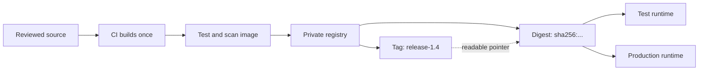

# Image Optimization, Versioning, and Registries

> [!abstract] Learning target
> Recognize multi-stage builds, image-size trade-offs, tags, immutable digests, and the path into a team registry.

> **Curriculum priority:** Working depth

## Executive Summary

- **What it is:** Image optimization removes unnecessary runtime contents, while versioning and registries let a team identify, store, scan, and distribute approved images.
- **Why it matters:** A useful team image must be small enough to move efficiently, clearly identified, protected from accidental replacement, and available to CI and runtime platforms.
- **Mental model:** A tag is a human-friendly label on a package; a digest is the package's tamper-evident content identifier; a registry is the controlled warehouse holding the packages.
- **Best used when:** The same dbt, Python, or Airflow image must move through CI, test, and production with evidence that it did not change.
- **Avoid or reconsider when:** Do not optimize only for the smallest possible image if it makes the runtime unsupported, difficult to patch, or hard for the team to diagnose.

## What It Can Do

- Remove compilers, build tools, and intermediate files from a final image through multi-stage builds.
- Give images meaningful tags such as a release, Git commit, or approved environment candidate.
- Identify exact image content using an immutable digest.
- Store and share images through a private or public registry.
- Support a build-once, test-once, promote-the-same-image release process.
- Reduce startup downloads, storage, and the number of unnecessary packages to patch or scan.

## What It Cannot Do

- Make a tag immutable by convention alone; many registries allow a tag to be moved unless policy prevents it.
- Prove that an image is safe merely because it is small or stored privately.
- Fix vulnerabilities without rebuilding from patched inputs and retesting.
- Guarantee compatibility across CPU architectures unless the image was built and tested for them.
- Replace access control, vulnerability scanning, signing or provenance controls, retention policy, and incident response.

## Core Concepts

| Concept | Plain-language meaning | Why it matters |
|---|---|---|
| Image tag | A readable label pointing to image content, such as `1.4.2` or `git-a1b2c3d` | Useful for people and release workflows, but the label may later point elsewhere |
| Image digest | A cryptographic identifier derived from exact image content | Pulling by digest retrieves the same content rather than whatever a tag currently references |
| Registry | A service that stores and distributes images | CI pushes images; development and runtime systems pull approved images |
| Repository | A named collection of related images inside a registry | Keeps versions of one application or runtime together |
| Multi-stage build | A Dockerfile with separate build and final stages | Build tools can produce an artifact without remaining in the runtime image |
| Slim image | A base image with fewer preinstalled packages | Usually downloads faster and has less unnecessary software, but may be harder to debug |
| Promotion | Moving an already-built image through release stages | Prevents dev, test, and production from receiving separately rebuilt content |
| Retention | Rules for keeping or deleting old image versions | Controls registry cost while preserving rollback and audit evidence |

## How It Works (Simple Flow)

1. CI builds one image from reviewed source and controlled dependencies.
2. Automated checks test the image itself, not a separately installed environment.
3. CI applies traceable tags, commonly a release and a source-commit identifier.
4. The registry stores the image layers and assigns or reports the content digest.
5. Security and policy checks evaluate that stored image.
6. Test environments pull the approved image reference.
7. Production receives the same digest after approval rather than rebuilding from source.
8. Registry retention keeps enough history for audit and rollback while removing disposable development images.

## Visuals



The important control is that test and production use the same digest. A release tag remains useful for people, but it should resolve to the approved content.

## Readable Snippets

```powershell
# Build with a traceable tag.
docker build --tag registry.example.com/data/python-job:git-a1b2c3d .

# Publish it to the team's registry.
docker push registry.example.com/data/python-job:git-a1b2c3d

# Inspect the tag and the digest it currently resolves to.
docker buildx imagetools inspect registry.example.com/data/python-job:git-a1b2c3d
```

A multi-stage build is most valuable when compilation or packaging needs tools that the running job does not:

```dockerfile
FROM python:3.12-slim AS builder
WORKDIR /build
COPY requirements.lock .
RUN pip wheel --wheel-dir /wheels -r requirements.lock

FROM python:3.12-slim
COPY --from=builder /wheels /wheels
RUN pip install --no-cache-dir /wheels/* && rm -rf /wheels
```

This is an illustrative pattern, not a requirement for every Python or dbt image. A clear single-stage image is often the better starting point.

## Consultant Talking Points

- **Client question this answers:** "How do we prove that production runs the exact dbt or Python image that passed testing?"
- **Trade-offs to mention:** Smaller images transfer and scan faster, but extreme minimalism can complicate package compatibility and incident diagnosis.
- **Risk or governance angle:** Control who can push, prevent release tags from being overwritten, scan images, retain provenance, and deploy approved digests.
- **Cost or operational angle:** Registry storage and scanning cost money, while smaller images and sensible retention reduce transfer time, storage, and patching work.

## Common Pitfalls

- Deploying `latest` and assuming everyone receives the same image over time.
- Rebuilding separately for test and production; the same source can resolve newer base images or dependencies.
- Confusing a tag with a versioned object. A tag is usually a movable reference unless the registry enforces immutability.
- Choosing the smallest base available without confirming Python wheels, certificates, operating-system libraries, and support needs.
- Installing build compilers in the final runtime image even when a build stage could keep them out.
- Pushing to a registry without restricting write access, scanning the result, or recording which source produced it.
- Deleting all older images and losing a known-good rollback target or audit evidence.
- Pinning forever without a planned rebuild process, leaving known vulnerabilities unpatched.

## When to Recommend What (Decision Table)

| Situation | Recommend | Why | Watch-outs |
|---|---|---|---|
| Local exploration | Use a clear named tag such as `dev` | Easy for a developer to rebuild and recognize | Never treat it as an auditable release identity |
| CI candidate | Tag with the source commit and record the digest | Links source, build, and exact output | Keep build metadata and test results with the release evidence |
| Production deployment | Deploy an approved digest, optionally reached through an immutable release tag | Prevents silent tag movement from changing runtime content | Digest pinning requires an explicit patch and promotion process |
| Python image contains compilers used only during installation | Consider a multi-stage build | Reduces unused runtime software and size | Measure the benefit; Python package compatibility can add complexity |
| Team or regulated workload | Use a private registry with access, scanning, retention, and audit policy | Centralizes approved distribution | A private registry is not automatically a trusted supply chain |
| Small internal image with no build-only tools | Keep a simple single-stage build | Easier to understand and maintain | Still remove temporary package caches and unnecessary files |

## Related Topics

- [[04 Docker/02 Reproducible Images and Docker Compose/Reproducible Images and Docker Compose Overview|Reproducible Images and Docker Compose Overview]]
- [[04 Docker/02 Reproducible Images and Docker Compose/06 Build Context Layers Cache and Reproducibility|Build Context, Layers, Cache, and Reproducibility]]
- [[04 Docker/04 Security Operations and Team Standards/16 Image Provenance Pinning Scanning and SBOMs|Image Provenance, Pinning, Scanning, and SBOMs]]
- [[04 Docker/04 Security Operations and Team Standards/17 CI Build Test Publish and Promotion|CI Build, Test, Publish, and Promotion]]

## Related Decision Notes

- [[80 Comparisons and Decision Notes/Decision Notes/Cross-Tool/Decisions - Choosing a Snowflake DevOps and Deployment Pattern|Decisions - Choosing a Snowflake DevOps and Deployment Pattern]]

## Questions

- **Explain:** Why can a release tag and an image digest both be useful even though only the digest identifies exact content?
- **Apply:** How would you demonstrate that the image tested in CI is the image later used for an Airflow worker or Python job?
- **Challenge:** When could making a Python image smaller increase operational risk rather than reduce it?

## Sources To Revisit

- [Docker Docs: Multi-stage builds](https://docs.docker.com/build/building/multi-stage/)
- [Docker Docs: Build, tag, and publish an image](https://docs.docker.com/get-started/docker-concepts/building-images/build-tag-and-publish-an-image/)
- [Docker Docs: Image digests](https://docs.docker.com/dhi/core-concepts/digests/)
- [Docker Docs: Docker Hub repositories](https://docs.docker.com/docker-hub/repos/)
