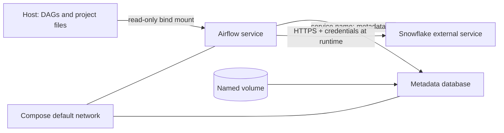

# Docker Compose: Services, Storage, Networking, and Readiness

> [!abstract] Learning target
> Read a Compose file as the declarative definition of services, networks, volumes, configuration, startup dependencies, and health.

> **Curriculum priority:** Essential

## Executive Summary

- **What it is:** Docker Compose describes a group of related containers and their local configuration in one YAML file.
- **Why it matters:** A developer can start a consistent Airflow, metadata database, dbt, and Python environment without remembering a long collection of individual container commands.
- **Mental model:** A Dockerfile defines one packaged runtime; a Compose file is the local wiring plan that starts several runtimes together.
- **Best used when:** Local development, integration testing, onboarding, and reproducible demonstrations need multiple cooperating services.
- **Avoid or reconsider when:** High availability, autoscaling, multi-host scheduling, strict secret management, or full production Airflow operations are required.

## What It Can Do

- Build an image or pull a named image for each service.
- Start, stop, recreate, and inspect a related group of containers as one project.
- Create a default network where containers discover each other by service name.
- Attach bind mounts for live project files and named volumes for container-managed persistent data.
- Supply environment-specific configuration and declare startup dependencies.
- Use health checks so one service can wait for a dependency to become usable.
- Provide a common local topology for data engineers, CI jobs, and integration tests.

## What It Cannot Do

- Turn the official Airflow Compose example into a production-ready Airflow platform by itself.
- Guarantee that a process is genuinely ready merely because its container has started.
- Make a container's writable filesystem durable after that container is removed.
- Secure secrets simply because they are referenced from environment variables or a local `.env` file.
- Manage Snowflake as a local service; Snowflake normally remains an external managed platform reached over the network.
- Replace production monitoring, backups, scaling, access control, and recovery procedures.

## Core Concepts

| Concept | Plain-language meaning | Why it matters |
|---|---|---|
| Project | The set of resources created from one Compose application model | Gives related containers, networks, and volumes a common scope |
| Service | One role in the application, such as `scheduler` or `metadata-db` | A service defines its image, command, configuration, mounts, and network access |
| `build` | Tells Compose how to build a local image | Useful while developing a team's Dockerfile |
| `image` | Tells Compose which named image to run | Use an approved registry reference when the image is already built |
| Bind mount | Maps a specific host file or folder into a container | Convenient for editing DAGs, dbt models, or Python code locally |
| Named volume | Container-engine-managed persistent storage | Suitable for local database state that should survive container replacement |
| Default network | The private network Compose creates for the project | Services can normally connect using service names instead of changing IP addresses |
| Port mapping | Publishes a container port on the host | Needed for host or browser access, not for normal service-to-service traffic |
| `depends_on` | Declares startup relationships between services | Short syntax waits for start, not full readiness; `service_healthy` adds a health condition |
| Health check | A command that tests a narrow sign of service health | Gives Compose a better readiness signal, but only for what the test actually checks |

## How It Works (Simple Flow)

1. Compose reads `compose.yaml`, resolves variables, and validates the combined configuration.
2. It builds local images or pulls the requested image references.
3. It creates the project network and any declared named volumes.
4. It creates services in dependency order.
5. Services join the network and reach each other by service name, such as `metadata-db`.
6. Bind mounts and named volumes provide the files or state each service needs.
7. A dependency using `condition: service_healthy` waits until its health check passes before the dependent service starts.
8. Developers inspect service state and logs, then stop the project without deleting named data unless deletion is intentional.

## Visuals



Compose manages the local Airflow-side containers and wiring. Snowflake remains outside the Compose project and is reached using runtime authentication and network policy.

## Readable Snippets

This deliberately small example shows the concepts, not a complete Airflow deployment:

```yaml
services:
  metadata-db:
    image: postgres:16
    environment:
      POSTGRES_USER: airflow
      POSTGRES_PASSWORD: ${POSTGRES_PASSWORD:?set locally}
    volumes:
      - metadata-data:/var/lib/postgresql/data
    healthcheck:
      test: ["CMD-SHELL", "pg_isready -U airflow"]
      interval: 10s
      timeout: 5s
      retries: 5

  scheduler:
    build: .
    depends_on:
      metadata-db:
        condition: service_healthy
    volumes:
      - ./dags:/opt/airflow/dags:ro

volumes:
  metadata-data:
```

Useful everyday commands:

```powershell
docker compose config
docker compose up -d
docker compose ps
docker compose logs --follow scheduler
docker compose down
```

`docker compose down` removes the project containers and network but normally keeps named volumes. Adding `--volumes` deletes those named volumes too, so confirm that local state is disposable first.

## Consultant Talking Points

- **Client question this answers:** "Can every engineer start the same local Airflow and data-tool environment with one reviewed definition?"
- **Trade-offs to mention:** Compose reduces setup drift and makes dependencies visible, but local bind mounts, resource limits, and host architecture can still produce differences.
- **Risk or governance angle:** Keep credentials out of committed YAML and `.env` files, use read-only mounts where possible, and avoid publishing ports that only other containers need.
- **Cost or operational angle:** Standard local environments reduce onboarding and support time; running many services can consume substantial laptop CPU, memory, and disk through images, logs, and volumes.

## Common Pitfalls

- Using `localhost` from one container to reach another. Inside the container, `localhost` means that same container; use the other service's name.
- Publishing every database and service port to the host even when communication is only internal.
- Assuming short-form `depends_on` means the dependency is ready to accept work.
- Writing a weak health check that tests only whether a process exists rather than the capability the dependent service needs.
- Keeping important database data only in a container's writable layer and losing it when the container is replaced.
- Using a bind mount for everything and then encountering Windows/Linux permissions, line-ending, or file-performance differences.
- Committing `.env` files or inserting Snowflake keys and passwords directly into `compose.yaml`.
- Running `docker compose down --volumes` without recognizing that named development data will be deleted.
- Presenting a laptop-oriented Compose topology as a complete high-availability Airflow production design.

## When to Recommend What (Decision Table)

| Situation | Recommend | Why | Watch-outs |
|---|---|---|---|
| Developer edits DAGs, dbt models, or Python code frequently | Bind mount the project folder, preferably read-only where writes are unnecessary | Changes appear without rebuilding the image each time | Host permissions and file behavior can differ across operating systems |
| Local metadata database must survive container recreation | Named volume | Compose manages the storage separately from the container | Define how to reset, back up, or intentionally remove local state |
| One container talks to another | Use the Compose network and service name | Stable naming avoids changing container IP addresses | Use the container port, not the host-published port |
| Host browser or local tool needs access | Publish only the required port | Makes a container service reachable from the host | Published ports expand exposure and can conflict with existing ports |
| Startup requires a usable dependency | Health check plus long-form `depends_on` with `service_healthy` | Readiness is stronger than start order alone | The health check must reflect the actual dependency requirement |
| Local multi-service integration environment | Docker Compose | Clear, repeatable, and approachable for a data team | Resource use and local secret handling still need standards |
| Production Airflow platform | Use the organization's supported production deployment pattern | Production needs scaling, resilience, secret management, upgrades, and monitoring | Compose may still be useful for local parity, not as proof of production readiness |

## Related Topics

- [[04 Docker/02 Reproducible Images and Docker Compose/Reproducible Images and Docker Compose Overview|Reproducible Images and Docker Compose Overview]]
- [[04 Docker/01 Foundations and Everyday Docker/04 Files Mounts Networks Configuration and Secrets|Files, Mounts, Networks, Configuration, and Secrets]]
- [[04 Docker/03 Data Stack Integration Patterns/09 Local Airflow dbt Python and Snowflake Environment|Local Airflow, dbt, Python, and Snowflake Environment]]
- [[04 Docker/04 Security Operations and Team Standards/18 Operations Troubleshooting and Production Boundaries|Operations, Troubleshooting, and Production Boundaries]]

## Related Decision Notes

- [[80 Comparisons and Decision Notes/Decision Notes/dbt/Decisions - Choosing a dbt Scheduling and Orchestration Pattern|Decisions - Choosing a dbt Scheduling and Orchestration Pattern]]

## Questions

- **Explain:** Why should a service connect to `metadata-db:5432` rather than `localhost:5432` from inside the Compose network?
- **Apply:** Which data would you bind mount, and which data would you put in a named volume, in a local Airflow and dbt environment?
- **Challenge:** What production requirements remain unsolved even after a Compose-based Airflow environment works reliably on every developer laptop?

## Sources To Revisit

- [Docker Docs: How Compose works](https://docs.docker.com/compose/intro/compose-application-model/)
- [Docker Docs: Define services in Compose](https://docs.docker.com/reference/compose-file/services/)
- [Docker Docs: Networking in Compose](https://docs.docker.com/compose/how-tos/networking/)
- [Docker Docs: Define and manage volumes in Compose](https://docs.docker.com/reference/compose-file/volumes/)
