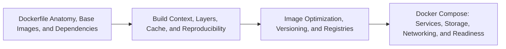

# Reproducible Images and Docker Compose Overview

> [!abstract] Chapter outcome
> Read and safely modify Dockerfiles and Compose files that define a repeatable Python-based, multi-service development environment.

## Topics

- [[04 Docker/02 Reproducible Images and Docker Compose/05 Dockerfile Anatomy Base Images and Dependencies|05 - Dockerfile Anatomy, Base Images, and Dependencies]]
- [[04 Docker/02 Reproducible Images and Docker Compose/06 Build Context Layers Cache and Reproducibility|06 - Build Context, Layers, Cache, and Reproducibility]]
- [[04 Docker/02 Reproducible Images and Docker Compose/07 Image Optimization Versioning and Registries|07 - Image Optimization, Versioning, and Registries]]
- [[04 Docker/02 Reproducible Images and Docker Compose/08 Docker Compose Services Storage Networking and Readiness|08 - Docker Compose: Services, Storage, Networking, and Readiness]]

## Chapter Map

## How To Use This Area

Prioritize Topics 05 and 08. Topics 06 and 07 add the reproducibility and image-governance depth needed for confident team conversations.

## Related Areas

- [[04 Docker/Docker Learning Map|Docker Learning Map]]
- [[04 Docker/01 Foundations and Everyday Docker/Foundations and Everyday Docker Overview|Previous: Foundations and Everyday Docker]]
- [[04 Docker/03 Data Stack Integration Patterns/Data Stack Integration Patterns Overview|Next: Data Stack Integration Patterns]]
