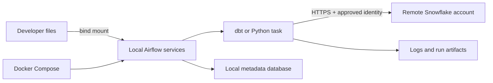

# Local Airflow, dbt, Python, and Snowflake Environment

> [!abstract] Learning target
> Trace a realistic local environment in which Airflow and code run in containers while Snowflake remains a remote managed service.

> **Curriculum priority:** Essential

## Executive Summary

- **What it is:** A Docker Compose project that starts the local services needed for Airflow and runs dbt or Python code with agreed versions.
- **Why it matters:** Everyone can start from the same runtime instead of repairing a different laptop setup.
- **Mental model:** Compose runs the local control room; Snowflake is a remote service reached over the network.
- **Best used when:** A team needs a repeatable environment for developing and testing DAGs, dbt commands, and small Python jobs.
- **Avoid or reconsider when:** Treating the local stack as a production design, or when a managed development environment already provides the same consistency.

## What It Can Do

- Start related local services together, such as the Airflow scheduler, web/API service, metadata database, and workers.
- Give developers the same Airflow, dbt, Python, provider, and connector versions.
- Mount local DAGs and project files for a quick edit-test cycle.
- Test whether tasks can authenticate to and run work in a non-production Snowflake environment.
- Make setup and cleanup predictable with a small set of Compose commands.

## What It Cannot Do

- Run Snowflake itself; Snowflake remains a managed service outside Docker.
- Reproduce production networking, identity, scale, or failure behavior automatically.
- Make unsafe credentials, poorly designed DAGs, or non-idempotent jobs safe.
- Guarantee identical behavior across CPU architectures, corporate networks, and operating systems without additional testing.

## Core Concepts

| Concept | Plain-language meaning | Why it matters |
|---|---|---|
| Compose service | One named part of the local stack | Airflow components and supporting databases can be started together |
| Shared network | Private local network created by Compose | Services refer to one another by service name rather than laptop-specific addresses |
| Bind mount | A local folder shown inside a container | DAG and dbt edits can be tested without rebuilding on every change |
| Named volume | Docker-managed persistent storage | Airflow metadata can survive a container restart during development |
| Remote dependency | A service not running in the stack | Snowflake access depends on external DNS, TLS, proxy rules, and credentials |
| Runtime configuration | Values supplied when containers start | The same image can target development, test, or production without rebuilding |

## How It Works (Simple Flow)

1. The developer checks out the DAG, dbt, and Python code.
2. Docker Compose reads the service definitions, networks, volumes, and local configuration.
3. Compose starts Airflow and its supporting local services in dependency order.
4. DAGs and project files are mounted into the appropriate containers for development.
5. Airflow schedules a task that runs dbt or Python in the chosen execution environment.
6. The task obtains approved runtime credentials and connects over HTTPS to Snowflake.
7. Logs and artifacts are written to an agreed location so failures can be investigated.

## Visuals



## Readable Snippets

This deliberately shows the boundary, not a complete Airflow deployment:

```yaml
services:
  airflow-scheduler:
    image: company-airflow:approved
    volumes:
      - ./dags:/opt/airflow/dags
    environment:
      SNOWFLAKE_ACCOUNT: ${SNOWFLAKE_ACCOUNT}
      DBT_TARGET: dev

  dbt-check:
    image: company-dbt:approved
    command: ["dbt", "debug", "--target", "dev"]
    profiles: ["tools"]
```

```powershell
docker compose up -d
docker compose logs -f airflow-scheduler
docker compose --profile tools run --rm dbt-check
```

Credentials are intentionally absent. A local secret mechanism or approved identity flow should supply them at runtime.

## Consultant Talking Points

- **Client question this answers:** “Can every engineer develop Airflow and dbt without manually recreating the full toolchain?”
- **Trade-offs to mention:** Local consistency improves, but Compose adds files, images, resource use, and maintenance ownership.
- **Risk or governance angle:** Separate developer identity from workload identity; use a non-production Snowflake role and never bake secrets into images.
- **Cost or operational angle:** Local containers consume laptop resources, while dbt and Python queries still consume Snowflake credits remotely.

## Common Pitfalls

- Saying “everything is local” even though Snowflake queries leave the laptop and can create real cost or data changes.
- Using `localhost` from one container to reach another; inside a container, `localhost` means that same container.
- Mounting the entire repository into every service, which exposes unnecessary files and can create confusing permissions.
- Starting services before their dependencies are ready; startup order alone is not a readiness check.
- Copying a local `.env` file containing secrets into the image build context or Git.
- Assuming the official Airflow Compose example is a production architecture; it is primarily a learning and local-development starting point.

## When to Recommend What (Decision Table)

| Situation | Recommend | Why | Watch-outs |
|---|---|---|---|
| New team developing DAGs and dbt locally | A small, version-controlled Compose stack | Fast, repeatable onboarding | Keep it smaller than production and document required resources |
| One-off dbt validation | Run the dbt image directly or as an optional Compose profile | Avoid starting the full Airflow stack | Use the same pinned image and target rules as the team |
| Testing production identity or networking | A controlled integration environment | Laptop networking and credentials are not production-equivalent | Test least-privilege roles, proxies, private connectivity, and secret delivery |
| Production Airflow | Use the organization’s approved orchestrator platform | Production needs durable storage, scaling, monitoring, backups, and secure networking | Docker Compose alone is not sufficient evidence of readiness |

## Related Topics

- [[04 Docker/02 Reproducible Images and Docker Compose/08 Docker Compose Services Storage Networking and Readiness|Docker Compose Services, Storage, Networking, and Readiness]]
- [[04 Docker/03 Data Stack Integration Patterns/13 Running dbt and Python from Airflow|Running dbt and Python from Airflow]]
- [[04 Docker/03 Data Stack Integration Patterns/14 Snowflake Connectivity Authentication and Environment Parity|Snowflake Connectivity, Authentication, and Environment Parity]]
- [[04 Docker/03 Data Stack Integration Patterns/Data Stack Integration Patterns Overview|Data Stack Integration Patterns Overview]]

## Related Decision Notes

- No dedicated decision note yet; the decision table above captures the current durable guidance.

## Questions

- **Explain:** Why is Snowflake not another service in the local Compose file?
- **Apply:** Which local services and mounts would you need to test an Airflow DAG that invokes dbt?
- **Challenge:** Which production behavior would be least trustworthy if it had only been tested on a developer laptop?

## Sources To Revisit

- [Docker Docs: Docker Compose](https://docs.docker.com/compose/)
- [Docker Docs: Set environment variables in Compose](https://docs.docker.com/compose/how-tos/environment-variables/set-environment-variables/)
- [Apache Airflow Docs: Running Airflow in Docker](https://airflow.apache.org/docs/apache-airflow/stable/howto/docker-compose/)
- [Snowflake Docs: Connecting with the Python Connector](https://docs.snowflake.com/en/developer-guide/python-connector/python-connector-connect)
