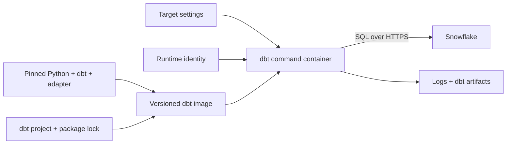

# Containerizing dbt Core

> [!abstract] Learning target
> Package dbt Core, its Snowflake adapter, project dependencies, profiles behavior, and artifacts into a predictable command-container workflow.

> **Curriculum priority:** Essential

## Executive Summary

- **What it is:** An image containing Python, dbt Core, the Snowflake adapter, and optionally the dbt project and package dependencies.
- **Why it matters:** The same dbt command can use the same dependency versions on a laptop, in CI, and under Airflow.
- **Mental model:** The image is a versioned dbt command-line appliance; project code and runtime credentials are its inputs, while logs and artifacts are outputs.
- **Best used when:** Several developers or automated jobs need predictable dbt execution.
- **Avoid or reconsider when:** A managed dbt runtime already owns dependency management, or a one-person experiment does not justify image maintenance.

## What It Can Do

- Pin dbt Core, `dbt-snowflake`, Python, and operating-system dependencies together.
- Run familiar commands such as `dbt debug`, `dbt build`, and `dbt docs generate` without a laptop installation.
- Use one tested image in development, CI, and orchestration.
- Keep generated logs and JSON artifacts available for debugging and audit evidence.
- Separate stable runtime software from environment-specific targets and credentials.

## What It Cannot Do

- Make a dbt project correct, tested, or cost-efficient by itself.
- Remove the need for a valid `profiles.yml` or equivalent profile configuration.
- Protect credentials that are copied into the image or printed to logs.
- Preserve `target/` and `logs/` after a short-lived container exits unless they are mounted or exported.
- Guarantee parity if development bind-mounts uncommitted code while production runs code copied into an image.

## Core Concepts

| Concept | Plain-language meaning | Why it matters |
|---|---|---|
| dbt runtime image | Python, dbt Core, and the Snowflake adapter packaged together | Removes “different dbt version” surprises |
| Project code | Models, tests, macros, seeds, and project configuration | This is the business logic executed by the runtime |
| Profile | Connection and target settings used by dbt | The image should not hard-code an environment or secret |
| Package lock | Resolved dbt package versions | Makes `dbt deps` repeatable |
| Entrypoint/command | What runs when the container starts | Lets the same image run different dbt commands |
| Artifacts | Files such as `manifest.json` and `run_results.json` | Needed for debugging, state-aware workflows, and run evidence |

## How It Works (Simple Flow)

1. The team pins compatible Python, dbt Core, `dbt-snowflake`, and package versions.
2. Docker builds these dependencies into a versioned image.
3. Development either mounts the dbt project into the image or rebuilds after code changes.
4. Runtime configuration selects the profile and target; an approved mechanism supplies credentials.
5. The container runs one explicit command, such as `dbt build --target dev`.
6. dbt connects to remote Snowflake and submits SQL using the configured role and warehouse.
7. The process exits successfully or unsuccessfully, and its logs and artifacts are retained outside the disposable container.

## Visuals



## Readable Snippets

Illustrative files—the team should replace the version placeholders with tested, exact versions:

```dockerfile
FROM python:3.12-slim

RUN useradd --create-home dbt
WORKDIR /home/dbt/project

COPY requirements.txt .
RUN pip install --no-cache-dir -r requirements.txt

COPY --chown=dbt:dbt . .
USER dbt
ENTRYPOINT ["dbt"]
```

```text
# requirements.txt
dbt-core==<approved-version>
dbt-snowflake==<compatible-approved-version>
```

```yaml
services:
  dbt:
    image: company-dbt:approved
    volumes:
      - ./target:/home/dbt/project/target
      - ./logs:/home/dbt/project/logs
      - ./local-profile:/home/dbt/.dbt:ro
```

```powershell
docker compose run --rm dbt build --target dev
```

The profile mount should contain configuration, not a committed password. In production, credentials should come from the platform’s secret or workload-identity mechanism.

## Consultant Talking Points

- **Client question this answers:** “How do we know developers, CI, and Airflow are running the same dbt toolchain?”
- **Trade-offs to mention:** Copying project code into the image improves release immutability; bind mounts make local iteration faster.
- **Risk or governance angle:** Pin and scan dependencies, keep credentials outside the image, and preserve run artifacts according to audit needs.
- **Cost or operational angle:** Docker build time and registry storage are usually small; Snowflake warehouse use remains the main execution cost.

## Common Pitfalls

- Installing `dbt-core` without the `dbt-snowflake` adapter, or pinning incompatible versions.
- Running `pip install` every time the container starts, making jobs slow and dependent on package repositories being available.
- Baking `profiles.yml`, private keys, or passwords into an image layer.
- Losing `target/run_results.json` when a short-lived container is removed.
- Using the floating `latest` tag, so an unchanged deployment can run different software later.
- Mounting local project files in production, weakening the link between a reviewed commit and the code that ran.

## When to Recommend What (Decision Table)

| Situation | Recommend | Why | Watch-outs |
|---|---|---|---|
| Fast local model editing | Mount the project into a pinned dbt image | Quick feedback without rebuilding | Local files can differ from Git |
| CI or scheduled production run | Copy reviewed project code into an immutable image | Runtime and project release travel together | Rebuild for each approved code change |
| One image used with several environments | Supply target settings and identity at runtime | Avoids rebuilding identical code per environment | Strictly control which target each platform may select |
| Artifacts used for state, audit, or debugging | Export `target/` and logs to durable storage | Short-lived containers otherwise discard them | Avoid collisions between concurrent runs |

## Related Topics

- [[04 Docker/02 Reproducible Images and Docker Compose/05 Dockerfile Anatomy Base Images and Dependencies|Dockerfile Anatomy, Base Images, and Dependencies]]
- [[04 Docker/03 Data Stack Integration Patterns/13 Running dbt and Python from Airflow|Running dbt and Python from Airflow]]
- [[02 dbt/01 Core Concepts and Project Structure/04 Environments Profiles Targets and Credentials|Environments, Profiles, Targets, and Credentials]]
- [[02 dbt/01 Core Concepts and Project Structure/06 Commands and Artifacts|Commands and Artifacts]]

## Related Decision Notes

- No dedicated decision note yet; the key choice is development bind mount versus immutable release image.

## Questions

- **Explain:** Which parts belong in a dbt image, and which belong in runtime configuration?
- **Apply:** How would you preserve `run_results.json` after Airflow removes the dbt task container?
- **Challenge:** When would copying project code into the image be safer than mounting it?

## Sources To Revisit

- [Docker Docs: Dockerfile overview](https://docs.docker.com/build/concepts/dockerfile/)
- [dbt Developer Hub: Install dbt](https://docs.getdbt.com/docs/local/install-dbt)
- [dbt Developer Hub: About profiles.yml](https://docs.getdbt.com/docs/local/profiles.yml)
- [dbt Developer Hub: dbt artifacts](https://docs.getdbt.com/reference/artifacts/dbt-artifacts)
