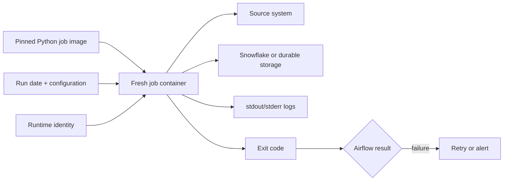

# Containerizing Python Data Jobs

> [!abstract] Learning target
> Build data jobs with explicit dependencies, configuration, inputs, outputs, logging, exit behavior, and idempotency expectations.

> **Curriculum priority:** Essential

## Executive Summary

- **What it is:** Packaging a Python script and its exact runtime dependencies as an image that performs one clear data job.
- **Why it matters:** The script runs with the same Python libraries under a developer, CI, and Airflow instead of relying on whatever is installed on the host.
- **Mental model:** A job container is a disposable worker: receive configuration, do one unit of work, report clearly, then exit.
- **Best used when:** A scheduled extraction, validation, file-processing, or API job needs reproducible execution.
- **Avoid or reconsider when:** The logic is better expressed as a Snowflake SQL/dbt transformation, or a long-running service has different lifecycle needs.

## What It Can Do

- Pin Python and library versions for a predictable runtime.
- Provide a standard command, working directory, and file layout.
- Accept dates, object names, and non-secret settings as command arguments or environment variables.
- Stream useful logs to Airflow or the container platform.
- Return a clear exit code so an orchestrator can mark success or failure.
- Run safely more than once when the job itself is designed to be idempotent.

## What It Cannot Do

- Make Python logic correct or idempotent simply because it is containerized.
- Keep files written inside the container after it is removed unless storage is mounted or the files are uploaded.
- Decide retry behavior, scheduling, alerting, or business recovery rules; the orchestrator owns those concerns.
- Secure credentials that are embedded in code, image layers, arguments, or verbose logs.
- Replace Snowflake warehouse sizing and query-cost controls.

## Core Concepts

| Concept | Plain-language meaning | Why it matters |
|---|---|---|
| Dependency file | Exact Python packages required by the job | Prevents library drift between environments |
| Entrypoint | Default program started by the image | Makes the image behave like one clear job |
| Arguments | Values that define this run, such as a processing date | Keeps code reusable and makes retries explainable |
| Environment configuration | Runtime values such as account, role, or log level | Separates the reusable image from its environment |
| Standard output/error | The normal log streams of the process | Airflow and Docker can collect logs without a file agent |
| Exit code | `0` for success; non-zero for failure | The orchestrator needs an unambiguous result |
| Idempotency | Repeating the same run does not duplicate or corrupt results | Airflow retries are then safer |

## How It Works (Simple Flow)

1. The image is built with a pinned Python version, dependency file, and the job code.
2. Airflow or a developer starts a fresh container with a run date and environment name.
3. The platform injects approved credentials at runtime.
4. The script validates required inputs before doing expensive or destructive work.
5. It reads from the source, performs its work, and writes to an explicit durable destination.
6. It logs useful milestones and row counts without printing secrets or sensitive records.
7. It closes connections and exits `0` on success or non-zero on failure.
8. The container is removed; durable data, logs, and checkpoints remain outside it.

## Visuals



## Readable Snippets

```dockerfile
FROM python:3.12-slim

WORKDIR /app
COPY requirements.txt .
RUN pip install --no-cache-dir -r requirements.txt
COPY job.py .

USER 10001
ENTRYPOINT ["python", "job.py"]
```

```python
# job.py
import argparse
import logging

parser = argparse.ArgumentParser()
parser.add_argument("--run-date", required=True)
args = parser.parse_args()

logging.basicConfig(level=logging.INFO)
logging.info("Starting load for %s", args.run_date)

# Validate -> read -> write/merge -> reconcile.
# Let unexpected errors stop the program with a non-zero exit code.
```

```powershell
docker run --rm company-daily-load:approved --run-date 2026-08-10
```

Use environment variables or a mounted secret for connection material; do not add a password as a command argument because commands may be visible in logs or process metadata.

## Consultant Talking Points

- **Client question this answers:** “How can Airflow run this Python job predictably without installing its libraries into Airflow itself?”
- **Trade-offs to mention:** A separate job image adds build and release work but isolates dependencies and failures.
- **Risk or governance angle:** Run as a non-root user, minimize packages, avoid secrets in the image, and define retry-safe write behavior.
- **Cost or operational angle:** Container CPU cost may be minor, but API calls, data transfer, Snowflake compute, and repeated failed retries can be significant.

## Common Pitfalls

- Writing important output only to the container filesystem and losing it when the container is removed.
- Catching every Python exception and still exiting `0`, causing Airflow to report a failed load as successful.
- Logging access tokens, connection strings, private data, or entire API responses.
- Leaving dependencies unpinned, so rebuilding the same source later produces a different runtime.
- Retrying an append-only load without a run key, merge rule, or duplicate protection.
- Using a very large general-purpose image for one small job, increasing build time and security exposure.

## When to Recommend What (Decision Table)

| Situation | Recommend | Why | Watch-outs |
|---|---|---|---|
| SQL transformation already belongs in dbt | Use dbt rather than a Python container | Keeps SQL lineage and testing in the established tool | Do not force unsuitable API or file work into SQL |
| Python job has unique libraries or release cadence | Dedicated job image | Strong dependency and failure isolation | Requires image ownership and promotion |
| Several tiny jobs share stable dependencies | A small shared base plus separate job images | Reuses safe layers while keeping each job explicit | Shared base upgrades require coordinated testing |
| Job writes to Snowflake and may retry | Design an idempotent write using a run key, stage, or merge | Reduces duplicate and partial results | Define cleanup and reconciliation behavior |

## Related Topics

- [[04 Docker/03 Data Stack Integration Patterns/13 Running dbt and Python from Airflow|Running dbt and Python from Airflow]]
- [[04 Docker/03 Data Stack Integration Patterns/14 Snowflake Connectivity Authentication and Environment Parity|Snowflake Connectivity, Authentication, and Environment Parity]]
- [[04 Docker/02 Reproducible Images and Docker Compose/07 Image Optimization Versioning and Registries|Image Optimization, Versioning, and Registries]]
- [[02 dbt/08 dbt on Snowflake and Finance Patterns/81 Fivetran to Snowflake to dbt Flow|Fivetran to Snowflake to dbt Flow]]

## Related Decision Notes

- No dedicated decision note yet; the main decision is whether the work belongs in dbt SQL, a Python job, or a managed connector.

## Questions

- **Explain:** Why should a job container perform one clear unit of work and then exit?
- **Apply:** What must a daily Snowflake load do so an Airflow retry does not duplicate data?
- **Challenge:** Which output belongs outside the container even if the job normally succeeds?

## Sources To Revisit

- [Docker Docs: Build best practices](https://docs.docker.com/build/building/best-practices/)
- [Docker Docs: Run a container](https://docs.docker.com/engine/containers/run/)
- [Python Docs: Logging HOWTO](https://docs.python.org/3/howto/logging.html)
- [Snowflake Docs: Python Connector](https://docs.snowflake.com/en/developer-guide/python-connector/python-connector)
