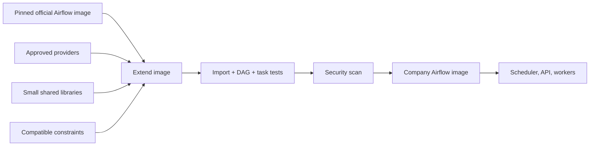

# Extending the Apache Airflow Image

> [!abstract] Learning target
> Add providers and project dependencies to the official image while preserving compatible Airflow constraints and repeatable builds.

> **Curriculum priority:** Essential

## Executive Summary

- **What it is:** Building a company Airflow image `FROM` a pinned official Apache Airflow image and adding only the approved providers and libraries the deployment needs.
- **Why it matters:** Airflow tasks must find their imports every time, and installing packages during container startup is slow and unreliable.
- **Mental model:** The official image is the tested foundation; the extended image is your controlled runtime release.
- **Best used when:** DAGs require providers or Python libraries that are not in the chosen official image.
- **Avoid or reconsider when:** A task-specific library can be isolated in its own job container, or complex native compilation requires a more deliberate custom build.

## What It Can Do

- Add the Snowflake, Docker, or other approved Airflow provider packages.
- Add small Python libraries used directly by DAG parsing or in-process tasks.
- Pin Airflow and provider dependencies in a build that can be tested and scanned once.
- Publish one image for all Airflow components that must share the same runtime.
- Optionally copy DAGs into the image for an immutable production release.

## What It Cannot Do

- Guarantee that every new provider is compatible with the current Airflow and Python versions.
- Make the Airflow Docker Compose quick-start a production platform.
- Safely solve dependency conflicts by installing whatever is newest.
- Isolate heavy or conflicting job libraries when all tasks run in the same Airflow environment.
- Remove the need to rebuild after Airflow, provider, dependency, or security updates.

## Core Concepts

| Concept | Plain-language meaning | Why it matters |
|---|---|---|
| Official base image | Apache’s versioned Airflow image used as the starting point | Avoids assembling Airflow from scratch |
| Extension | A small Dockerfile that adds team-specific needs | Usually the simplest supported customization route |
| Provider package | Airflow integration code for systems such as Snowflake or Docker | Operators, hooks, and connections are separate installable packages |
| Airflow constraints | Tested dependency limits for an Airflow/Python combination | Reduces the chance that `pip` chooses an incompatible set |
| Version pinning | Selecting exact base, provider, and library versions | Makes rebuilds and rollbacks understandable |
| Image user | The Linux identity used during build and runtime | The official image expects runtime processes to return to the `airflow` user |

## How It Works (Simple Flow)

1. Select a specific official Airflow image tag, including a Python version when the team requires one.
2. List only the additional provider and Python packages needed by DAGs or in-process tasks.
3. Confirm those versions support the selected Airflow version.
4. Build an extended image while keeping Airflow at the base image’s version and using compatible constraints.
5. Run import, DAG parsing, connection, and representative task tests against the image.
6. Scan and publish the image with an immutable release tag or digest.
7. Configure every Airflow service in that release to use the same tested image.
8. Rebuild and retest deliberately when dependencies or security fixes change.

## Visuals



## Readable Snippets

```dockerfile
# Example current at writing; use the team's approved pinned tag.
FROM apache/airflow:3.3.0-python3.13

COPY requirements.txt /requirements.txt
RUN pip install --no-cache-dir \
    "apache-airflow==${AIRFLOW_VERSION}" \
    -r /requirements.txt
```

```text
# requirements.txt — use compatible exact versions in the real repository
apache-airflow-providers-snowflake==<approved-version>
apache-airflow-providers-docker==<approved-version>
```

```yaml
services:
  airflow-scheduler:
    build: .
    image: company-airflow:approved
```

Including `apache-airflow==${AIRFLOW_VERSION}` in the install command prevents `pip` from silently replacing the Airflow version already present in the base image. For production, build in CI and reference the published image instead of rebuilding independently on each host.

## Consultant Talking Points

- **Client question this answers:** “Where should the Snowflake provider and shared task libraries be installed?”
- **Trade-offs to mention:** A broad Airflow image is simple to operate but couples many DAGs to one dependency set; task images offer stronger isolation.
- **Risk or governance angle:** Approved sources, exact versions, image scanning, software inventory, and a patching owner are part of the control design.
- **Cost or operational angle:** Larger images pull and start more slowly; unnecessary providers also increase the dependency and vulnerability surface.

## Common Pitfalls

- Using `apache/airflow:latest`, causing an unexpected Airflow or Python change on rebuild.
- Installing packages every time a container starts through an environment variable or startup command.
- Letting `pip` upgrade or downgrade Airflow while adding a provider.
- Installing all job-specific libraries into Airflow, eventually creating conflicts and a very large shared runtime.
- Switching to `root` to install an operating-system package and forgetting to switch back to the `airflow` user.
- Updating only the scheduler image while workers still run an older image.

## When to Recommend What (Decision Table)

| Situation | Recommend | Why | Watch-outs |
|---|---|---|---|
| Add a provider or a few pure-Python libraries | Extend a pinned official image | Simple and aligned with Airflow guidance | Test compatibility and retain the Airflow version |
| Heavy compiled dependencies are needed | Use a carefully customized or multi-stage build | Keeps build tools out of the runtime image | Requires stronger Docker expertise and testing |
| Library is needed by only one data job | Put it in a dedicated task image | Avoids coupling the whole Airflow platform to it | Airflow needs an approved way to start that image |
| Production release | Build, test, scan, and publish once in CI | Every component pulls the same artifact | Do not use local `build: .` as the release process |

## Related Topics

- [[04 Docker/02 Reproducible Images and Docker Compose/05 Dockerfile Anatomy Base Images and Dependencies|Dockerfile Anatomy, Base Images, and Dependencies]]
- [[04 Docker/03 Data Stack Integration Patterns/13 Running dbt and Python from Airflow|Running dbt and Python from Airflow]]
- [[04 Docker/03 Data Stack Integration Patterns/11 Containerizing Python Data Jobs|Containerizing Python Data Jobs]]
- [[04 Docker/04 Security Operations and Team Standards/Security Operations and Team Standards Overview|Security, Operations, and Team Standards Overview]]

## Related Decision Notes

- No dedicated decision note yet; preserve the distinction between extending Airflow and isolating a task in its own image.

## Questions

- **Explain:** Why should an image build retain the Airflow version already present in the base image?
- **Apply:** Where would you install a library used by only one large Python job?
- **Challenge:** What must be tested before a provider upgrade is promoted to every Airflow worker?

## Sources To Revisit

- [Apache Airflow Docker Image Docs: Building the image](https://airflow.apache.org/docs/docker-stack/build.html)
- [Apache Airflow Docs: Running Airflow in Docker](https://airflow.apache.org/docs/apache-airflow/stable/howto/docker-compose/)
- [Apache Airflow Docs: Docker image](https://airflow.apache.org/docs/docker-stack/)
- [Docker Docs: Build best practices](https://docs.docker.com/build/building/best-practices/)
