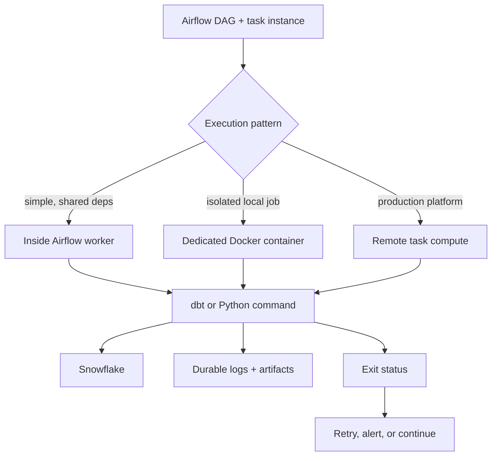

# Running dbt and Python from Airflow

> [!abstract] Learning target
> Compare execution inside an Airflow image with dedicated task containers or remote execution, including artifacts, isolation, and failure handling.

> **Curriculum priority:** Essential

## Executive Summary

- **What it is:** Airflow schedules and monitors work, while dbt or Python executes either inside the Airflow worker, in a dedicated container, or on a remote compute platform.
- **Why it matters:** The execution choice determines dependency isolation, security exposure, scaling, logs, artifact handling, and operational complexity.
- **Mental model:** Airflow is the conductor, not necessarily the musician; a task definition points to where and how the real work runs.
- **Best used when:** The team explicitly selects an execution pattern based on job size, dependencies, platform capabilities, and production controls.
- **Avoid or reconsider when:** Every dependency is placed in the Airflow image by habit, or Airflow receives dangerous access to the Docker host without a security review.

## What It Can Do

- Run a small dbt command or Python callable directly in an Airflow worker.
- Start a dedicated dbt or Python image with its own pinned dependencies.
- Submit work to remote container or compute infrastructure and monitor the result.
- Pass run context such as logical date, target, or model selection to the task.
- Use exit status, logs, and explicit checks to decide success, retry, or alerting.
- Keep orchestration code separate from transformation or extraction code.

## What It Cannot Do

- Make a non-idempotent task safe to retry.
- Move large result sets reliably through Airflow’s small task-to-task metadata mechanism.
- Automatically retain dbt artifacts produced inside a disposable task container.
- Remove the need to define who owns the Airflow image, task images, registry, secrets, and compute platform.
- Make host Docker-socket access low-risk; that access can provide broad control of the Docker host.

## Core Concepts

| Concept | Plain-language meaning | Why it matters |
|---|---|---|
| In-worker execution | The command runs in the Airflow worker’s own environment | Simple, but task dependencies can affect Airflow itself |
| Dedicated task container | Airflow starts a separate dbt or Python image | Stronger dependency and failure isolation |
| Remote execution | Airflow submits work to another managed compute environment | Better production isolation and scaling, with more platform setup |
| Operator | Airflow’s adapter for launching a type of work | The selected operator defines configuration and security boundaries |
| Exit status | The task process reports success or failure | Airflow retries and alerts depend on it |
| Artifact handoff | Logs and files are saved outside the task container | Needed because the container may be removed immediately |
| Run context | Date, environment, target, and correlation identifiers | Makes execution traceable and replayable |

## How It Works (Simple Flow)

1. The DAG defines the job, its schedule or trigger, dependencies, retries, and execution method.
2. Airflow creates a task instance for a specific logical run.
3. The selected operator runs a command in the worker, starts a task container, or submits remote work.
4. The execution environment receives a pinned image, non-secret run context, and approved runtime identity.
5. dbt or Python connects to Snowflake or another external service and performs the job.
6. Logs stream to Airflow or centralized logging; larger files and dbt artifacts go to durable storage.
7. The command’s exit status and any validation checks determine task success or failure.
8. Airflow applies the declared retry, downstream dependency, alert, or recovery behavior.

## Visuals



## Readable Snippets

An Airflow task that starts an already-built dbt image:

```python
from airflow.providers.docker.operators.docker import DockerOperator

run_dbt = DockerOperator(
    task_id="run_dbt_models",
    image="registry.example/company-dbt:approved",
    command="build --target prod --select tag:daily",
    auto_remove="success",
)
```

The dbt image’s entrypoint is `dbt`, so the command becomes `dbt build ...`. A real DAG also needs an approved Docker connection, network, identity delivery, resource limits, and artifact destination. Do not pass credentials in the command string.

For an in-worker task, the recognizable shape is simpler:

```text
BashOperator -> dbt build --target prod
```

That pattern works only if dbt, its adapter, project, profile, and dependencies are deliberately present in every worker image.

## Consultant Talking Points

- **Client question this answers:** “Should dbt and Python be installed in Airflow, or should Airflow launch separate job containers?”
- **Trade-offs to mention:** In-worker is simpler; dedicated images improve isolation; remote execution improves platform control but adds infrastructure.
- **Risk or governance angle:** Docker daemon access, workload identity, network reach, image provenance, and least-privilege Snowflake roles need explicit owners.
- **Cost or operational angle:** Dedicated and remote tasks add image pulls and compute startup, but can prevent dependency conflicts and allow job-level resource limits.

## Common Pitfalls

- Mounting `/var/run/docker.sock` into Airflow casually; control of the socket can amount to control of the host.
- Letting a dbt or Python dependency upgrade break Airflow’s own environment.
- Returning large query results or dbt artifacts through Airflow task metadata instead of durable storage.
- Treating “the process started” as success without checking its final exit status and expected outputs.
- Assigning retries to a job that appends data without duplicate protection.
- Using mutable image tags, so a retry may run different code from the original attempt.
- Removing a task container before its failure logs and artifacts are collected.

## When to Recommend What (Decision Table)

| Situation | Recommend | Why | Watch-outs |
|---|---|---|---|
| Small command with stable shared dependencies | Run inside the Airflow worker | Lowest operational overhead | A dependency change affects all workers and DAGs |
| dbt or Python has its own dependencies or release | Dedicated task image | Clear versioning and isolation | Requires secure container launch and artifact handling |
| High scale, strict isolation, or managed orchestration platform | Remote task execution using the platform’s supported operator | Independent resources and stronger platform controls | More networking, identity, and observability setup |
| Need to pass data between tasks | Store data externally and pass only a reference | Airflow metadata stays small and durable | Secure and lifecycle-manage the external object |
| Need reusable dbt orchestration | Run explicit dbt selections and preserve artifacts | Maintains dbt’s own dependency graph and evidence | Avoid duplicating every dbt model as hand-written Airflow logic |

## Related Topics

- [[04 Docker/03 Data Stack Integration Patterns/10 Containerizing dbt Core|Containerizing dbt Core]]
- [[04 Docker/03 Data Stack Integration Patterns/11 Containerizing Python Data Jobs|Containerizing Python Data Jobs]]
- [[04 Docker/03 Data Stack Integration Patterns/12 Extending the Apache Airflow Image|Extending the Apache Airflow Image]]
- [[02 dbt/05 Deployment CI CD and Operations/45 Artifacts Logs and Run Results|Artifacts, Logs, and Run Results]]

## Related Decision Notes

- No dedicated decision note yet; the execution-pattern decision table is the durable recommendation framework for this topic.

## Questions

- **Explain:** What is the practical difference between running dbt in an Airflow worker and in a dedicated task container?
- **Apply:** Where should `manifest.json` and `run_results.json` go if the task container is removed after success?
- **Challenge:** Why can giving Airflow access to the Docker socket change the security recommendation?

## Sources To Revisit

- [Apache Airflow Docker Provider: DockerOperator](https://airflow.apache.org/docs/apache-airflow-providers-docker/stable/_api/airflow/providers/docker/operators/docker/index.html)
- [Apache Airflow Standard Provider: BashOperator](https://airflow.apache.org/docs/apache-airflow-providers-standard/stable/operators/bash.html)
- [Apache Airflow Docs: Kubernetes integration](https://airflow.apache.org/docs/apache-airflow/stable/administration-and-deployment/kubernetes.html)
- [dbt Developer Hub: dbt commands](https://docs.getdbt.com/reference/dbt-commands)
