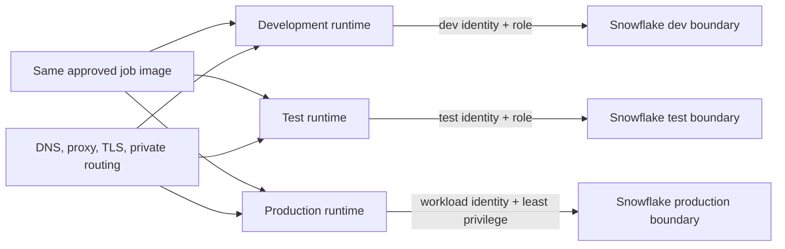

# Snowflake Connectivity, Authentication, and Environment Parity

> [!abstract] Learning target
> Connect containers through approved networking, certificate trust, proxies, and non-interactive identity while separating shared runtime from environment-specific settings.

> **Curriculum priority:** Essential

## Executive Summary

- **What it is:** The network, certificate, identity, role, and environment configuration that lets a containerized dbt or Python workload reach remote Snowflake safely.
- **Why it matters:** A correct image still fails if DNS, HTTPS, proxy, certificate trust, authentication, or Snowflake authorization differs between environments.
- **Mental model:** Keep one tested runtime image; inject the destination, identity, and permissions when it runs.
- **Best used when:** The team wants the same dbt/Python release promoted through development, test, and production with different controlled access.
- **Avoid or reconsider when:** “Parity” is interpreted as sharing production credentials or making every environment equally privileged.

## What It Can Do

- Use one image with different Snowflake accounts, databases, schemas, roles, and warehouses.
- Support interactive developer login separately from non-interactive workload authentication.
- Deliver a private key, token, or platform identity at runtime rather than storing it in the image.
- Respect enterprise DNS, proxy, certificate authority, private-connectivity, and egress rules.
- Add query tags and distinct workload identities so runs can be attributed and investigated.
- Test the full path from container to Snowflake before promoting a release.

## What It Cannot Do

- Make development and production identical; their data, scale, policies, network paths, and permissions should differ.
- Turn a human SSO login into a reliable unattended production identity automatically.
- Protect a secret copied into an image layer, source repository, Compose file, or log.
- Bypass Snowflake network policies, RBAC, certificate checks, or corporate egress controls safely.
- Guarantee that reaching the Snowflake login endpoint is enough; drivers may also need approved access to identity, certificate-status, and cloud-storage endpoints.

## Core Concepts

| Concept | Plain-language meaning | Why it matters |
|---|---|---|
| Account identifier | The Snowflake account the client connects to | A wrong format or region/account value stops login |
| Network path | DNS, HTTPS, proxy, firewall, and private routing between container and Snowflake | Container networking may differ from the host browser |
| TLS trust | Certificate authorities used to verify the remote service | Minimal images and corporate TLS inspection can expose trust problems |
| Interactive identity | A developer signs in through SSO/MFA | Appropriate for people, usually unsuitable for scheduled tasks |
| Workload identity | A non-human identity used by an automated job | Enables least privilege, rotation, ownership, and auditability |
| Runtime secret | Key, token, or passphrase delivered only when the job starts | Keeps sensitive material out of image history |
| Environment configuration | Account, role, warehouse, database, schema, and target | Promotes the same code while changing controlled destinations |
| Query attribution | Tags and identities showing which workload submitted a query | Supports cost, incident, and ownership analysis |

## How It Works (Simple Flow)

1. CI builds and tests one immutable dbt or Python image.
2. The target environment supplies its Snowflake account, role, warehouse, database, schema, and query tag.
3. The platform gives the workload an approved non-interactive identity or short-lived credential.
4. Container DNS and routing resolve the Snowflake endpoint through the approved public or private path.
5. The driver validates TLS and any required certificate-status checks; proxy and certificate settings are applied without disabling verification.
6. Snowflake authenticates the workload and then authorizes it through its assigned role and network policies.
7. The job executes with the environment’s resource and data boundaries.
8. Logs identify the image version, environment, Airflow run, and Snowflake query IDs without exposing credential material.

## Visuals



## Readable Snippets

A small Python connection shape using key-pair authentication:

```python
import os
import snowflake.connector

with snowflake.connector.connect(
    account=os.environ["SNOWFLAKE_ACCOUNT"],
    user=os.environ["SNOWFLAKE_USER"],
    authenticator="SNOWFLAKE_JWT",
    private_key_file=os.environ["SNOWFLAKE_PRIVATE_KEY_PATH"],
    warehouse=os.environ["SNOWFLAKE_WAREHOUSE"],
    role=os.environ["SNOWFLAKE_ROLE"],
    session_parameters={"QUERY_TAG": os.environ["QUERY_TAG"]},
) as connection:
    connection.cursor().execute("select current_role(), current_warehouse()")
```

Local Compose can grant a secret only to the service that needs it:

```yaml
services:
  data-job:
    image: company-data-job:approved
    environment:
      SNOWFLAKE_ACCOUNT: ${SNOWFLAKE_ACCOUNT}
      SNOWFLAKE_PRIVATE_KEY_PATH: /run/secrets/snowflake_key
      SNOWFLAKE_ROLE: DATA_ENGINEER_DEV
      SNOWFLAKE_WAREHOUSE: DEV_TRANSFORMING
      QUERY_TAG: local_airflow_data_job
    secrets:
      - snowflake_key

secrets:
  snowflake_key:
    file: ./local-secrets/snowflake_key.p8
```

The key file and its folder must be excluded from Git and from the Docker build context. In a production platform, use its managed secret or workload-identity facility rather than copying a developer key file.

## Consultant Talking Points

- **Client question this answers:** “If the image is the same, what must change safely between development and production?”
- **Trade-offs to mention:** Key pairs are widely supported but require rotation; short-lived OAuth or cloud workload identity reduces long-lived secrets but requires identity-platform integration.
- **Risk or governance angle:** Separate human and workload users, enforce least-privilege roles and network policies, and test key/token rotation before expiry.
- **Cost or operational angle:** Set environment-specific warehouses, timeouts, resource monitors, and query tags; identical code does not imply identical compute size.

## Common Pitfalls

- Using a developer’s password, browser SSO session, or personal key for a scheduled production task.
- Storing a private key in the image, repository, Compose YAML, or CI log.
- Testing connectivity from the laptop host but not from inside the actual container network.
- Assuming port `443` to one hostname is the complete allowlist; authentication, certificate checks, and cloud stages may use additional approved endpoints.
- Disabling TLS or certificate checks to “fix” a proxy or trust-store problem.
- Sharing one service identity and broad role across development and production.
- Promoting an image while silently changing Python connector or CA-certificate versions between environments.

## When to Recommend What (Decision Table)

| Situation | Recommend | Why | Watch-outs |
|---|---|---|---|
| Developer working interactively | Organization-approved SSO/MFA | Preserves personal attribution and access policy | Browser-based flows can be awkward inside headless containers |
| Scheduled workload on a supported cloud platform | Workload identity federation where organizationally supported | Uses short-lived platform identity without a stored long-lived key | Requires coordinated cloud and Snowflake configuration |
| Scheduled workload needing broad connector compatibility | Dedicated Snowflake service user with rotated key-pair authentication | Non-interactive and widely understood | Protect the private key and test rotation overlap |
| Enterprise OAuth standard already exists | OAuth client credentials or approved token flow | Central policy and short-lived access | Token audience, scopes, expiry, and refresh ownership |
| Same release across environments | Same immutable image; different runtime configuration and identity | Separates code promotion from access | Validate schema, feature, scale, and network differences explicitly |
| Restricted enterprise network | Approved proxy/private connectivity plus correct CA trust and endpoint allowlists | Meets network policy without weakening TLS | Test from the actual runtime with SnowCD or connector diagnostics |

## Related Topics

- [[04 Docker/01 Foundations and Everyday Docker/04 Files Mounts Networks Configuration and Secrets|Files, Mounts, Networks, Configuration, and Secrets]]
- [[04 Docker/03 Data Stack Integration Patterns/09 Local Airflow dbt Python and Snowflake Environment|Local Airflow, dbt, Python, and Snowflake Environment]]
- [[01 Snowflake/08 Enterprise Snowflake in Production/56 Authentication and Service Identity Patterns|Authentication and Service Identity Patterns]]
- [[01 Snowflake/03 Security and Governance/16 Network Policies and Private Connectivity|Network Policies and Private Connectivity]]

## Related Decision Notes

- No dedicated decision note yet; authentication method should be selected with the client’s Snowflake and cloud identity owners.

## Questions

- **Explain:** Which parts should remain identical across environments, and which should be injected at runtime?
- **Apply:** How would you prove that a production task uses the expected Snowflake identity, role, warehouse, and query tag?
- **Challenge:** Why is disabling certificate verification the wrong fix when a container fails behind a corporate proxy?

## Sources To Revisit

- [Snowflake Docs: Connecting with the Python Connector](https://docs.snowflake.com/en/developer-guide/python-connector/python-connector-connect)
- [Snowflake Docs: Key-pair authentication and rotation](https://docs.snowflake.com/en/user-guide/key-pair-auth)
- [Snowflake Docs: Troubleshooting connectivity with SnowCD](https://docs.snowflake.com/en/user-guide/snowcd)
- [Docker Docs: Secrets in Compose](https://docs.docker.com/reference/compose-file/secrets/)
