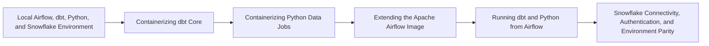

# Data Stack Integration Patterns Overview

> [!abstract] Chapter outcome
> Apply Docker directly to dbt Core, Python jobs, Airflow, and Snowflake connectivity while keeping runtime and ownership boundaries explicit.

## Topics

- [[04 Docker/03 Data Stack Integration Patterns/09 Local Airflow dbt Python and Snowflake Environment|09 - Local Airflow, dbt, Python, and Snowflake Environment]]
- [[04 Docker/03 Data Stack Integration Patterns/10 Containerizing dbt Core|10 - Containerizing dbt Core]]
- [[04 Docker/03 Data Stack Integration Patterns/11 Containerizing Python Data Jobs|11 - Containerizing Python Data Jobs]]
- [[04 Docker/03 Data Stack Integration Patterns/12 Extending the Apache Airflow Image|12 - Extending the Apache Airflow Image]]
- [[04 Docker/03 Data Stack Integration Patterns/13 Running dbt and Python from Airflow|13 - Running dbt and Python from Airflow]]
- [[04 Docker/03 Data Stack Integration Patterns/14 Snowflake Connectivity Authentication and Environment Parity|14 - Snowflake Connectivity, Authentication, and Environment Parity]]

## Chapter Map

## How To Use This Area

This is the essential application chapter. Relate each topic to the actual repository, images, Compose files, and Airflow deployment used by your team.

## Related Areas

- [[04 Docker/Docker Learning Map|Docker Learning Map]]
- [[04 Docker/02 Reproducible Images and Docker Compose/Reproducible Images and Docker Compose Overview|Previous: Reproducible Images and Docker Compose]]
- [[04 Docker/04 Security Operations and Team Standards/Security Operations and Team Standards Overview|Next: Security, Operations, and Team Standards]]
- [[02 dbt/05 Deployment CI CD and Operations/44 Scheduling and Orchestration|dbt Scheduling and Orchestration]]
- [[01 Snowflake/04 Data Engineering/25 dbt on Snowflake|dbt on Snowflake]]
